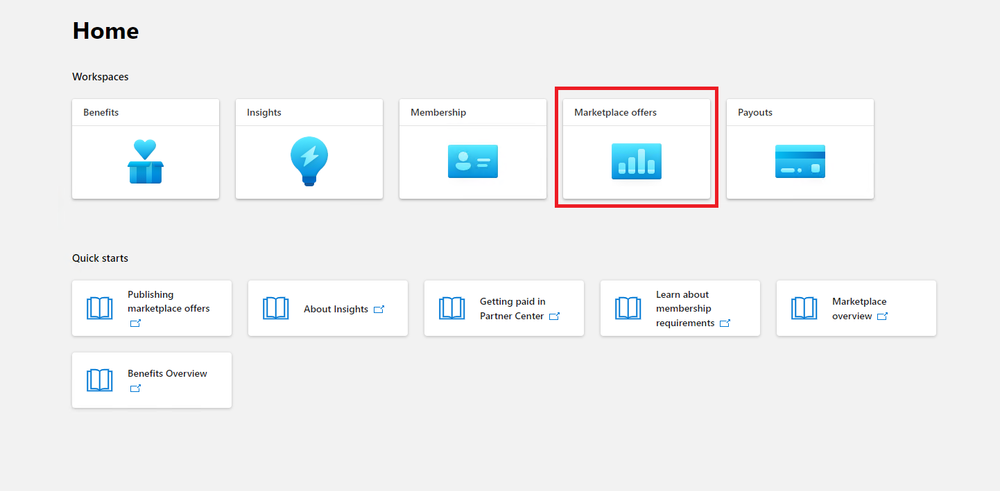
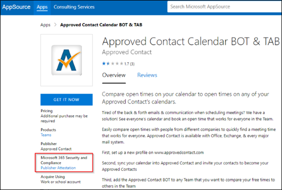

# 合作伙伴的Microsoft 365应用合规性计划用户指南 - SaaS

|阶段|Title|
|---|---|
|阶段 1| 发布者证明|
|阶段 2| Microsoft 365 认证|

## 1. 概述 

本文档充当合作伙伴的分步用户指南，注册了Microsoft 365应用符合性计划，旨在通过合作伙伴中心门户对其 SaaS 应用进行Publisher证明和认证。

>[!IMPORTANT]
>本指南仅适用于已由Microsoft 365应用合规性团队批准并列入允许列表的 SaaS 应用。 如果应用未列入允许列表，则无法在合作伙伴中心内继续。 若要将 SaaS 列入允许列表，请联系 appcert@microsoft.com。

## 2. 定义&首字母缩略词
|首字母缩略词 | 定义 |
|----|----|
|[PC (合作伙伴中心) ](https://partner.microsoft.com/)|适用于所有 Microsoft 合作伙伴的门户。 合作伙伴登录到合作伙伴中心并提交自我评估问卷。 [Microsoft 365应用合规性的](https://partner.microsoft.com/dashboard/home)合作伙伴中心|
|ISV | 独立软件供应商 a.k.a. 合作伙伴或开发人员 |
|应用源 | 应用目录 |
|示例 |[现在虚拟代理](https://appsource.microsoft.com/product/office/WA104381816)|

## 3. Publisher证明工作流

**主页**：这是合作伙伴登录到合作伙伴中心后的登陆页。

  
**步骤 1** ：选择市场产品/服务

  
**步骤 2**：选择“市场产品/服务”后，切换到“商业市场”。

从列表中选择一个应用，另一个导航栏将弹出选项“应用符合性”。
  
**步骤 3**：选择“应用符合性”
  

  
**步骤 4**：填写Publisher证明的自我评估问卷。

  
**注意，如果要返回更新/重新提交应用程序，请单击“选择产品”的下拉列表，选择应用并单击“克隆”。**

**还可以利用导入/导出功能脱机完成窗体并将其导入完成。**

 
**步骤 5**：完成后，单击“提交”，评估现在为“正在审查”。
 
  
  
**批准/拒绝方案：**
  
答： Publisher证明拒绝
- 如果遭到拒绝，合作伙伴可以：
     - 查看失败报告
          - 合作伙伴将通过电子邮件收到通知，他们可以在合作伙伴中心查看失败报告
     - 更新并重新提交自我评估问卷。
        

B.  Publisher证明审批
- 经批准后，合作伙伴可以：
     - 更新并重新提交证明
     - 查看已完成Publisher证明
     - "开始"菜单Microsoft 365认证过程
        
        
  
 
  
**Publisher证明批准后：AppSource 中针对发布者证明应用的链接示例。**
  

   
## 4. Microsoft 365认证工作流
  
合作伙伴可以通过选中复选框并单击“提交”来开始认证过程
  
 
  
**步骤 1**：初始文档提交

填写所有详细信息，上传相关文档，然后单击“提交”
  
 

  
单击提交时，将审查初始文档提交。

  
分析师请求修订，以防初始文档不够或相关。 分析师将与合作伙伴合作，帮助获取正确的文档以获得批准。

分析师批准初始文档提交后，合作伙伴需要提交控制要求。
  
**步骤 2**：控制要求提交
  
填写所有详细信息，上传相关文档，然后单击“提交”

  

 
单击“提交”时，将审查初始文档提交。

  
分析师请求修订，以防控制要求文档不够或相关。 分析师将与合作伙伴合作，帮助获取正确的文档以获得批准。

  
 
 
如果提交不符合审批标准，分析师将拒绝提交。
  
合作伙伴可以与分析师合作，提供相关信息和文档。

  
满足所有安全标准后，分析师将批准提交，合作伙伴将Microsoft 365认证。

  
**认证后审批：AppSource 中Microsoft 365认证徽章的示例。** 

 
## 5. Microsoft 365续订工作流：
  
**Microsoft 365Publisher证明和认证续订工作流：**  

Microsoft 365应用符合性计划现在提供年度续订过程。 在此过程中，应用开发人员可以更新其现有Publisher证明问卷和Microsoft 365认证所需的文档。 
 
**好处：** 

- 在 AppSource、Office Microsoft Store、Teams Microsoft Store 和各种管理门户中维护认证徽章，以便将应用与其他应用区分开来。 
- 提高客户使用已认证应用的信心。 
- 帮助 IT 管理员使用更新的认证信息做出明智的决策。

合作伙伴 [中心](https://partner.microsoft.com/dashboard/home) 提供了新的续订过程，可提供无缝体验。 从到期日期前 90 天开始，合作伙伴中心将显示续订提醒。 定期提醒也将在过期前 90 天、60 天和 30 天内通过电子邮件发送。 
 
**阶段 1：Publisher证明续订：**
  
需要每年重新提交应用的Publisher证明答案。 当证明接近 1 年大关时，将发送电子邮件提醒，鼓励重新提交证明。 
 
**步骤 1**：选择 **“续订**”以续订Publisher证明。
  

  
**步骤 2**：查看上一Publisher证明答案，并根据需要更新最新信息。 
  
准备就绪时提交Publisher证明以进行续订。 M365 应用合规性分析师将对此进行评审。

  
**已批准Publisher证明续订：**
  

  
**Publisher证明已过期：**
  
应用的信息需要在到期日期之前续订，才能在 Microsoft 文档上维护应用的Publisher证明页。及时续订还可确保在各种店面中持续损坏应用和图标。 
 

**注意**：过期后，可以通过单击“续订”随时启动Publisher证明续订过程。
 
**阶段 2：Microsoft 365认证续订**
  
需要每年重新提交应用的认证信息。 这需要重新验证当前环境的范围内控件。 当认证接近 1 年标记时，将发送电子邮件通知，鼓励重新提交文档和证据。
 
 

**认证续订批准/拒绝方案：**

**方案 1：** 

认证续订已开始并正在审查中。
 
 

方案 1A： 

认证续订拒绝： 
- 如果存在以下情况，则可能会拒绝认证： 
     - 应用没有所需的工具、流程或配置，并且无法在认证窗口中实现所需的更改。 
     - 应用存在突出的漏洞，无法在认证窗口内修复。 
 

方案 1B： 

认证续订已获批准

**认证过期：**

应用的信息需要在到期日期之前续订，才能在 Microsoft 文档上维护应用的认证页面。及时续订还可确保 AppSource 和 Team Microsoft Store 中应用的持续损坏和图标。

  
注意：过期后，可以通过单击“续订”随时启动Publisher证明和认证过程。 
