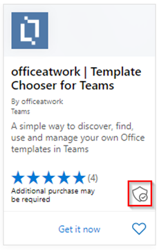

# 适用于应用合规性计划Microsoft 365合作伙伴的用户指南 - SaaS

|阶段|Title|
|---|---|
|阶段 1| 发布者证明|
|阶段 2| Microsoft 365 认证|

## 1. 概述 

本文档是我们的合作伙伴的分步用户指南，已注册 Microsoft 365 应用合规性计划，旨在通过合作伙伴中心门户为 SaaS 应用进行 Publisher 证明和认证。

## 2. 首字母缩略&定义
|首字母缩略词 | 定义 |
|----|----|
|[电脑 (合作伙伴中心) ](https://partner.microsoft.com/)|所有 Microsoft 合作伙伴的门户。 合作伙伴登录到合作伙伴中心并提交自我评估调查表。 应用合规性[Microsoft 365中心](https://partner.microsoft.com/dashboard/home)|
|ISV | 独立软件供应商 a.k.a. 合作伙伴或开发人员 |
|应用源 | 应用程序目录 |
|示例 |[Now virtual agent](https://appsource.microsoft.com/product/office/WA104381816)|

## 3. Publisher证明工作流

**主页：** 这是合作伙伴登录到合作伙伴中心后登录页面。

  
**步骤 1** ：选择市场产品/服务

  
**步骤 2**：选择"市场产品/服务"后，切换到"商业市场"。

Select an app from the list and another navigation bar will pop up with option 'App Compliance'.
  
**步骤 3**：选择"应用合规性"
  

  
**步骤 4**：填写自我评估调查表，Publisher证明。

  
**注意 如果你要返回更新/重新提交应用程序，请单击"选择产品"下拉列表，选择应用，然后单击"克隆"。**

**您还可以利用表单导入/导出以脱机方式完成表单，并完成导入。**

 
**步骤 5**：完成后，单击"提交"，评估现在将为"正在审查"。
 
 
  
**批准/拒绝方案：**
  
答： Publisher证明拒绝
- 如果拒绝，合作伙伴可以：
     - 查看故障报告
          - 合作伙伴将通过电子邮件收到通知，他们可以查看合作伙伴中心中的故障报告
     - 更新和重新提交自我评估调查表。
        

B.  Publisher证明审批
- 经批准后，合作伙伴可以：
     - 更新并重新提交证明
     - 查看已完成Publisher证明
     - 开始Microsoft 365认证过程
        
        
  
 
  
**发布Publisher证明审批：适用于发布者证明应用的 AppSource 中的链接示例。**
  

   
## 4. Microsoft 365认证工作流
  
合作伙伴可以通过选中复选框并单击"提交"开始认证过程
  
 
  
**步骤 1** ：初始文档提交

填写所有详细信息，上传相关文档，然后单击"提交"
  
 

  
单击提交后，将审核初始文档提交。

  
分析员请求修订，以防初始文档不足或相关。 分析师将与合作伙伴合作，帮助获取正确的文档进行审批。

分析员批准初始文档提交后，合作伙伴需要提交控制要求。
  
**步骤 2**：控制要求提交
  
填写所有详细信息、上传相关文档并单击"提交"

  

 
单击"提交"后，将审核初始文档提交。

  
分析员请求修订，以防控制要求文档不足或相关。 分析师将与合作伙伴合作，帮助获取正确的文档进行审批。

  
 
 
如果提交不符合审批标准，分析员将拒绝提交。
  
合作伙伴可以与分析师合作，以提供相关信息和文档。

  
满足所有安全标准后，分析员将批准提交，并且合作伙伴Microsoft 365认证。

  
**认证审批后：AppSource Microsoft 365认证徽章的示例。** 

 
## 5. Microsoft 365续订工作流：
  
**Microsoft 365Publisher证明和认证续订工作流：**  

Microsoft 365应用合规性计划现在提供年度续订过程。 在此过程中，应用开发人员可以更新其现有Publisher证明调查表和认证Microsoft 365文档。 
 
**优点：** 

- 在 AppSource、Office 应用商店、Teams应用商店和各种管理门户中维护你的认证锁屏提醒，以将你的应用与其他门户区分。 
- 提高客户对使用认证应用的信心。 
- 使用更新的认证信息帮助 IT 管理员做出明智的决策。

合作伙伴中心提供 [新的续订流程](https://partner.microsoft.com/dashboard/home) ，以提供无缝体验。 从到期日期前 90 天开始，将在合作伙伴中心中显示续订提醒。 定期提醒也会在到期前的 90、60 和 30 天内通过电子邮件发送。 
 
**阶段 1：Publisher证明续订：**
  
需要每年重新提交Publisher证明答案。 当证明接近 1 年标志时，将发送电子邮件提醒，鼓励重新提交证明。 
 
**步骤 1**：选择 **续订** 以续订Publisher证明。
  

  
**步骤 2**：查看上一Publisher证明答案，并根据需要使用最新信息进行更新。 
  
准备好Publisher提交要续订的证明。 M365 应用合规性分析师将审核此内容。

  
**Publisher证明续订已批准：**
  

  
**Publisher证明已过期：**
  
需要在到期日期之前续订应用的信息，以维护 Microsoft Publisher证明页面。及时续订还将确保在各种店面继续使用应用的标记和图标。 
 

**注意**：一旦Publisher，可以随时通过单击"续订"启动证明续订过程。
 
**阶段 2：Microsoft 365认证续订**
  
需要每年重新提交应用的认证信息。 这需要重新验证当前环境的作用域内控件。 当认证接近 1 年标记时，将发送电子邮件通知，鼓励重新提交文档和证据。
 
 

**认证续订批准/拒绝方案：**

**方案 1：** 

证书续订已开始，正在审查中。
 
 

方案 1A： 

证书续订拒绝： 
- 如果： 
     - 应用没有所需的工具、进程或配置，并且将无法在认证窗口中实现所需的更改。 
     - 应用具有未解决的漏洞，无法在认证窗口中修复。 
 

方案 1B： 

认证续订已批准

**认证过期：**

需要在到期日期之前续订应用信息，才能在 Microsoft 文档上维护应用的认证页面。及时续订还将确保在 AppSource 和团队应用商店中为应用持续提供标记和图标。

  
注意：一旦Publisher，可以随时通过单击"续订"启动证明和认证过程。 
