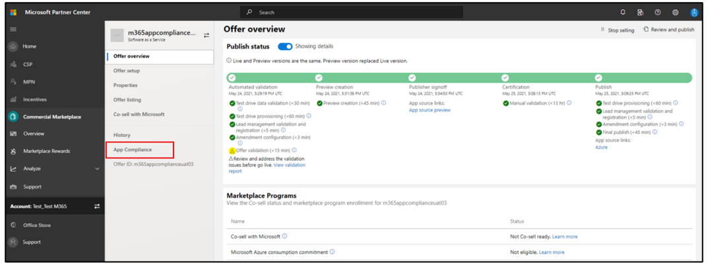
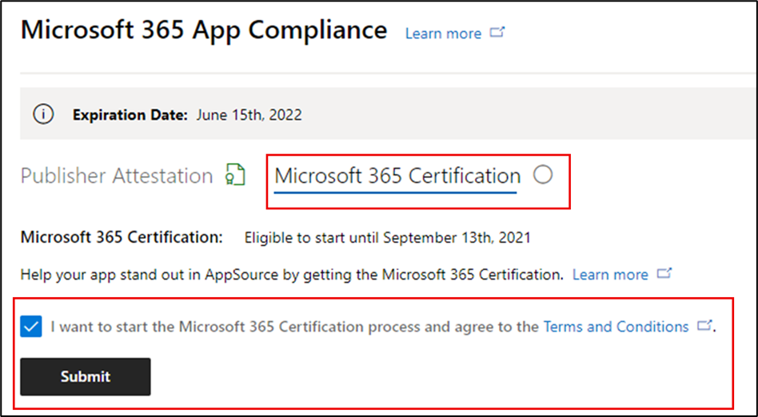

# 适用于应用合规性计划Microsoft 365合作伙伴的用户指南 - SaaSPartner's User Guide for Microsoft 365 App Compliance Program - SaaS

|阶段Phase|TitleTitle|
|---|---|
|阶段 1Phase 1| 发布者证明Publisher Attestation|
|阶段 2Phase 2| Microsoft 365 认证Microsoft 365 Certification|

## 1. 概述1. Overview 

本文档是我们的合作伙伴的分步用户指南，已注册 Microsoft 365 应用合规性计划，旨在通过合作伙伴中心门户为 SaaS 应用进行 Publisher 证明和认证。This document acts as a step-by-step user guide for our partners, enrolled for Microsoft 365 App Compliance program aiming to undergo Publisher Attestation and Certification for their SaaS apps, though the Partner Center portal.

## 2. 首字母缩略&定义2. Acronyms & Definitions
|首字母缩略词Acronym | 定义Definition |
|----|----|
|[电脑 (合作伙伴中心) PC (Partner Center)](https://partner.microsoft.com/)|所有 Microsoft 合作伙伴的门户。A portal for all Microsoft partners. 合作伙伴登录到合作伙伴中心并提交自我评估调查表。A partner logs in to Partner Center and submits self-assessment questionnaire. 应用合规性[Microsoft 365中心](https://partner.microsoft.com/dashboard/home)Partner Center for [Microsoft 365 App Compliance](https://partner.microsoft.com/dashboard/home)|
|ISVISV | 独立软件供应商 a.k.a.Independent Software Vendor a.k.a. 合作伙伴或开发人员Partner or Developer |
|应用源App Source | 应用程序目录Catalog of apps |
|示例Example |[Now virtual agentNow virtual agent](https://appsource.microsoft.com/product/office/WA104381816)|

## 3. Publisher证明工作流3. Publisher Attestation Workflow

**主页：** 这是合作伙伴登录到合作伙伴中心后登录页面。**Home Page**: This is the landing page once a partner logs in to Partner Center.

  
**步骤 1：** 在页面左侧的导航栏上：**Step 1** : On the left side of the page, on the navigation bar:

- 选择商业市场Select Commercial Marketplace
- 选择概述Select Overview

  
选择"概述"后，合作伙伴可以看到可用于启动合规性计划Microsoft 365列表。Upon selecting ‘Overview’, partner can see list of apps available to start the Microsoft 365 Compliance program.
  
**步骤 2：** 从列表中选择应用以开始Publisher证明过程。**Step 2**: Select an app from the list to begin the Publisher Attestation process.

选择应用时，会弹出另一个导航栏，并添加选项"应用合规性"。On selecting an app, another navigation bar will pop up with option ‘App Compliance’.
  
**步骤 3：** 选择"应用合规性"**Step 3**: Select 'App Compliance’
  

  
**步骤 4：** 填写个人证明的自我Publisher调查表。**Step 4**: Fill out the self-assessment questionnaire for Publisher Attestation.

  
**注意 如果你要返回以更新/重新提交应用程序，请单击"选择产品"下拉列表，选择应用并单击"克隆"。****NOTE If you are coming back to update/re-submit your application, click dropdown for ‘Choose the product’, select the app and click ‘Clone’.**

**您还可以利用表单导入/导出以脱机方式完成表单，并完成导入。****You can also leverage the Import/Export feature to complete the form offline and import it once completed.**

 
**步骤 5：** 完成后，单击"提交"，评估现在将为"正在审查"。**Step 5**: Once completed, click on ‘Submit’, the assessment will now be ‘Under Review’.
 
   
  
**批准/拒绝方案：****Approve/Reject Scenarios:**
  
A.A. Publisher证明拒绝Publisher Attestation Rejection
- 如果拒绝，合作伙伴可以：In case of rejection, a partner can:
     - 查看故障报告View failure report
          - 合作伙伴将通过电子邮件收到通知，他们可以查看合作伙伴中心中的故障报告Partner will be notified via email, and they can view the failure report in Partner Center
     - 更新和重新提交自我评估调查表。Update and re-submit self-assessment questionnaire.
        

B.B.  Publisher证明审批Publisher Attestation Approval
- 经批准后，合作伙伴可以：Upon approval, the partner can:
     - 更新并重新提交证明Update and resubmit attestation
     - 查看已完成Publisher证明View completed Publisher Attestation
     - 开始Microsoft 365认证过程Start the Microsoft 365 Certification process
        
        
  
 
  
**发布Publisher证明审批：适用于发布者证明应用的 AppSource 中的链接示例。****Post Publisher Attestation Approval: Example of link in AppSource for publisher attested apps.**
  

   
## 4. Microsoft 365认证工作流4.   Microsoft 365 Certification Workflow
  
合作伙伴可以通过选中复选框并单击"提交"开始认证过程A partner can begin the Certification process by selecting the checkbox and clicking ‘Submit’
  
 
  
**步骤 1：** 初始文档提交**Step 1** : Initial Document Submission

填写所有详细信息，上传相关文档，然后单击"提交"Fill out all the details, upload relevant documents and click ‘Submit’
  
 
  

  
单击提交后，将审核初始文档提交。On clicking submit, the initial document submission will be under review.

  
分析员请求修订，以防初始文档不足或相关。An analyst requests a revision in case the initial documents are not sufficient or relevant. 分析师将与合作伙伴合作，帮助获取正确的文档进行审批。The analyst will work with the partner to help get the right documents for approval.

分析员批准初始文档提交后，合作伙伴需要提交控制要求。Once the analyst approves the initial document submission, the partner needs to submit the control requirements.
  
**步骤 2：** 控制要求提交**Step 2**: Control Requirement Submission
  
填写所有详细信息、上传相关文档并单击"提交"Fill out all the details, upload relevant documents and Click ‘Submit’

  

 
单击"提交"后，将审核初始文档提交。On clicking Submit, the initial document submission will be under review.

  
分析员请求修订，以防控制要求文档不足或相关。An analyst requests a revision in case the control requirement documents are not sufficient or relevant. 分析师将与合作伙伴合作，帮助获取正确的文档进行审批。The analyst will work with the partner to help get the right documents for approval.

  
 
 
如果提交不符合审批标准，分析员将拒绝提交。In case the submission does not satisfy the approval standards, the analyst will reject the submission.
  
合作伙伴可以与分析师合作，以提供相关信息和文档。The partner can work with the analyst to provide the relevant information and documents.

  
满足所有安全标准后，分析员将批准提交，并且合作伙伴Microsoft 365认证。Once all the security standards have been met, the analyst will approve the submission and the partner will be Microsoft 365 Certified.

  
**认证审批后：AppSource Microsoft 365认证徽章的示例。****Post Certification Approval: Example of Microsoft 365 certification badge in AppSource.** 

 
## 5. Microsoft 365续订工作流：5.   Microsoft 365 Renewal Workflow:
  
**Microsoft 365Publisher证明和认证续订工作流：****Microsoft 365 Publisher Attestation and Certification Renewal Workflow:**  

Microsoft 365应用合规性计划现在提供年度续订流程。Microsoft 365 App Compliance program now offers an annual renewal process. 在此过程中，应用开发人员可以更新其现有Publisher证明调查表和认证Microsoft 365文档。During this process, app developers can update their existing Publisher Attestation questionnaire and documents required for Microsoft 365 Certification. 
 
**优点：****Benefits:** 

- 在 AppSource、Office 应用商店、Teams应用商店和各种管理门户中维护你的认证锁屏提醒，以将你的应用与其他门户区分。Maintain your certification badge in AppSource, the Office Store, the Teams Store and various admin portals to differentiate your app from others. 
- 提高客户对使用认证应用的信心。Increase customer confidence in using your certified app. 
- 使用更新的认证信息帮助 IT 管理员做出明智的决策。Help IT admins make informed decisions with updated certification information.

合作伙伴中心提供 [新的续订流程](https://partner.microsoft.com/dashboard/home) ，以提供无缝体验。The new renewal process is available in [Partner Center](https://partner.microsoft.com/dashboard/home) to provide a seamless experience. 从到期日期前 90 天开始，将在合作伙伴中心中显示续订提醒。A renewal reminder will be shown in Partner Center starting 90 days before the expiration date. 定期提醒也会在到期前的 90、60 和 30 天内通过电子邮件发送。Periodic reminders will also be sent via email at 90, 60 and 30 days before expiration. 
 
**阶段 1：Publisher证明续订：****Phase 1: Publisher Attestation Renewal:**
  
应用Publisher证明答案将需要每年重新提交。The app’s Publisher Attestation answers will need to be resubmitted on an annual basis. 当证明接近 1 年标志时，将发送电子邮件提醒，鼓励重新提交证明。When the attestation nears the 1-year mark, an email reminder will be sent encouraging a resubmission of the attestation. 
 
**步骤 1：** 选择 **续订** 以续订Publisher证明。**Step 1**: Select **Renew** to renew the Publisher Attestation.
  

  
**步骤 2：** 查看上一Publisher证明答案，并根据需要使用最新信息进行更新。**Step 2**: Review the previous Publisher Attestation answers and update with the latest information as needed. 
  
准备好Publisher提交证明进行续订。Submit Publisher Attestation for renewal when ready. M365 应用合规性分析师将审核此内容。It will be reviewed by an M365 App Compliance analyst.

  
**Publisher证明续订已批准：****Publisher Attestation Renewal Approved:**
  

  
**Publisher证明已过期：****Publisher Attestation Expired:**
  
需要在到期日期之前续订应用的信息，以维护 Microsoft 文档上的Publisher证明页面。及时续订还将确保在各种店面继续使用应用的标记和图标。The app’s information needs to be renewed before the expiration date to maintain the app’s Publisher Attestation page on the Microsoft docs. Timely renewal will also ensure continued badging and icons for the app in various storefronts. 
 

**注意**：一旦Publisher，可以随时通过单击"续订"启动证明续订过程。**Note**: Once expired, Publisher Attestation renewal process can be started anytime by clicking ‘Renew’.
 
**阶段 2：Microsoft 365认证续订****Phase 2: Microsoft 365 Certification Renewal**
  
需要每年重新提交应用的认证信息。The app’s certification information needs to be resubmitted on an annual basis. 这需要重新验证当前环境的作用域内控件。This will require revalidation of the in-scope controls of your current environment. 当认证接近 1 年标记时，将发送电子邮件通知，鼓励重新提交文档和证据。When the Certification nears 1-year mark an email notification will be sent encouraging a resubmission of the documents and evidence.
 
 

**认证续订批准/拒绝方案：****Certification Renewal Approve/Reject Scenarios:**

**方案 1：****Scenario 1:** 

证书续订已开始，正在审查中。Certification renewal has started and is under review.
 
 

方案 1A：Scenario 1A: 

证书续订拒绝：Certification renewal rejection: 
- 如果：Certification may be rejected if: 
     - 应用没有所需的工具、进程或配置，并且将无法在认证窗口中实现所需的更改。The app does not have the required tooling, processes, or configurations in place and will not be able to implement required changes within the certification window. 
     - 应用具有未解决的漏洞，无法在认证窗口中修复。The app has outstanding vulnerabilities in place and cannot be fixed within the certification window. 
 

方案 1B：Scenario 1B: 

认证续订已批准Certification renewal is approved

**认证过期：****Certification Expiration:**

需要在到期日期之前续订应用信息，才能在 Microsoft 文档上维护应用的认证页面。及时续订还将确保在 AppSource 和团队应用商店中为应用持续提供标记和图标。The app’s information needs to be renewed before the expiration date to maintain app’s Certification page on the Microsoft docs. Timely renewal will also ensure continued badging and icons for the app in AppSource and Team Store.

  
注意：一旦Publisher，可以随时通过单击"续订"启动证明和认证过程。Note: Once expired, Publisher Attestation and Certification process can be started anytime by clicking ‘Renew’. 
