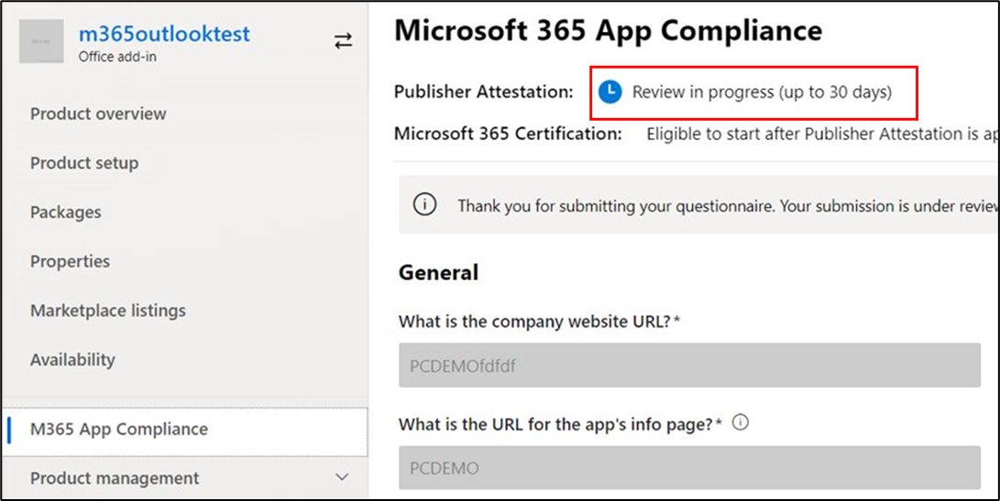
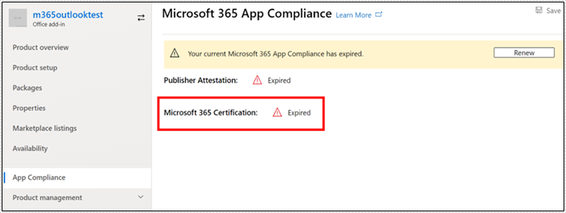

# 适用于应用合规性计划Microsoft 365合作伙伴的用户指南

|||
|---|---|
|第 1 层| 发布者证明|
|第 2 层| Microsoft 365 认证|

## 1. 概述
本文档作为合作伙伴的分步用户指南，已注册 Microsoft 365 应用合规性计划，旨在通过合作伙伴中心门户接受 Publisher 证明和认证。

## 2. 首字母缩略&定义
| | |
|---|----|
|首字母缩略词 | 定义 |
|电脑 (合作伙伴中心) |所有 Microsoft 合作伙伴的门户。 合作伙伴登录到合作伙伴中心并提交Self-Assessment调查表 https://partner.microsoft.com/|
|ISV|独立软件供应商 A.k.a. 合作伙伴或开发人员|
|应用源| 应用程序目录 (https://appsource.microsoft.com/)
||示例：现在虚拟代理 (https://appsource.microsoft.com/en-us/product/office/WA104381816)|

## 3. Publisher证明工作流

主页：这是合作伙伴登录到合作伙伴中心后登录页面。

**步骤 1：**   在页面左侧的导航栏中：
1. 选择Office应用商店
1. 选择概述

选择"概述"后，合作伙伴可以看到通过合作伙伴中心提交且可用于 Microsoft 365 合规性计划的应用列表。

**步骤 2：** 从列表中选择应用以开始Publisher证明过程。

选择应用时，会弹出另一个导航栏，并添加选项"应用合规性"

**步骤 3：** 选择"应用合规性"

**步骤 4：** 填写Self-Assessment证明Publisher调查表

**注意**：如果你要返回更新/重新提交应用程序，请单击"选择产品"下拉列表，选择应用并单击"克隆"。

 

您还可以利用表单导入/导出以脱机方式完成表单，并完成导入。 

**步骤 5：** 完成后，单击"提交"，评估现在将为"正在审查"。

### 批准/拒绝方案：

**A.Publisher证明拒绝**

如果在此阶段拒绝，合作伙伴可以：
-   查看故障报告。
    - 合作伙伴将在合作伙伴中心中通过电子邮件收到通知。
-   更新Self-Assessment响应。
-   重新提交自我评估。

**B.Publisher证明重新提交**

**C.Publisher证明审批**

-   批准后，合作伙伴可以：
    - 更新并重新提交证明
    - 查看和共享完成的Publisher证明
    - 启动 M365 认证过程

**发布Publisher验证审批：适用于发布者证明应用的 AppSource 中的链接示例**

## 4. Microsoft 365认证工作流

合作伙伴单击"提交"并提交所有文档和证据进行审阅后： 

### Microsoft 365认证 - 已提交

**Microsoft 365认证 - 已拒绝**

**Microsoft 365认证 - 已批准**

**认证审批后：AppSource Microsoft 365认证徽章的示例**

## 5. 现有 ISV 的工作流

如果你是现有 ISV，并且想要更新Publisher证明。

**步骤 1：** 单击"更新并重新提交你的Publisher证明"链接。

**注意：** 如果你要返回更新/重新提交应用程序，请单击"选择产品"下拉列表，选择应用并单击"导入"。

**步骤 2：** 更新表单并单击"保存/提交"。

提交后，将进行审阅。

## 6. Microsoft 365 Publisher证明和认证续订工作流：

Microsoft 365应用合规性计划现在提供年度续订流程。 在此过程中，应用开发人员可以更新其现有Publisher证明调查表和认证Microsoft 365文档。 

**优点：**

- 在 AppSource 和团队应用商店中维护你的认证锁屏提醒，以将你的应用与其他应用区别开。 
- 提高客户对使用认证应用的信心。 
- 使用更新的认证信息帮助 IT 管理员做出明智的决策。 

合作伙伴中心提供 [新的续订流程](https://partner.microsoft.com/en-us/dashboard/home) ，以提供无缝体验。 从到期日期前 90 天开始，将在合作伙伴中心中显示续订提醒。 定期提醒也会在到期前的 90、60 和 30 天内通过电子邮件发送。

**第 1 层：Publisher证明续订：** 

应用Publisher证明答案将需要每年重新提交。 当证明接近 1 年标记时，将发送电子邮件提醒，鼓励重新提交证明。 

**步骤 1：** 选择 **续订** 以续订Publisher证明。 

**步骤 2：** 查看上一Publisher证明答案，并根据需要使用最新信息进行更新。 准备好Publisher提交证明进行续订。 M365 应用合规性分析师将审核它。

**Publisher证明已过期：** 需要在到期日期之前续订应用的信息，以维护 Microsoft 文档上的Publisher证明页面。及时续订还将确保在 AppSource 和团队应用商店中为应用持续提供标记和图标。

注意：一旦Publisher，可以随时通过单击"续订"启动证明续订过程。 

**第 2 层：Microsoft 365认证续订** 

需要每年重新提交应用的认证信息。 这需要重新验证当前环境的作用域内控件。 当认证接近 1 年标记时，将发送电子邮件通知，鼓励重新提交文档和证据。 

**认证续订批准/拒绝方案：**

**方案 1：** 

Publisher证明已完成。 证书续订已开始，正在审查中。 

**方案 1A：**

证书续订拒绝：如果： 

 - 应用没有所需的工具、进程或配置，并且将无法在认证窗口中实现所需的更改。 
 - 应用具有未解决的漏洞，无法在认证窗口中修复。 

    
**方案 1B：** 

认证续订已批准  

**认证过期：**

需要在到期日期之前续订应用信息，才能在 Microsoft 文档上维护应用的认证页面。及时续订还将确保在 AppSource 和团队应用商店中为应用持续提供标记和图标。 

    
**注意**：一旦Publisher，可以随时通过单击"续订"启动证明和认证过程。 

