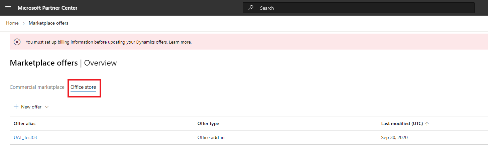
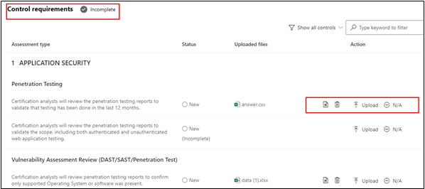

# 合作伙伴的应用符合性计划Microsoft 365用户指南

|阶段|标题|
|---|---|
|阶段 1| 发布者证明|
|阶段 2| Microsoft 365 认证|

## 1. 概述
本文档充当我们注册了Microsoft 365应用合规性计划中的合作伙伴的分步用户指南，旨在通过合作伙伴中心门户进行Publisher证明和认证。

## 2. 定义&首字母缩略词
| 首字母缩略词 |定义 |
|---|----|
|PC [ (合作伙伴中心) ](https://partner.microsoft.com/)|适用于所有 Microsoft 合作伙伴的门户。 合作伙伴登录到合作伙伴中心并提交自我评估问卷。 Microsoft 365应用合规性的[合作伙伴中心](https://partner.microsoft.com/dashboard/home)|
|ISV|独立软件供应商。 A.k.a. 合作伙伴或开发人员|
|应用源| [应用目录](https://appsource.microsoft.com/)
|示例|[现在虚拟代理](https://appsource.microsoft.com/product/office/WA104381816)|

## 3. Publisher证明工作流

**主页** ：这是合作伙伴登录到合作伙伴中心后的登陆页。

**步骤 1** ：选择市场产品/服务。 

  
**步骤 2**：选择“市场产品/服务”后，切换到“Office应用商店”。 从列表中选择应用以开始Publisher证明过程。

选择应用时，将弹出另一个导航栏，其中包含“其他认证信息”选项，然后单击“应用符合性”。
  
**步骤 3**：选择“应用符合性”

**步骤 4**：填写Publisher证明的自我评估问卷

**注意，如果要返回更新/重新提交应用程序，请单击“选择产品”的下拉列表，选择应用，然后单击“克隆”。**

还可以利用导入/导出功能脱机完成窗体并将其导入完成。

**步骤 5**：完成后，单击“提交”，评估现在为“正在审查”。

### 批准/拒绝方案：

**A. Publisher证明拒绝**

- 如果在此阶段遭到拒绝，合作伙伴可以：
    - 查看失败报告
         - 合作伙伴将通过电子邮件收到通知，他们可以在合作伙伴中心查看失败报告
    - 更新并重新提交Publisher证明

**B. Publisher证明审批**

- 批准后，合作伙伴可以：
    - 更新并重新提交证明
    - 查看和共享已完成Publisher证明
    - 启动Microsoft 365认证过程

**发布Publisher证明审批：AppSource 中针对发布者证明应用的链接示例**

## 4. Microsoft 365认证工作流

合作伙伴可以通过选中复选框并单击“提交”来开始认证过程 

**步骤 1：** 初始文档提交填写所有详细信息，上传相关文档并单击“提交”

单击提交时，将审查证明提交。 

分析师请求修订，以防初始文档不够或相关。 分析师将与合作伙伴合作，帮助获取正确的文档以获得批准。 

分析师批准初始文档提交后，合作伙伴需要提交控制要求。 

**步骤 2：** 控制要求提交填写所有详细信息，上传相关文档并单击“提交” 

单击“提交”时，将审查认证提交。 

分析师请求修订，以防控制要求文档不够或相关。 分析师将与合作伙伴合作，帮助获取正确的文档以获得批准。 

如果提交不符合审批标准，分析师将拒绝提交。 合作伙伴可以与分析师合作，提供相关信息和文档。 

满足所有安全标准后，分析师将批准提交，合作伙伴将Microsoft 365认证。 

**认证后审批：AppSource 中Microsoft 365认证徽章的示例**

## 5. Microsoft 365续订工作流：
  
**Microsoft 365 Publisher证明和认证续订工作流：** Microsoft 365应用符合性计划现在提供年度续订过程。 在此过程中，应用开发人员可以更新其现有Publisher证明问卷和Microsoft 365认证所需的文档。 
 
**好处：** 

- 在 AppSource、Teams 应用商店、Office应用商店和其他店面中维护认证徽章，以区分应用。 
- 提高客户使用已认证应用的信心。 
- 帮助 IT 管理员使用更新的认证信息做出明智的决策。 

[合作伙伴中心](https://partner.microsoft.com/dashboard/home)提供续订过程，可提供无缝体验。 从到期日期前 90 天开始，合作伙伴中心将显示续订提醒。 定期提醒也将在过期前 90 天、60 天和 30 天内通过电子邮件发送。

**阶段 1：Publisher证明续订：** 

合作伙伴 [中心](https://partner.microsoft.com/dashboard/home) 提供了新的续订过程，可提供无缝体验。 从到期日期前 90 天开始，合作伙伴中心将显示续订提醒。 定期提醒也将在过期前 90 天、60 天和 30 天内通过电子邮件发送。 

**步骤 1**：选择 **“续订**”以续订Publisher证明。 

**步骤 2**：查看上一Publisher证明答案，并根据需要更新最新信息。 准备就绪时提交Publisher证明以进行续订。 Microsoft 365应用合规性分析师将对此进行评审。

**已批准Publisher证明续订**

**Publisher证明已过期：** 应用的信息需要在到期日期之前续订，才能在 Microsoft 文档上维护应用的Publisher证明页。及时续订还可确保 AppSource、Teams 应用商店、Office应用商店和其他店面中应用的持续损坏和图标。

注意：过期后，可以通过单击“续订”随时启动Publisher证明续订过程。 

**阶段 2：Microsoft 365认证续订** 

需要每年重新提交应用的认证信息。 这需要重新验证当前环境的范围内控件。 当认证接近 1 年标记时，将发送电子邮件通知，鼓励重新提交文档和证据。 

**认证续订批准/拒绝方案：**
 
**方案 1：** 

认证续订已开始并正在审查中。

**方案 1A：**

认证续订拒绝：如果： 
- 应用没有所需的工具、流程或配置，并且无法在认证窗口中实现所需的更改。 
- 应用存在突出的漏洞，无法在认证窗口内修复。 
 

    
**方案 1B：** 

认证续订已获批准  

**认证过期：**
 
应用的信息需要在到期日期之前续订，才能在 Microsoft 文档上维护应用的认证页面。及时续订还可确保 AppSource 和 Team Store 中应用的持续损坏和图标。

应用的信息需要在到期日期之前续订，才能在 Microsoft 文档上维护应用的认证页面。及时续订还可确保 AppSource、Teams 应用商店、Office应用商店和其他店面中应用的持续损坏和图标。 

    
**注意**：过期后，可以通过单击“续订”随时启动Publisher证明和认证过程。 

