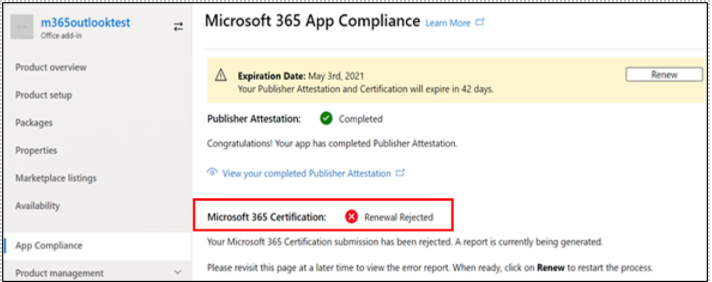

# 适用于应用合规性计划Microsoft 365合作伙伴的用户指南Partner's User Guide for Microsoft 365 App Compliance Program

|阶段Phase|TitleTitle|
|---|---|
|阶段 1Phase 1| 发布者证明Publisher Attestation|
|阶段 2Phase 2| Microsoft 365 认证Microsoft 365 Certification|

## 1. 概述1. Overview
本文档是注册 Microsoft 365 应用合规性计划（旨在通过合作伙伴中心门户进行 Publisher 证明和认证）的合作伙伴的分步用户指南。This document acts as a step-by-step user guide for our partners enrolled in the Microsoft 365 App Compliance Program aiming to undergo Publisher Attestation and Certification though Partner Center portal.

## 2. 首字母缩略&定义2. Acronyms & Definitions
| 首字母缩略词Acronym |定义Definition |
|---|----|
|电脑 [ (合作伙伴中心) ](https://partner.microsoft.com/)PC [(Partner Center)](https://partner.microsoft.com/)|所有 Microsoft 合作伙伴的门户。A portal for all Microsoft Partners. 合作伙伴登录到合作伙伴中心并提交Self-Assessment调查表。A Partner logs in to Partner Center and submits Self-Assessment Questionnaire. [应用合规性](https://partner.microsoft.com/dashboard/home)Microsoft 365中心[Partner Center](https://partner.microsoft.com/dashboard/home) for Microsoft 365 App Compliance|
|ISVISV|独立软件供应商。Independent Software Vendor. A.k.a.A.k.a. 合作伙伴或开发人员Partner or Developer|
|应用源App Source| [应用程序目录Catalog of apps](https://appsource.microsoft.com/)
||示例： [现在虚拟代理](https://appsource.microsoft.com/product/office/WA104381816)Example: [Now virtual agent](https://appsource.microsoft.com/product/office/WA104381816)|

## 3. Publisher证明工作流3.   Publisher Attestation Workflow

主页：这是合作伙伴登录到合作伙伴中心后登录页面。Home Page: This is the landing page once a partner logs in to Partner Center.

**步骤 1：**   在页面左侧的导航栏中：**Step 1**   : On the left side of the page, in the navigation bar:
1. 选择Office应用商店Select Office store
1. 选择概述Select Overview

选择"概述"后，合作伙伴可以看到通过合作伙伴中心提交且可用于 Microsoft 365 合规性计划的应用列表。Upon selecting ‘Overview’, partner can see list of apps submitted through Partner Center and available for the Microsoft 365 Compliance program.

**步骤 2：** 从列表中选择应用以开始Publisher证明过程。**Step 2** : Select an app from the list to begin the Publisher Attestation process.

选择应用时，会弹出另一个导航栏，并添加选项"应用合规性"。On selecting an app, another navigation bar will pop up with option ‘App Compliance.’

**步骤 3：** 选择"应用合规性"**Step 3**: Select ‘App Compliance’

**步骤 4：** 填写Self-Assessment证明Publisher调查表**Step 4**: Fill out the Self-Assessment Questionnaire for Publisher Attestation

**注意：** 如果你要返回以更新/重新提交应用程序，请单击"选择产品"下拉列表，选择应用，然后单击"克隆"。**Note:** If you are coming back to update/re-submit your application, click dropdown for ‘Choose the product’, select the app and click ‘Clone.’

您还可以利用表单导入/导出以脱机方式完成表单，并完成导入。You can also leverage the Import/Export feature to complete the form offline and import it once completed.

您还可以利用表单导入/导出以脱机方式完成表单，并完成导入。You can also leverage the Import/Export feature to complete the form offline and import it once completed. 

**步骤 5：** 完成后，单击"提交"，评估现在将为"正在审查"。**Step 5**: Once completed, click on ‘Submit’, the assessment will now be ‘under review’.

### 批准/拒绝方案：Approve/Reject Scenarios:

**A.Publisher证明拒绝****A.Publisher Attestation Rejection**

如果在此阶段拒绝，合作伙伴可以：In case of rejection at this stage, an partner can:
-   查看故障报告。View failure report.
    - 合作伙伴将通过电子邮件收到通知，他们可以查看合作伙伴中心中的故障报告Partner will be notified via email, and they can view the failure report in Partner Center
-   更新并重新提交Publisher Update and re-submit Publisher Attestation 

**B.Publisher证明重新提交****B.Publisher Attestation Re-submission**

**C.Publisher证明审批****C.Publisher Attestation Approval**

-   批准后，合作伙伴可以：Upon approval partner can:
    - 更新并重新提交证明Update and resubmit attestation
    - 查看和共享完成的Publisher证明View and share completed Publisher Attestation
    - 启动 M365 认证过程Start M365 Certification Process

**发布Publisher验证审批：适用于发布者证明应用的 AppSource 中的链接示例****Post Publisher Verification Approval: Example of link in AppSource for publisher attested apps**

## 4. Microsoft 365认证工作流4. Microsoft 365 Certification Workflow

合作伙伴单击"提交"并提交所有文档和证据进行审阅后：Once partner clicks on ‘Submit’ and submits all documents and evidence for review: 

### Microsoft 365认证 - 已提交Microsoft 365 Certification - Submitted

**Microsoft 365认证 - 已拒绝****Microsoft 365 certification - Rejected**

**Microsoft 365认证 - 已批准****Microsoft 365 Certification - Approved**

**认证审批后：AppSource Microsoft 365认证徽章的示例****Post Certification Approval: Example of Microsoft 365 certification badge in AppSource**

## 5. 现有 ISV 的工作流5. Workflow for Existing ISVs

如果你是现有 ISV，并且想要更新Publisher证明。If you are an existing ISV and want to Update Publisher Attestation.

**步骤 1：** 单击"更新并重新提交你的Publisher证明"链接。**Step 1**: Click on ‘Update and re-submit your Publisher Attestation’ link.

**注意：** 如果你要返回更新/重新提交应用程序，请单击"选择产品"下拉列表，选择应用并单击"导入"。**Note:**: If you are coming back to update/re-submit your application, click dropdown for ‘Choose the product’, select the app and click ‘Import’.

**步骤 2：** 更新表单并单击"保存/提交"。**Step 2**: Make updates to your form and click Save/Submit.

提交后，将进行审阅。Once submitted, it will be under review.

## 6. Microsoft 365 Publisher证明和认证续订工作流：6.   Microsoft 365 Publisher Attestation and Certification Renewal Workflow:

Microsoft 365应用合规性计划现在提供年度续订流程。Microsoft 365 App Compliance Program now offers an annual renewal process. 在此过程中，应用开发人员可以更新其现有Publisher证明调查表和认证Microsoft 365文档。During this process, app developers can update their existing Publisher Attestation questionnaire and documents required for Microsoft 365 Certification. 

**优点：****Benefits:**

- 在 AppSource 和团队应用商店中维护你的认证锁屏提醒，以将你的应用与其他应用区别开。Maintain your certification badge in AppSource and Team Store to differentiate your app from others. 
- 提高客户对使用认证应用的信心。Increase customer confidence in using your certified app. 
- 使用更新的认证信息帮助 IT 管理员做出明智的决策。Help IT admins make informed decisions with updated certification information. 

合作伙伴中心提供 [新的续订流程](https://partner.microsoft.com/en-us/dashboard/home) ，以提供无缝体验。The new renewal process is available in [Partner Center](https://partner.microsoft.com/en-us/dashboard/home) to provide a seamless experience. 从到期日期前 90 天开始，将在合作伙伴中心中显示续订提醒。A renewal reminder will be shown in Partner Center starting 90 days before the expiration date. 定期提醒也会在到期前的 90、60 和 30 天内通过电子邮件发送。Periodic reminders will also be sent via email at 90, 60 and 30 days before expiration.

**第 1 层：Publisher证明续订：****Tier 1: Publisher Attestation Renewal:** 

应用Publisher证明答案将需要每年重新提交。The app’s Publisher Attestation answers will need to be resubmitted on an annual basis. 当证明接近 1 年标记时，将发送电子邮件提醒，鼓励重新提交证明。When the attestation nears 1-year mark, an email reminder will be sent encouraging a resubmission of the attestation. 

**步骤 1：** 选择 **续订** 以续订Publisher证明。**Step 1**: Select **Renew** to renew the Publisher Attestation. 

**步骤 2：** 查看上一Publisher证明答案，并根据需要使用最新信息进行更新。**Step 2**: Review the previous Publisher Attestation answers and update with the latest information as needed. 准备好Publisher提交证明进行续订。Submit Publisher Attestation for renewal when ready. M365 应用合规性分析师将审核它。It will be reviewed by an M365 App Compliance Analyst.

**Publisher证明已过期：** 需要在到期日期之前续订应用的信息，以维护 Microsoft 文档上的Publisher证明页面。及时续订还将确保在 AppSource 和团队应用商店中为应用持续提供标记和图标。**Publisher Attestation Expired:** The app’s information needs to be renewed before the expiration date to maintain the app’s Publisher Attestation page on the Microsoft docs. Timely renewal will also ensure continued badging and icons for the app in AppSource and Team Store.

注意：一旦Publisher，可以随时通过单击"续订"启动证明续订过程。Note: Once expired, Publisher Attestation renewal process can be started anytime by clicking ‘Renew’. 

**第 2 层：Microsoft 365认证续订****Tier 2: Microsoft 365 Certification Renewal** 

需要每年重新提交应用的认证信息。The app’s certification information needs to be resubmitted on an annual basis. 这需要重新验证当前环境的作用域内控件。This will require revalidation of the in-scope controls of your current environment. 当认证接近 1 年标记时，将发送电子邮件通知，鼓励重新提交文档和证据。When the Certification nears 1-year mark an email notification will be sent encouraging a resubmission of the documents and evidence. 

**认证续订批准/拒绝方案：****Certification Renewal Approve/Reject Scenarios:**

**方案 1：****Scenario 1:** 

Publisher证明已完成。Publisher Attestation  is complete. 证书续订已开始，正在审查中。Certification renewal has started and under review. 

**方案 1A：****Scenario 1A:**

证书续订拒绝：如果：Certification renewal rejection: Certification may be rejected if: 

 - 应用没有所需的工具、进程或配置，并且将无法在认证窗口中实现所需的更改。The app does not have the required tooling, processes, or configurations in place and will not be able to implement required changes within the certification window. 
 - 应用具有未解决的漏洞，无法在认证窗口中修复。The app has outstanding vulnerabilities in place and cannot be fixed within the certification window. 

    
**方案 1B：****Scenario 1B:** 

认证续订已批准Certification renewal is approved  

**认证过期：****Certification Expiration:**

需要在到期日期之前续订应用信息，才能在 Microsoft 文档上维护应用的认证页面。及时续订还将确保在 AppSource 和团队应用商店中为应用持续提供标记和图标。The app’s information needs to be renewed before the expiration date to maintain app’s Certification page on the Microsoft docs. Timely renewal will also ensure continued badging and icons for the app in AppSource and Team Store. 

    
**注意**：一旦Publisher，可以随时通过单击"续订"启动证明和认证过程。**Note**: Once expired, Publisher Attestation and Certification process can be started anytime by clicking ‘Renew’. 

