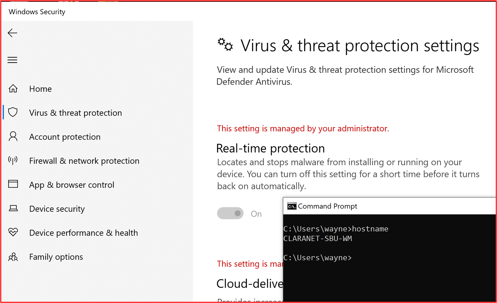
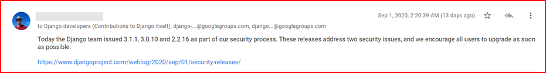
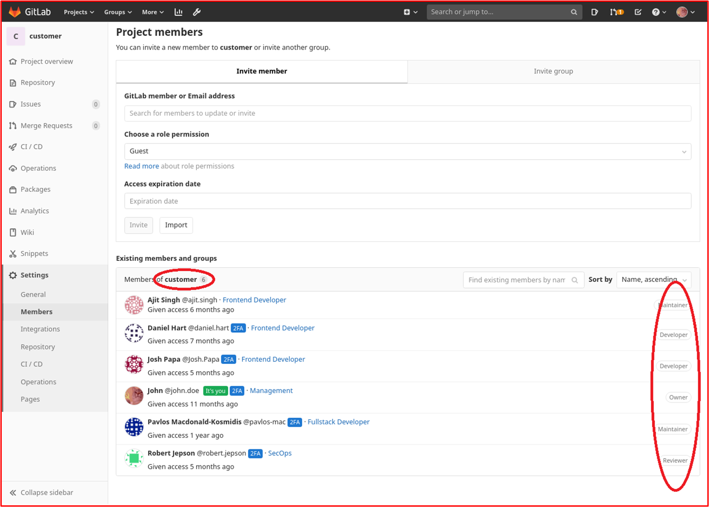
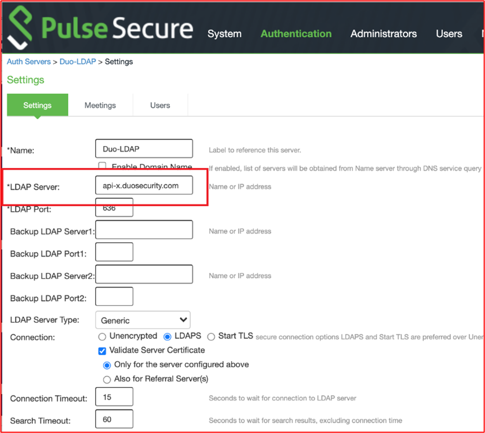
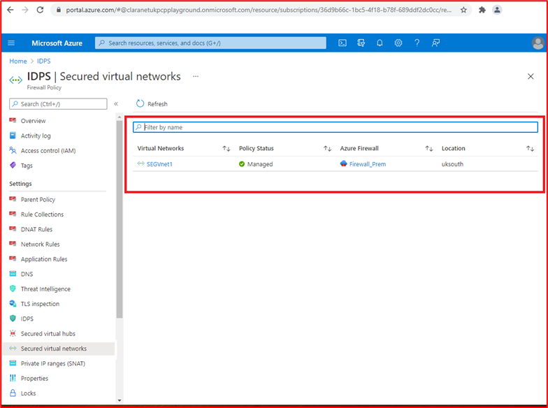
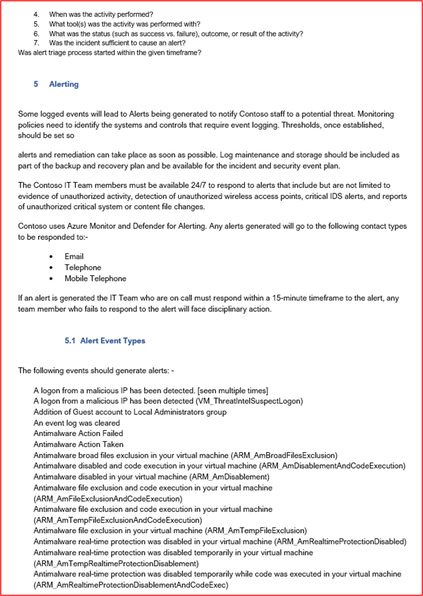
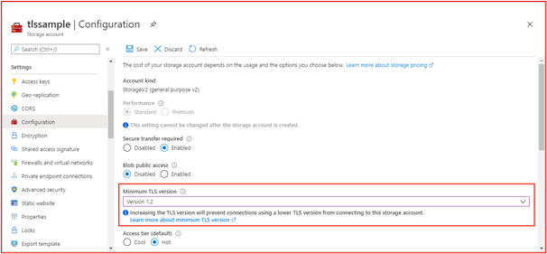
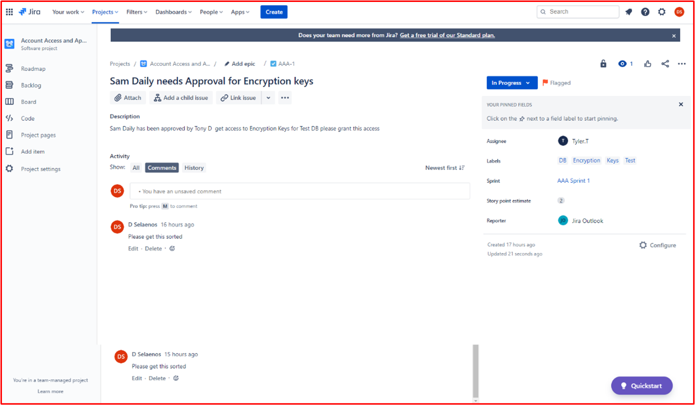
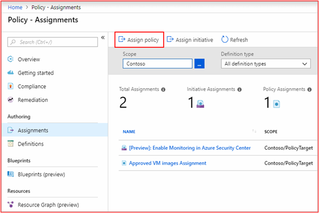

# Microsoft 365认证 - 示例证据指南

## 概述

本指南的创建是为了向 ISV 提供每个Microsoft 365认证控件所需的证据类型和详细级别的示例。 本文档中共享的任何示例并不表示唯一可用于证明满足控件的证据，而只是作为所需证据类型的准则。 

请注意：用于满足要求的实际接口、屏幕截图和文档将因产品使用、系统设置和内部流程而异。 此外，请注意，如果需要策略或过程文档，则需要 ISV 发送实际文档，而不是屏幕截图，如某些示例中所示。 

认证中有两个部分需要提交：
1. [**初始文档提交：**](../docs/initialdocumentsubguide.md) 确定评估范围所需的一小组高级文档。
1. **证据提交：** 认证评估范围内每个控件所需的完整证据集。 

## 结构 

本文档直接映射到在合作伙伴中心认证期间将显示的控件。 本文档中提供的指南详述如下：
- 安全域：所有控件分组到的三个安全域：应用程序安全性、操作安全性以及数据安全和隐私。
- 控制 () ： = 评估活动说明 - 这些控件 () 和关联编号 (No.) 直接从Microsoft 365认证清单中获取。  
- 意向：= 将安全控制包含在程序中的原因及其旨在缓解的特定风险的意向。  希望这些信息能为 ISV 提供控件背后的推理，以便更好地了解需要收集的证据类型，以及 ISV 在提供证据时必须注意和了解哪些证据。
- 示例证据指南：= 为了帮助指导Microsoft 365认证清单电子表格上的证据收集任务，这使 ISV 能够清楚地看到证书分析员可以使用的证据类型的示例，这些证据类型将使用它来自信地确定控件已就位并维护，这绝不是详尽无遗的。
- 证据示例：= 本部分提供针对Microsoft 365认证清单电子表格中每个控件捕获的潜在证据的示例屏幕截图和图像，具体针对电子表格) 中的操作安全和数据安全和隐私安全域 (选项卡。 请记下示例中包含红色箭头和框的任何信息，以便进一步帮助你了解满足任何控件所需的要求。

## 安全域：应用程序安全性

**控件 1 - 控制 16**：

应用程序安全域控件可以满足在过去 12 个月内发布的渗透测试报告，显示你的应用没有未完成的漏洞。 唯一必需的提交是由一家信誉良好的独立公司提交的干净报告。 

## 安全域：操作安全性/安全开发

“操作安全/安全开发”安全域旨在确保 ISV 针对威胁执行者面临的大量威胁实施一组强大的安全缓解技术。  这旨在保护操作环境和软件开发过程，以构建安全的环境。

#### 恶意软件保护 - 防病毒

**控制号 1：** 提供管理防病毒做法和过程的策略文档。
- 意向：此控件的目的是评估 ISV 在考虑计算机病毒威胁时所面临问题的理解。 通过建立和使用行业最佳做法来制定防病毒政策和流程，ISV 提供了一个资源，根据组织缓解恶意软件所面临的风险的能力，列出了病毒检测和消除方面的最佳做法，并提供了证据，证明记录的策略为组织及其员工提供了建议的安全指导。 通过记录 ISV 如何部署反恶意软件的策略和过程，这可确保此技术在降低环境中恶意软件风险方面持续推出和维护。

- 示例证据指南：提供防病毒/反恶意软件策略的副本，详细说明在基础结构中实现的流程和过程，以推广防病毒/恶意软件最佳做法。
示例证据

- 示例证据：

**注意：** 此屏幕截图显示了策略/流程文档，预期 ISV 共享实际的支持策略/过程文档，而不只是提供屏幕截图。

**控件 2：** 提供可证明的证据，证明防病毒软件正在所有采样的系统组件中运行。

- 意向：请务必让反病毒 (AV)  (或反恶意软件防御) 在你的环境中运行，以防止网络安全风险，你可能知道，也可能不知道，因为潜在的破坏性攻击在复杂性和数量上都在增加。 将 AV 部署到支持其使用的所有系统组件，将有助于缓解环境中引入反恶意软件的一些风险。 只需要一个终结点才能不受保护，从而可能为威胁执行组件提供攻击向量，从而在环境中站稳脚跟。 因此，应将 AV 用作多种防御层之一，以防止此类威胁。

- 示例证据准则：用于证明 AV 的活动实例正在评估环境中运行。 为示例中支持使用防病毒的 _每个设备_ 提供屏幕截图，该屏幕截图显示防病毒进程正在运行、防病毒软件处于活动状态，或者如果你有一个针对防病毒的集中管理控制台，则你也许能够从该管理控制台进行演示。 如果使用管理控制台，请确保在屏幕截图中证明采样的设备已连接并正常工作。

- 证据示例 1：以下屏幕截图已从Azure 安全中心中获取;它显示已在名为 MSPGPRODAZUR01&quot; 的 &quot;VM 上部署了反恶意软件扩展。

- 证据示例 2

下面的屏幕截图已从Windows 10设备中获取，显示&quot;为主机名 &quot;CLARANET-SBU-WM&quot; 启用了实时保护&quot;。

**控件 3：** 提供可证明的证据，证明防病毒签名在) 1天内 (的所有环境中都是最新的。

- 意向：每天标识数十万个新的恶意软件和可能不需要的应用程序 (PUA) 。 若要针对新发布的恶意软件提供充分的保护，需要定期更新 AV 签名，以考虑新发布的恶意软件。

- 此控件的存在是为了确保 ISV 已考虑到环境的安全性以及过时的 AV 对安全性的影响。

- 示例证据指南：提供来自每个采样设备的防病毒日志文件，显示每天应用更新。

- 示例证据：以下屏幕截图显示 Microsoft Defender 通过显示&#39;事件 2000（Windows Defender&#39;即更新）每天更新。 显示主机名，显示这是从范围内系统 &quot;CLARANET-SBU-WM&quot; 获取的。

**注意：** 提供的证据需要包括日志的导出，以便在更长的时间段内显示每日更新。 某些防病毒产品将生成更新日志文件，因此应提供这些文件或从事件查看器导出日志。

**控件 4：** 提供可证明的证据，证明防病毒已配置为对所有采样的系统组件执行访问扫描或定期扫描。

**注意：** 如果未启用访问扫描，则必须至少启用每日扫描和 **alerting__be。**

- 意向：此控件的目的是确保快速识别恶意软件，以最大程度地降低这可能对环境的影响。 在进行访问扫描并自动阻止恶意软件的情况下，这将有助于阻止防病毒软件已知的恶意软件感染。 如果由于出现导致服务中断的误报风险而&#39;不需要访问扫描，则需要实施适当的每日 (或更多) 扫描和警报机制，以确保及时响应恶意软件感染，以最大程度地减少损害。

- 示例证据指南：为示例中支持防病毒的 _每个设备_ 提供屏幕截图，显示防病毒在设备上运行，并配置为访问 (实时扫描) 扫描， **或** 提供屏幕截图，显示为每日扫描启用了定期扫描、配置了警报以及示例中 _每个设备_ 的最后一个扫描日期。

- 示例证据：以下屏幕截图显示为主机 &quot;CLARANET-SBU-WM&quot; 启用了实时保护。

**控件 5：** 提供可证明的证据，证明防病毒已配置为自动阻止所有采样系统组件中的恶意软件或隔离和警报。

- 意图：恶意软件的复杂性随着它们可能带来的不同程度的破坏而不断演变。 此控件的目的是阻止恶意软件执行，从而阻止其执行其潜在的破坏性有效负载，或者，如果自动阻止不是选项，则通过发出警报并立即响应潜在的恶意软件感染，限制恶意软件可能造成破坏的时间。

- 示例证据指南：为示例中支持防病毒的 _每个设备_ 提供屏幕截图，显示防病毒正在计算机上运行，并配置为自动阻止恶意软件、警报或隔离和警报。

- 示例证据 1：以下屏幕截图显示主机 &quot;CLARANET-SBU-WM&quot; 配置了针对Microsoft Defender 防病毒的实时保护。 如设置所示，这将查找并阻止恶意软件在设备上安装或运行。

**控件 6：** 提供可证明的证据，证明应用程序在部署前已获得批准。

- 意向：通过应用程序控制，组织将批准允许在操作系统上运行的每个应用程序/进程。 此控件的目的是确保已完成审批过程，以授权哪些应用程序/进程可以运行。

- 示例证据准则：可以提供证据，表明正在遵循审批过程。 这可以通过已签名的文档、在更改控制系统中跟踪或使用类似Azure DevOps或 JIRA 来跟踪这些请求和授权来提供。

- 示例证据：以下屏幕截图演示了管理层的批准，即允许在环境中运行的每个应用程序都遵循审批过程。 这是 Contoso 中基于纸张的过程，但可以使用其他机制。

**控件 7：** 提供可证明的证据，证明存在并维护了具有业务理由的已批准应用程序的完整列表。

- 意向：组织必须保留已批准的所有应用程序的列表，以及应用程序/流程获得批准的原因。 这将有助于确保配置保持最新状态，并且可以根据基线进行审核，以确保未配置未经授权的应用程序/进程。

- 示例证据指南：提供已记录的已批准应用程序/流程列表以及业务理由。

- 示例证据：以下屏幕截图列出了具有业务理由的已批准应用程序。

**注意：** 此屏幕截图显示了一个文档，期望 ISV 共享实际的支持文档，而不是简单地提供屏幕截图。

**控件 8：** 提供相关支持文档，详细说明应用程序控制软件配置为满足特定的应用程序控制机制。

- 意向：应记录应用程序控制技术的配置以及如何维护技术的过程，即添加和删除应用程序/进程。 作为本文档的一部分，应详细介绍每个应用程序/进程使用的机制类型。 这会馈送到下一个控件中，以确保根据所述配置技术。

- 示例证据指南：提供支持文档，详细说明如何设置应用程序控制，以及如何在技术中配置每个应用程序/进程。

- 示例证据：以下屏幕截图列出了用于实现应用程序控件的控制机制。 下面可以看到，1 个应用正在使用证书控件，其他应用正在使用文件路径。

**注意：** 此屏幕截图显示了一个文档，期望 ISV 共享实际的支持文档，而不是简单地提供屏幕截图。

**控件 9：** 提供可证明的证据，证明应用程序控件是根据所有采样系统组件中所述进行配置的。

- 意向：其目的是验证是否根据文档在示例中配置了应用程序控件。

- 示例证据指南：为示例中的 _每个设备_ 提供屏幕截图，以显示其已配置和激活应用程序控件。 这应显示计算机名称、它们所属的组，以及应用于这些组和计算机的应用程序控制策略。

- 证据示例：以下屏幕截图显示了启用了软件限制策略的组策略对象。

下一张屏幕截图显示了与上述控件一致的配置。

下一个屏幕截图显示了 M365 环境和应用到此 GPO 对象&#39;域计算机设置&#39;范围内包含的计算机。

最后一张屏幕截图显示了在上面的屏幕截图中的 OU 内的范围内服务器 &quot;DBServer1&quot; 。

### 修补程序管理 - 风险排名

安全漏洞的快速识别和修正有助于最大程度地降低威胁参与者危害环境或应用程序的风险。 修补程序管理分为两个部分：风险排名和修补。 这三个控件涵盖安全漏洞的识别，并根据它们构成的风险对其进行排名。

此安全控制组适用于平台即服务 (PaaS) 托管环境，因为应用程序/外接程序第三方软件库和代码库必须根据风险排名进行修补。

**控件 10：** 提供策略文档，用于控制如何识别和分配新的安全漏洞并分配风险分数。

- 意向：此控件的目的是提供支持文档，以确保快速识别安全漏洞，以减少威胁执行者必须利用这些漏洞的机会窗口。 需要建立可靠的机制来识别涵盖组织正在使用的所有系统组件的漏洞;例如， (Windows服务器、Ubuntu 等) 的操作系统、Tomcat、MS Exchange、SolarWinds 等 (应用程序) 、AngularJS、jQuery 等代码依赖 (项) 。 组织不仅需要确保及时识别资产中的漏洞，还需要相应地对任何漏洞进行排名，以确保根据漏洞带来的风险在适当的时间范围内进行修正。

**注意** 即使你在纯平台即服务环境中运行，你仍有责任识别代码库中的漏洞：即第三方库。

- 示例证据指南：提供支持文档 (而不是屏幕截图) 

- 示例证据：此屏幕截图显示了风险排名策略的代码片段。

**注意：** 此屏幕截图显示了策略/流程文档，期望 ISV 共享实际的支持策略/过程文档，而不只是提供screenshot._

**控件 11：** 提供如何识别新安全漏洞的证据。

- 意向：此控件的目的是确保遵循此过程，并且它&#39;足够强大，能够识别整个环境中的新安全漏洞。 这可能不只是操作系统;它可能包括在环境中运行的应用程序和任何代码依赖项。

- 示例证据指南：可以通过显示邮件列表订阅的方式提供证据，手动查看安全源以了解新发布的漏洞， (需要使用活动的时间戳（即 JIRA 或 Azure DevOps) ）进行充分跟踪，例如，查找过期软件 (的工具在查找过时的软件库时可能是 Snyk， 或者可以是 Nessus，使用经过身份验证的扫描来识别过期的 software.) 。

**注意** 如果使用 Nessus，则需要定期运行此操作以快速识别漏洞。 我们建议至少每周一次。

- 示例证据：此屏幕截图演示正在使用邮件组来通知安全漏洞。

**控件 12：** 提供证据，证明所有漏洞在标识后都分配了风险排名。

- 意向：修补需要基于风险，漏洞风险越大，需要修正的速度越快。 标识的漏洞的风险排名是此过程不可或缺的一部分。 此控件的目的是确保遵循记录的风险排名过程，以确保根据风险适当地对所有已识别的漏洞进行排名。 组织通常利用 CVSS (供应商或安全研究人员提供的常见漏洞评分系统) 分级。 建议如果组织依赖于 CVSS，则过程中会包含重新排名机制，以便组织能够根据内部风险评估更改排名。 有时，由于应用程序在环境中的部署方式，漏洞可能不是应用程序。 例如，可能会释放 Java 漏洞，从而影响组织未使用的特定库。

- 示例证据准则：通过屏幕截图或其他方式（例如，DevOps/Jira）提供证据，这说明漏洞正在经历风险排名过程，并由组织分配适当的风险排名。

- 示例证据：此屏幕截图显示在列 D 中发生的风险排名，并在组织执行风险评估并确定风险可以降级时在 F 列和 G 列中重新排名。 需要提供重新排名风险评估的证据作为支持证据

### 修补程序管理 - 修补

以下控件适用于 Patch Management 的修补元素。 若要维护安全的操作环境，必须适当修补应用程序/加载项和支持系统。 需要管理识别 (或公开发布) 和修补之间的适当时间范围，以减少威胁行为者利用漏洞的机会窗口。 Microsoft 365认证没有规定&#39;修补时段&#39;，但认证分析师将拒绝不合理的时间范围。

此安全控制组适用于平台即服务 (PaaS) 托管环境，因为应用程序/外接程序第三方软件库和代码库必须根据风险排名进行修补。

**控件 13：** 提供有关修补范围内系统组件的策略文档，其中包括针对关键、高和中等风险漏洞的适当最小修补时间范围;并解除任何不受支持的操作系统和软件的授权。

- 意向：许多安全合规性框架（例如 PCI-DSS、ISO 27001、NIST (SP) 800-53）都需要修补程序管理。 不能过分强调良好的修补程序管理的重要性，因为它可以纠正软件、固件和缓解漏洞的安全和功能问题，从而有助于减少开发机会。 此控件的目的是尽量减少威胁执行组件必须利用范围内环境中可能存在的漏洞的机会窗口。

- 示例证据准则：提供详细介绍修补程序管理过程的所有策略和过程的副本。 这应包括最小修补窗口中的一个部分，并且环境中不得使用不受支持的操作系统和软件。

- 示例证据：下面是一个示例策略文档。

**注意：** 此屏幕截图显示了策略/流程文档，期望 ISV 共享实际的支持策略/过程文档，而不只是提供screenshot._

**控件 14：** 提供可证明的证据，证明所有采样的系统组件正在修补。

**注意：** 包括任何软件/第三方库。

- 意向：修补漏洞可确保构成信息技术基础结构一部分的不同模块 (硬件、软件和服务) 保持最新状态，不受已知漏洞影响。 需要尽快进行修补，以最大程度地减少漏洞详细信息发布和修补之间的安全事件的可能性。 更关键的是，在野外利用已知的漏洞。

- 示例证据指南：提供示例中 _每个设备_ 的屏幕截图和支持软件组件，显示修补程序是按照记录的修补过程安装的。

- 示例证据：以下屏幕截图显示，作用域内系统组件 &quot;CLARANET-SBU-WM&quot; 正在按照修补策略执行Windows更新。

**注意：** 修补所有范围内的系统组件需要提供证据。 这包括诸如;OS 更新、应用程序/组件更新 (i.e__.、_ _Apache Tomcat、OpenSSL 等) 、软件依赖项 (例如 JQuery、AngularJS 等) 等。_

**控件 15：** 提供可证明的证据，证明环境中未使用任何不受支持的操作系统和软件组件。

- 意向：供应商不维护的软件将加班加点，并遭受未修复的已知漏洞。 因此，不得在生产环境中使用不受支持的操作系统和软件组件。

- 示例证据指南：提供示例中 _每个设备_ 的屏幕截图，其中显示了运行 (的 OS 版本，包括屏幕截图) 中的服务器&#39;名称。 除此之外，还提供在环境中运行的软件组件正在运行受支持版本的证据。 这可以通过提供内部漏洞扫描报告的输出来实现， (提供经过身份验证的扫描) 和/或检查第三方库（如 [Snyk](https://snyk.io/)、 [Trivy](https://github.com/aquasecurity/trivy) 或 [NPM 审核](https://docs.npmjs.com/cli/v7/commands/npm-audit)）的工具的输出。 如果仅在 PaaS 中运行，则修补控制组仅需要涵盖第三方库修补。

- 示例证据：以下证据表明，范围内系统组件 THOR 正在运行供应商支持的软件，因为 Nessus&#39;未标记任何问题。

**注意：** 完整的报表必须与认证分析师共享。

- 示例证据 2

此屏幕截图显示范围内的系统组件 &quot;CLARANET-SBU-WM&quot; 在受支持的Windows版本上运行。

- 示例证据 3

以下屏幕截图是 [Trivy](https://github.com/aquasecurity/trivy) 输出，完整报表不&#39;列出任何不受支持的应用程序。

**注意：** 完整的报表必须与认证分析师共享。

### 漏洞扫描

通过引入定期的漏洞评估，组织可以检测其环境中的弱点和不安全感，这些弱点和不安全感可能会为恶意参与者提供危害环境的入口点。 漏洞扫描有助于识别环境中缺失的修补程序或配置错误。 通过定期进行这些扫描，组织可以提供适当的补救措施，以最大程度地降低因这些漏洞扫描工具通常遇到的问题而导致的入侵风险。

**控件 16：** 提供季度基础结构和 Web 应用程序漏洞扫描报告。 需要针对整个公共占用情况进行扫描， (IP 地址和 URL) 和内部 IP 范围。

**注意：** 这 **必须** 包括环境的完整范围。

- 意向：漏洞扫描查找组织计算机系统、网络和 Web 应用程序中可能存在的弱点，以确定可能导致安全漏洞和敏感数据泄露的漏洞。 漏洞扫描通常需要行业标准和政府法规，例如 PCI DSS (支付卡行业数据安全标准) 。

- 安全指标的一份题为《 &quot;[2020 年 PCI DSS 合规性](https://info.securitymetrics.com/pci-guide-2020)&quot; 安全指标指南》的报告指出，&#39;从发现组织存在漏洞到攻击者入侵系统所用的时间平均需要 166 天。 一旦遭到入侵，攻击者平均可访问敏感数据 127 天&#39;因此，此控件旨在识别范围内环境中的潜在安全漏洞。

- 示例证据指南：为过去 12 个月执行的每个季度&#39;漏洞扫描提供完整扫描报告 () 。 报表应明确说明目标，以验证是否包含完整的公共占用空间，并在适用的情况下，指定每个内部子网。 为 **每个** 季度提供 **所有** 扫描报告。

- 示例证据：示例证据是提供正在使用的扫描工具的扫描报告。 应为每个季度提供&#39;扫描报告以供审阅。 扫描需要包括整个环境的系统组件，因此;环境可用的每个内部子网和每个公共 IP 地址/URL。

**控件 17：** 提供可证明的证据，证明根据记录的修补时间范围修补了在漏洞扫描期间识别的漏洞的修正。

- 意向：如果无法快速识别、管理和修正漏洞和错误配置，可能会增加组织&#39;导致潜在数据泄露的泄露风险。 正确识别和修正问题对于组织&#39;整体安全状况和环境非常重要，这符合各种安全框架的最佳做法：例如 ISO 27001 和 PCI DSS。

- 示例证据指南： (提供合适的项目，例如，屏幕截图) 显示漏洞扫描中发现的漏洞示例已根据上面的 Control 13 中提供的修补窗口进行修正。

- 示例证据：以下屏幕截图显示了 2021 年 8 月 2 日此示例中名为 &quot;THOR&quot;) 的单台计算机 (范围内环境的 Nessus 扫描，其中显示了漏洞。

以下屏幕截图显示问题已解决，2 天后，即在修补策略中定义的修补窗口内。

**注意：** 对于此控制，认证分析师需要查看过去 12 个月中每个季度的漏洞扫描报告和修正。

### 防火墙

防火墙通常在受信任的 (内部网络) 、不受信任的 (Internet) 和半受信任的 (DMZ) 环境之间提供安全边界。 这些通常是组织深入防御安全策略中的第一条防线，旨在控制入口和出口服务的流量流，并阻止不需要的流量。 这些设备必须受到严格控制，以确保它们有效运行，并且不会配置错误，从而使环境面临风险。

**控件 18：** 提供管理防火墙管理做法和过程的策略文档。

- 意向：防火墙是分层安全 (深层防御) 策略中的重要第一道防线，可保护环境免受受信任度较低的网络区域的侵害。 防火墙通常会基于 IP 地址和协议/端口控制流量流，功能更丰富的防火墙还可以通过检查应用程序流量来提供额外的 &quot;应用程序层&quot; 防御，以防范基于所访问的应用程序的滥用、漏洞和威胁。 这些保护仅与防火墙的配置一样好，因此需要制定强有力的防火墙策略和支持程序，以确保配置它们以提供对内部资产的充分保护。 例如，包含允许从任意源到 ANY 目标的所有流量的规则的防火墙只是充当路由器。

- 示例证据指南：提供完整的防火墙策略/过程支持文档。 本文档应涵盖以下所有要点以及适用于环境的任何其他最佳做法。

- 示例证据：下面是我们需要的防火墙策略文档类型的示例 (这是一个演示，可能无法完成) 。

**控件 19：** 提供明显的证据，证明在安装到生产环境中之前，任何默认管理凭据都已更改。

- 意向：组织需要注意供应商提供的默认管理凭据，这些凭据是在设备或软件的配置过程中配置的。 默认凭据通常由供应商公开提供，并且可以为外部威胁执行组件提供破坏环境的机会。 例如，在 Internet 上简单搜索默认 iDrac (集成的 Dell 远程访问控制器) 凭据将突出显示 _root：：calvin_ 作为默认用户名和密码。 这会使某人能够远程访问远程服务器管理。 此控件的目的是确保环境不会受到设备/应用程序强化期间未更改的默认供应商凭据的攻击。

- 示例证据准则

- 可以在屏幕共享会话中证明这一点，认证分析师可以尝试使用默认凭据对范围内的设备进行身份验证。

- 示例证据

下面的屏幕截图显示了认证分析师将从 WatchGuard 防火墙的无效用户名/密码中看到的内容。

**控件 20：** 提供明显的证据，证明防火墙安装在范围内环境的边界上，并在外围网络 (（也称为 DMZ、非军事区）和筛选的子网之间安装，) 和内部受信任的网络。

- 意向：防火墙提供控制不同安全级别的不同网络区域之间的流量的功能。 由于所有环境都已连接 Internet，因此需要在边界（即 Internet 和范围内环境之间）上安装防火墙。 此外，需要在不受信任的 DMZ (非军事化区域) 网络和内部受信任网络之间安装防火墙。 DMZ 通常用于为来自 Internet 的流量提供服务，因此是攻击目标。 通过实现 DMZ 并使用防火墙控制流量流，DMZ 的入侵&#39;不一定意味着内部受信任网络和企业/客户数据的泄露。 应有足够的日志记录和警报，以帮助组织快速确定妥协方案，以最大程度地减少威胁执行者进一步破坏内部受信任网络的机会。 此控件的目的是确保受信任网络和受信任度较低的网络之间有足够的控制。

- 示例证据指南：证据应通过防火墙配置文件或屏幕截图提供，以证明 DMZ 已就绪。 这应该与提供的体系结构图相匹配，这些图表演示了支持环境的不同网络。 防火墙上网络接口的屏幕截图，加上作为初始文档提交一部分提供的网络关系图应提供此证据。

- 示例证据：下面是一个 WatchGuard 防火墙的屏幕截图，其中演示了两个 DMZ，一个用于名为 DMZ) 的入站服务 (，另一个用于提供 jumpbox (Bastian 主机) 。

**控件 21：** 提供明显的证据，证明所有公共访问在非军事区 (DMZ) 中终止。

- 意向：可公开访问的资源可受到大量攻击。 如上所述，DMZ 的目的是从可能包含敏感数据的受信任的内部网络中分段受信任的网络。 DMZ 被认为不太受信任，因为可公开访问的主机极有可能被外部威胁行为者入侵。 公共访问应始终在这些受信任度较低的网络中终止，这些网络由防火墙进行充分分段，以帮助保护内部资源和数据。 此控制的目的是确保这些受信任较低的 DMZ 中的所有公共访问终止，就好像受信任的内部网络上的资源是公开面对的一样，这些资源的泄露为威胁参与者提供了在保存敏感数据的网络中的立足点。

- 示例证据准则

- 为此提供的证据可能是防火墙配置，这些配置显示入站规则以及这些规则终止的位置，方法是将公共 IP 地址路由到资源，或者提供入站流量的 NAT (网络地址转换) 。

- 示例证据

在下面的屏幕截图中，有三个传入规则，每个规则向 10.0.3.x 和 10.0.4.x 子网（即 DMZ 子网）显示 NAT

**控件 22：** 提供明显的证据，证明通过防火墙允许的所有流量都经过审批过程。

- 意向：由于防火墙是不受信任的流量和内部资源之间以及不同信任级别的网络之间的防御屏障，因此需要安全地配置防火墙，并确保仅启用业务运营所需的流量。 通过允许不必要的流量流或过于宽松的流量流，这可能会在这些各种网络区域的边界的防御中造成弱点。 通过为所有防火墙更改建立可靠的审批流程，可以降低引入给环境带来重大风险的规则的风险。 Verizon&#39;的 [2020 年数据泄露调查报告](https://enterprise.verizon.com/en-gb/resources/reports/dbir/) 强调， &quot;错误&#39;（包括错误配置）是唯一一种逐年持续增长的&quot;操作类型。

- 示例证据指南：证据可以是文档形式，其中显示了已授权的防火墙更改请求，这可能是 CAB (更改顾问委员会) 会议或更改控制系统跟踪所有更改的分钟数。

- 示例证据：以下屏幕截图显示了使用基于纸张的进程请求和授权的防火墙规则更改。 例如，这可以通过DevOps或 Jira 之类的内容来实现。

**控件 23：** 提供明显的证据，证明防火墙规则基础配置为删除未显式定义的流量。

- 意向：大多数防火墙将以自上而下的方法处理规则，以尝试查找匹配的规则。 如果规则匹配，则将应用该规则的操作，并且将停止对规则的所有进一步处理。 如果找不到匹配规则，则默认情况下会拒绝流量。 此控件的意图是，如果在未找到匹配规则的情况下，防火墙&#39;不默认删除流量，则规则基础必须包括&quot;所有防火墙列表末尾的“拒绝 **所有**&quot;”规则。 这是为了确保防火墙在处理规则时&#39;不会默认为默认允许状态，从而允许未显式定义&#39;流量。

- 示例证据准则：可以通过防火墙配置或屏幕截图提供证据，这些屏幕截图显示末尾显示“ &quot;拒绝所有规则”&quot; 的所有防火墙规则，或者如果防火墙删除默认情况下&#39;与规则不匹配的流量，则提供所有防火墙规则的屏幕截图和指向供应商管理指南的链接，其中突出显示默认情况下，防火墙将删除所有不匹配的流量。

- 示例证据：下面是 WatchGuard 防火墙规则基的屏幕截图，其中演示了未将任何规则配置为允许所有流量。 末尾没有拒绝规则，因为 WatchGuard 会删除默认情况下&#39;不匹配的流量。

以下 WatchGuard 帮助中心链接; [https://www.watchguard.com/help/docs/help-center/en-US/Content/en-US/Fireware/policies/policies\_about\_c.html](https://www.watchguard.com/help/docs/help-center/en-US/Content/en-US/Fireware/policies/policies_about_c.html) 包括以下信息：

**控件 24：** 提供明显的证据，证明防火墙仅支持所有非控制台管理接口上的强加密。

- 意向：为了缓解管理流量的中间人攻击，所有非控制台管理接口都应仅支持强加密。 此控件的主要目的是在设置非控制台连接时保护管理凭据。 此外，这还有助于防止窃听连接，尝试重播管理函数以重新配置设备或作为侦查的一部分。

- 示例证据准则：如果配置提供非控制台管理接口的加密配置，则提供防火墙配置 (并非所有设备都会将此配置作为可配置选项) 。 如果未在配置中&#39;，则可以向设备发出命令，以显示为这些连接配置的内容。 某些供应商可能会在文章中发布此信息，因此，这也是证明此信息的一种方式。 最后，可能需要运行工具来输出支持的加密。

- 示例证据：以下屏幕截图显示了针对 TCP 端口 8080 上的 WatchGuard 防火墙的 Web 管理接口的 [SSLScan](https://github.com/rbsec/sslscan) 输出。 这会显示具有 AES-128 位最小加密密码的 TLS 1.2 或更高版本。

**注意**：WatchGuard 防火墙还支持使用 SSH (TCP 端口 4118) 和 WatchGuard System Manager (TCP 端口 4105 &amp; 4117) 的管理功能。 还需要提供这些非控制台管理接口的证据。

**控件 25：** 提供可证明的证据，证明你至少每 6 个月执行一次防火墙规则评审。

- 意向：随着时间的推移，具有作用域内环境的系统组件中存在配置爬行的风险。 这通常会导致不安全或配置错误，这可能会增加对环境造成危害的风险。 由于许多原因（例如，临时更改以帮助故障排除、临时更改即席功能更改）可以引入配置爬行，以便为有时由于引入快速修复的压力而过于宽松的问题引入快速修复。 例如，可以引入临时防火墙规则 &quot;“允许所有&quot; ”来克服紧急问题。 此控件的意图是双重的，一是确定哪些错误配置可能会导致不安全，第二是帮助识别不再需要的防火墙规则，因此，如果服务已停用，但防火墙规则已保留，则可以将其删除。

- 示例证据准则：证据需要能够证明审查会议已经发生。 这可以通过共享防火墙审查的会议分钟数和任何其他更改控制证据来完成，这些证据显示从审查中执行的任何操作。 确保日期存在，因为我们&#39;需要至少看到其中两个会议 (，即每六个月) 

- 示例证据：以下屏幕截图显示了 2021 年 1 月发生防火墙审查的证据。

以下屏幕截图显示了 2021 年 7 月进行防火墙审查的证据。

### 防火墙 - WAF

将Web 应用程序防火墙 (WAF) 部署到解决方案中是可选的。 如果使用 WAF，则这算作&#39;操作安全&#39;安全域内评分矩阵的额外额度。 WAF 可以检查 Web 流量，以筛选和监视 Internet 和已发布的 Web 应用程序之间的 Web 流量，以确定特定于 Web 应用程序的攻击。 Web 应用程序可能会遭受许多特定于 Web 应用程序的攻击，例如SQL注入 (SQLi) 、跨站点脚本 (XSS) 、跨站点请求伪造 (CSRF/XSRF) 等，WAF 旨在防范这些类型的恶意有效负载，以帮助保护 Web 应用程序免受攻击和潜在入侵。

**控件 26：** 提供可证明的证据，证明Web 应用程序防火墙 (WAF) 配置为主动监视、警报和阻止恶意流量。

- 意向：此控件可用于确认所有传入 Web 连接的 WAF 已就绪，并且已将其配置为阻止或警报恶意流量。 若要为 Web 流量提供额外的防御层，需要为所有传入的 Web 连接配置 WAF，否则，外部威胁执行组件可以绕过设计为提供此附加保护层的 WAF。 如果未将 WAF&#39;配置为主动阻止恶意流量，则 WAF 需要能够立即向能够快速应对潜在恶意流量的工作人员发出警报，以帮助维护环境安全并停止攻击。

- 示例证据指南：提供 WAF 的配置输出，其中突出显示了正在服务的传入 Web 连接，并且配置会主动阻止恶意流量或正在监视和警报。 或者，可以共享特定设置的屏幕截图，以演示组织是否满足此控件。

- 示例证据：以下屏幕截图显示启用了 Contoso 生产Azure 应用程序网关 WAF 策略，并将其配置为&#39;预防&#39;模式，该模式会主动删除恶意流量。

下面的屏幕截图显示了前端 IP 配置

**注意：** 证据应证明环境使用的所有公共 IP 以确保涵盖所有入口点，这也是此屏幕截图也包含的原因。

下面的屏幕截图显示了使用此 WAF 的传入 Web 连接。

以下屏幕截图显示了 ContosoAppGWCoreRules\_\_，显示这是针对 api.contoso.com 服务的。

**控件 27：** 提供可证明的证据，证明 WAF 支持 SSL 卸载。

- 意向：将 WAF 配置为支持 SSL 卸载的功能非常重要，否则 WAF 将无法检查 HTTPS 流量。 由于这些环境需要支持 HTTPS 流量，因此对于 WAF 来说，这是一个关键功能，以确保能够识别和停止 HTTPS 流量中的恶意有效负载。

- 示例证据准则：通过配置导出或屏幕截图提供配置证据，其中显示支持和配置 SSL 卸载。

- 示例证据：在Azure 应用程序网关中，配置启用了 SSL 侦听器的 SSL 卸载，请参阅具有 应用程序网关 Microsoft 文档页[的 TLS 终止和端到端 TLS 概述](/azure/application-gateway/ssl-overview)。 以下屏幕截图显示了为 Contoso 生产Azure 应用程序网关配置的屏幕截图。

**控件 28：** 根据 OWASP 核心规则集 (3.0 或 3.1) 提供可证明的证据，证明 WAF 可以防范某些或所有以下类别的漏洞：
- 协议和编码问题，
- 标头注入、请求走私和响应拆分，
- 文件和路径遍历攻击，
- 远程文件包含 (RFI) 攻击，
- 远程代码执行攻击，
- PHP 注入攻击，
- 跨站点脚本攻击，
- SQL注入攻击，
- 会话修复攻击。

- 意向：需要将 WAF 配置为标识常见漏洞类的攻击有效负载。 此控件旨在通过利用 OWASP 核心规则集来确保充分检测漏洞类。

- 示例证据指南：通过配置导出或屏幕截图提供配置证据，表明扫描涵盖了上面标识的大多数漏洞类。

- 示例证据：以下屏幕截图显示，Contoso 生产Azure 应用程序网关 WAF 策略配置为针对 OWASP 核心规则集 3.2 进行扫描。

### 更改控件

建立和理解的更改控制过程对于确保所有更改都经过可重复的结构化过程至关重要。 通过确保所有更改都经过结构化过程，组织可以确保更改在注销前得到有效管理、对等评审和充分测试。 这不仅有助于最大程度地降低系统中断的风险，还有助于通过引入不当的更改，最大程度地降低潜在安全事件的风险。

**控件 29：** 提供管理更改控制过程的策略文档。

- 意向：若要维护安全的环境和安全的应用程序，必须建立可靠的更改控制过程，以确保通过强有力的监督和定义的流程来执行所有基础结构和代码更改。 这可确保记录更改、考虑安全影响、考虑更改将产生哪些安全影响等。目的是确保记录更改控制过程，以确保对环境和应用程序开发实践中的所有更改采取安全且一致的方法。

- 示例证据准则：记录的更改控制策略/过程应与认证分析师共享。

- 示例证据：下面显示了示例更改管理策略的开始。 请提供完整的策略和过程作为评估的一部分。

**注意：** 此屏幕截图显示了策略/流程文档，预期 ISV 共享实际的支持策略/过程文档，而不只是提供屏幕截图。

**控件 30：** 提供可证明的证据，证明开发和测试环境强制将职责与生产环境分离。

- 意向：大多数组织&#39;开发/测试环境未配置为与生产环境相同的活力，因此安全性较低。 此外，不应在生产环境中进行测试，因为这可能会导致安全问题或对客户的服务交付有害。 通过维护强制职责分离的单独环境，组织可以确保将更改应用于正确的环境，从而通过对生产环境进行更改来降低针对开发/测试环境所做的更改，从而降低错误风险。

- 示例证据指南：可以提供屏幕截图，演示用于开发/测试环境和生产环境的不同环境。 通常，你将有不同的人员/团队可以访问每个环境，或者如果无法访问，则环境将利用不同的授权服务来确保用户不能错误地登录到错误的环境来应用更改。

- 示例证据：以下屏幕截图显示了 Contoso&#39;测试环境的 Azure 订阅。

下一张屏幕截图显示了 Contoso&#39;的单独 Azure 订阅&#39;生产&#39;环境。

**控件号 31：** 提供可证明的证据，证明在开发或测试环境中未使用敏感生产数据。

- 意向：如上所述，组织不会将开发/测试环境的安全措施实施到与生产环境相同的活力。 因此，通过在这些开发/测试环境中利用敏感的生产数据，可以增加泄露的风险，并且必须避免在这些开发/测试环境中使用实时/敏感数据。

**注意：** 可以在开发/测试环境中使用实时数据，前提是开发/测试包含在评估范围内，以便可以根据Microsoft 365认证控制来评估安全性。

- 示例证据准则：可以通过共享针对生产数据库的同一SQL查询输出的屏幕截图来提供证据， (编辑任何敏感信息) 和开发/测试数据库。 同一命令的输出应生成不同的数据集。 在存储文件时，查看两个环境中的文件夹内容还应演示不同的数据集。

- 示例证据：以下屏幕截图显示了提交证据 (的前 3 条记录，请从生产数据库提供前 20 个) 。

下一个屏幕截图显示了来自开发数据库的相同查询，其中显示了不同的记录。

这说明数据集不同。

**控件 32：** 提供可证明的证据，证明记录的更改请求包含更改的影响、回退过程的详细信息以及要执行的测试。

- 意向：此控件的目的是确保已对所请求的更改进行思考。 需要考虑并明确记录更改对系统/环境安全性的影响，如果出现问题，任何回退过程都需要是文档，以帮助恢复，最后还需要考虑和记录验证更改成功所需的测试详细信息。

- 示例证据准则：可以通过导出更改请求示例、提供纸张更改请求或提供更改请求的屏幕截图来提供证据，这些更改请求显示更改请求中保存的这三个详细信息。

- 示例证据：下图显示了一个新的跨站点脚本漏洞 (分配的 XSS) 和更改请求的文档。

下面的票证显示已设置或添加到票证中的信息，以便解析。

 

下面的两张票证显示了更改对系统的影响，以及出现问题时可能需要执行的任何退票过程。 可以看到更改和退回过程的影响已通过审批过程，并已获得测试批准。

在屏幕左侧，可以看到测试更改已获得批准，右侧显示更改现已获得批准和测试。

在整个过程中，请注意，执行该工作的人、报告该作业的人员以及批准要完成的工作的人员是不同的人。

上面的票证显示，更改现已获得批准以实现生产环境。 右侧框显示测试已成功运行，并且更改现已实现到 Prod 环境。

**控件号 33：** 提供可证明的证据，证明更改请求经过授权和注销过程。

- 意向：必须实施进程，禁止在未经适当授权的情况下进行更改并注销。 更改需要在实施之前获得授权，并且更改需要在完成后注销。 这可确保已正确审查更改请求，并且授权人员已注销更改。

- 示例证据准则：可以通过导出更改请求示例、提供纸张更改请求或提供更改请求的屏幕截图来提供证据，这些更改请求显示更改在实施之前已获授权，并且更改已在完成后已注销。

- 示例证据：下面的屏幕截图显示了一个示例 Jira 票证，该示例显示更改在由开发人员/请求者以外的人实施和批准之前需要获得授权。 可以看到此处的更改已获得有权限人员的批准。 右侧已由 DP 在完成后进行签名。

在下面的票证中，可以看到更改在完成后已注销，并显示作业已完成和关闭。

### 安全软件开发/部署

参与软件开发活动的组织往往面临着安全性与 TTM 之间的竞争优先级 (上市时间) 压力，但是，在整个软件开发生命周期内实施安全相关活动 (SDLC) 不仅可以节省资金，还能节省时间。 当安全性保留为事后考虑时，通常仅在 (DSLC) 的测试阶段确定问题，这通常会更耗时且成本更高。 此安全部分的目的是确保遵循安全的软件开发做法，以降低在开发的软件中引入编码缺陷的风险。 此外，本部分还希望包含一些可帮助安全部署软件的控件。

**控件号 34：** 提供支持安全软件开发和部署的策略和过程，包括针对常见漏洞类（例如 OWASP 前 10 名或 SANS 前 25 CWE）的安全编码最佳做法指南。

- 意向：组织需要尽其所能确保软件安全开发且不受漏洞影响。 为此，应建立可靠的安全软件开发生命周期 (SDLC) 和安全编码最佳做法，在整个软件开发过程中促进安全编码技术和安全开发。 目的是减少软件中漏洞的数量和严重性。

- 示例证据指南：提供记录的 SDLC 和/或支持文档，这些文档演示安全开发生命周期正在使用中，并为所有开发人员提供了该指南，以促进安全编码的最佳做法。 查看 [SDLC 中的 OWASP](https://owasp.org/www-project-integration-standards/writeups/owasp_in_sdlc/) 和 SAMM)  ([OWASP 软件保障成熟度模型](https://owaspsamm.org/model/) 。

- 示例证据：下面是 Contoso&#39;安全软件开发过程的提取，该过程演示了安全开发和编码做法。

**注意：** 这些屏幕截图显示了安全软件开发文档，期望 ISV 共享实际的支持文档，而不只是提供屏幕截图。

**控件 35：** 提供可证明的证据，证明代码更改由第二个审阅者进行审阅和授权过程。

- 意向：此控件的目的是由另一个开发人员执行代码评审，以帮助识别任何可能在软件中引入漏洞的编码错误。 应建立授权，以确保进行代码评审、进行测试等。 在部署之前。 授权步骤可以验证是否遵循了支持上述 SDLC 的正确进程。

- 示例证据指南：提供证据，证明代码经过对等评审，并且必须经过授权才能应用于生产环境。 此证据可能通过导出更改票证，表明代码评审已执行且已授权更改，也可以是通过代码评审软件（如 Crucible ([https://www.atlassian.com/software/crucible](https://www.atlassian.com/software/crucible)) ）。

- 示例证据

下面是一个票证，显示代码更改由原始开发人员以外的人进行评审和授权过程。 它显示被分配方已请求代码评审，并将分配给其他人进行代码评审。

下图显示代码评审已分配给原始开发人员以外的人，如下图右侧突出显示的部分所示。 在左侧，可以看到代码已审阅，代码审阅者提供了&#39;传递的代码审阅&#39;状态。

票证现在必须得到经理的批准，然后才能将更改放到实时生产系统上。

 上图显示已审核的代码已获得批准，可在实时生产系统上实施。

 完成代码更改后，最终作业将按上图所示进行注销。

请注意，在整个过程中涉及三个人，即代码的原始开发人员、代码审阅者和经理以给予批准和注销。 为了满足此控件的条件，预期您的票证将遵循此过程。 在代码评审的更改控制过程中，至少涉及三个人。

**控件号 36：** 提供可证明的证据，证明开发人员每年接受安全软件开发培训。

- 意向：所有编程语言都存在编码最佳做法和技术，以确保代码安全开发。 有一些外部培训课程旨在向开发人员讲授不同类型的软件漏洞类以及可用于停止将这些漏洞引入软件的编码技术。 此控件的目的是向所有开发人员教授这些技术，并确保不会忘记这些技术，或者通过每年执行此操作来学习较新的技术。

- 示例证据准则：通过由外部培训公司执行的证书或提供培训日记或其他项目屏幕截图（演示开发人员已参加培训）的方式提供证据。 如果这种培训是通过内部资源进行的，则还要提供培训材料的证据。

- 示例证据：下面是请求DevOps团队中的员工注册 OWASP 十大培训年度培训的电子邮件

下面显示了已请求具有业务理由和批准的培训。 随后是从培训中提取的屏幕截图和完成记录，显示该人员已完成年度培训。

**控件 37：** 提供可证明的证据，证明代码存储库通过多重身份验证 (MFA) 进行保护。

- 意向：如果威胁执行组件可以访问和修改软件&#39;代码库，则可在代码库中引入漏洞、后门或恶意代码，从而将其引入应用程序。 已经发生了几起这样的事件，其中最广为人知的可能是 NotPetya 勒索软件攻击，据报道，这是通过入侵的乌克兰税务软件更新感染，称为M.E.Doc (看看 [什么是 NotPetya](https://www.itpro.co.uk/malware/34381/what-is-notpetya)) 。

- 示例证据指南：通过代码存储库中的屏幕截图提供证据，证明 **所有** 用户都启用了 MFA。

- 示例证据：以下屏幕截图显示所有 8 GitLab 用户都启用了 MFA。

**控件号 38：** 提供可证明的证据，证明为保护代码存储库提供了访问控制措施。

- 意向：从以前的控件开始，应实施访问控制，以限制仅对处理特定项目的单个用户的访问权限。 通过限制访问，可以限制执行未经授权的更改的风险，从而引入不安全的代码更改。 应采用最低特权的方法来保护代码存储库。

- 示例证据准则：通过代码存储库中的屏幕截图提供证据，证明访问仅限于需要的个人，包括不同的权限。

- 示例证据：以下屏幕截图显示了 GitLab（Contoso Customer Portal&quot;）中“客户&quot;”项目的成员&quot;。&quot; 如屏幕截图中所示，用户具有不同的 &quot;角色&quot; 来限制对项目的访问。

### 帐户管理

安全帐户管理做法非常重要，因为用户帐户是允许访问信息系统、系统环境和数据的基础。 用户帐户需要得到适当的保护，因为用户&#39;凭据的泄露不仅可以提供对环境的立足点和对敏感数据的访问权限，而且如果用户&#39;凭据具有管理权限，还可以对整个环境或密钥系统提供管理控制。

**控件 39：** 提供管理帐户管理做法和过程的策略文档。

- 意向：用户帐户继续成为威胁执行组件的目标，并且通常是数据泄露的源。 通过配置过于宽松的帐户，组织不仅会增加&#39;特权&#39;帐户的池，这些帐户可由威胁执行组件利用来执行数据泄露，而且还会增加成功利用需要特定特权才能成功的漏洞的风险。

-  BeyondTrust 每年都会生成一份 Microsoft 漏洞报告&quot;，用于分析上一&quot;年的 Microsoft 安全漏洞，并详细了解依赖拥有管理员权限的用户帐户的这些漏洞百分比。 在最近一篇博客文章&quot;《[新建 Microsoft 漏洞报告》中&amp;，发现漏洞同比增加了 48%，以最低特权](https://www.beyondtrust.com/blog/entry/microsoft-vulnerabilities-report)&quot;缓解了漏洞，Internet Explorer 中 90% 的严重漏洞、Microsoft Edge 中 85% 的严重漏洞和 Microsoft Outlook 中 100% 的严重漏洞可以通过删除管理员权限来缓解。 为了支持安全帐户管理，组织需要确保已制定支持策略和过程，以促进安全最佳做法，并遵循这些策略和过程来缓解这些威胁。

- 示例证据指南：提供记录的策略和过程文档，这些文档涵盖帐户管理做法。 至少，所涵盖的主题应与Microsoft 365认证中的控件保持一致。

- 示例证据：以下屏幕截图显示了 Contoso 的帐户管理策略示例。

**注意：** 此屏幕截图显示了策略/流程文档，预期 ISV 共享实际的支持策略/过程文档，而不只是提供屏幕截图。

**控件 40：** 提供可证明的证据，证明在采样的系统组件中禁用、删除或更改默认凭据。

- 意向：尽管这越来越不受欢迎，但仍存在威胁执行组件可以利用默认且有据可查的用户凭据入侵生产系统组件的实例。 Dell iDRAC (集成的 Dell 远程访问控制器) 就是一个常用的示例。 此系统可用于远程管理 Dell Server，威胁执行组件可以利用它来控制服务器&#39;操作系统。 root：：calvin 的默认凭据已记录下来，并且威胁执行组件通常可以利用它来获取对组织使用的系统的访问权限。 此控件的目的是确保禁用或删除这些默认凭据

- 示例证据指南：可以通过多种方式收集证据来支持此控件。 所有系统组件中配置的用户的屏幕截图都可提供帮助，即 Linux /etc/shadow 和 /etc/passwd 文件的屏幕截图有助于演示帐户是否已禁用。 请注意，通过观察密码哈希以无效字符（例如&#39;！&#39;指示密码不可用）来证明帐户确实已禁用，需要 /etc/shadow 文件。 建议是仅禁用密码的几个字符并编辑其余的密码。 其他选项适用于评估员能够手动尝试默认凭据的屏幕共享会话，例如在上述关于 Dell iDRAC 的讨论中，评估员需要尝试使用默认凭据对所有 Dell iDRAC 接口进行身份验证。

- 示例证据：以下屏幕截图显示了为作用域内系统组件 &quot;CLARANET-SBU-WM&quot; 配置的用户帐户。 显示多个默认帐户;但是，管理员、DefaultAccount 和 Guest 的以下屏幕截图显示这些帐户已禁用。

下一张屏幕截图显示在范围内的系统组件 &quot;CLARANET-SBU-WM&quot; 上禁用了管理员帐户。

下一个屏幕截图显示了在范围内的系统组件 &quot;CLARANET-SBU-WM&quot; 上禁用来宾帐户。

下一张屏幕截图显示，在范围内的系统组件 &quot;CLARANET-SBU-WM&quot; 上禁用了 DefaultAccount。

**控件 41：** 提供可证明的证据，证明帐户创建、修改和删除经过了既定的审批过程。

- 意向：目的是有一个既定的过程，以确保所有帐户管理活动都得到批准，确保帐户特权保持最低特权原则，并且可以正确审查和跟踪帐户管理活动。

- 示例证据准则：证据通常以更改请求票证的形式提供，ITSM (IT 服务管理) 请求或文件，其中显示要创建、修改或删除帐户的请求已通过审批过程。

- 示例证据：下面的图像显示了为DevOps团队创建新入门的帐户，该初学者需要根据生产环境权限设置 RBAC，而无权访问开发环境和对其他所有内容的标准非特权访问。

创建帐户后，帐户创建将经过审批过程和注销过程，并且该帐户已关闭。

**控件 42：** 提供可证明的证据，证明已制定一个过程来禁用或删除 3 个月内未使用的帐户。

- 意向：非活动帐户有时可能会受到攻击，因为它们是暴力攻击的目标，可能不会标记为用户不会尝试登录帐户，或者通过密码数据库泄露的方式，其中用户&#39;密码已重复使用，并且在 Internet 上的用户名/密码转储中可用。 应禁用/删除未使用的帐户，以减少威胁参与者必须执行帐户泄露活动的攻击面。 这些帐户可能是由于离职者程序未正确执行、工作人员长期患病或工作人员休产假/陪产假。 通过实施季度过程来识别这些帐户，组织可以最大程度地减少攻击面。

- 示例证据准则：证据应为两倍。 首先，显示 &quot;作用域内环境中所有用户帐户的最后一个登录&quot; 名的屏幕截图或文件导出。 这可能是本地帐户以及集中目录服务中的帐户，例如AAD (Azure Active Directory) 。 这将证明未启用超过 3 个月的帐户。 第二，季度审查过程的证据，可能是在 ADO (Azure DevOps) 或 JIRA 票证中完成任务的书面证据，或者是应注销的纸质记录。

- 示例证据：此第一个屏幕截图显示了脚本的输出，该脚本每季度执行一次，以查看AAD中用户的最后一个登录属性。

如上面的屏幕截图所示，两个用户显示为一段时间没有登录。 以下两个屏幕截图显示这两个用户已禁用。

**控件号 43：** 提供可证明的证据，证明已实施强密码策略或其他适当的缓解措施来保护用户凭据。  应将以下内容用作最低准则：
- 最小密码长度为 8 个字符
- 帐户锁定阈值不超过 10 次尝试
- 至少 5 个密码的密码历史记录
- 强制使用强密码

- 意向：如已讨论的那样，用户凭据通常是试图访问组织&#39;环境的威胁参与者的攻击目标。 强密码策略的目的是尝试和强制用户选择强密码，以减少威胁执行者能够暴力攻击他们的可能性。 添加 &quot;其他适当缓解措施&quot; 的目的是认识到组织可以实施其他安全措施，以帮助根据行业发展（如 &quot;[NIST 特别出版物 800-63B](https://pages.nist.gov/800-63-3/sp800-63b.html)&quot;）保护用户凭据。

- 示例证据准则：证明强密码策略的证据可能采用组织组策略对象或本地安全策略&quot;帐户策略 à 密码策略&quot;和&quot;帐户策略 à 帐户锁定&quot;策略设置的屏幕截图的形式。 证据取决于正在使用的技术：即对于 Linux，它可以是 /etc/pam.d/common-password 配置文件，对于 BitBucket &quot;，在管理门户中使用身份验证策略&quot; 部分 () [https://support.atlassian.com/security-and-access-policies/docs/manage-your-password-policy/](https://support.atlassian.com/security-and-access-policies/docs/manage-your-password-policy/) 等。

- 示例证据：以下证据显示了在范围内系统组件 &quot;CLARANET-SBU-WM&quot; 的本地安全策略&quot;中&quot;配置的密码策略。

下面的屏幕截图显示了 WatchGuard 防火墙的帐户锁定设置。

下面是 WatchGaurd 防火墙的最小通行短语长度示例。

**控件 44：** 提供可证明的证据，证明向所有用户颁发了唯一的用户帐户。

- 意向：此控件的意图是问责制。 通过向用户颁发自己的唯一用户帐户，用户将对其操作负责，因为用户活动可以跟踪到单个用户。

- 示例证据指南：证据将通过屏幕截图显示跨范围系统组件配置的用户帐户，这些组件可能包括服务器、代码存储库、云管理平台、Active Directory、防火墙等。

- 示例证据：以下屏幕截图显示了为作用域内系统组件 &quot;CLARANET-SBU-WM&quot; 配置的用户帐户。

下一张屏幕截图显示在范围内的系统组件 &quot;CLARANET-SBU-WM&quot; 上禁用了管理员帐户。

下一个屏幕截图显示了在范围内的系统组件 &quot;CLARANET-SBU-WM&quot; 上禁用来宾帐户。

下一张屏幕截图显示，在范围内的系统组件 &quot;CLARANET-SBU-WM&quot; 上禁用了 DefaultAccount。

**控件 45：** 提供可证明的证据，证明环境中遵循了最低特权原则。

- 意向：仅应向用户提供履行其作业功能所需的权限。 这是为了限制用户有意或无意地访问不应&#39;或执行恶意行为的数据的风险。通过遵循此原则，它还减少了潜在的攻击面 (即，特权帐户) 可能成为恶意威胁行为者的目标。

- 示例证据准则：大多数组织将利用组根据组织内的团队分配权限。 证据可以是显示各种特权组的屏幕截图，并且仅显示需要这些权限的团队中的用户帐户。 通常，这会通过支持策略/流程进行备份，这些策略/流程使用所需的权限和业务理由定义每个定义的组，以及验证组成员身份的层次结构是否正确配置。

- 例如：在 Azure 中，所有者组应非常有限，因此应记录此信息，并且应为该组分配的人员数量有限。 另一个示例可能是能够进行代码更改的有限数量的员工，可以使用此权限设置一个组，其成员被认为需要配置此权限。 应记录此信息，以便认证分析师可以将文档与配置的组交叉引用，等等。

- 示例证据：以下屏幕截图显示环境配置了根据作业函数分配的组。

以下屏幕截图显示用户根据其作业函数分配给组。

**控件 46：** 提供可证明的证据，证明已制定一个过程来保护或强化服务帐户，并且正在遵循该过程。

- 意向：服务帐户通常会成为威胁执行组件的目标，因为它们通常使用提升的权限进行配置。 这些帐户可能不遵循标准密码策略，因为服务帐户密码的过期通常会中断功能。 因此，可以使用组织内重复使用的弱密码或密码来配置这些密码。 另一个潜在问题，特别是在Windows环境中，可能是操作系统缓存密码哈希。 如果有以下两种情况，这可能是一个大问题：服务帐户是在目录服务中配置的，因为此帐户可以在配置了权限级别的多个系统中使用访问权限，或者服务帐户是本地帐户，因此有可能在环境中的多个系统中使用相同的帐户/密码。 上述问题可能导致威胁执行组件获得对环境中更多系统的访问权限，并可能导致特权和/或横向移动的进一步提升。 因此，目的是确保服务帐户得到适当强化和保护，以帮助防止它们被威胁行为者接管，或者通过限制在其中一个服务帐户遭到入侵时的风险。

- 示例证据指南：Internet 上有许多指南可帮助强化服务帐户。 证据可以是屏幕截图的形式，这些屏幕截图演示了组织如何实现帐户的安全强化。  (预期的一些示例是，将使用多种技术) 包括：
- 将帐户限制为 Active Directory 中的一组计算机，
- 设置帐户以便&#39;不允许交互式登录，
- 设置极其复杂的密码，
- 对于 Active Directory，启用帐户是敏感的 &quot;，不能委派&quot; 标志。 以下文章&quot;介绍了这些技术：[卡片持有者数据环境](https://pciramblings.com/2019/12/13/segmentation-and-shared-active-directory-of-a-cardholder-data-environment/)&quot;的分段和共享 Active Directory。

- 示例证据：有多种方法可以强化服务帐户，这取决于每个环境。 适用于你的环境的机制，这些机制将在之前的帐户管理策略/过程文档中记录，这将有助于查看此证据。 下面是一些可能采用的机制：

以下屏幕截图显示&#39;帐户很敏感，&#39;服务帐户 Prod SQL服务帐户&quot;\_&quot;上选择了“连接”选项。

下一张屏幕截图显示服务帐户 &quot;\_Prod SQL服务帐户&quot;已锁定到SQL Server，并且只能登录到该服务器。

下一张屏幕截图显示，仅允许服务帐户 &quot;\_Prod SQL服务帐户&quot;作为服务登录。

**控件号 47：** 提供可证明的证据，证明 MFA 是为所有远程访问连接和所有非控制台管理接口配置的。

定义为：
- **远程访问** - 通常，这指的是用于访问支持环境的技术。 例如，远程访问 IPSec VPN、SSL VPN 或 Jumpbox/Bastian 主机。
- **非控制台管理接口** - 通常，这是指通过网络管理连接到系统组件。 这可能是通过远程桌面、SSH 或 Web 接口实现的。

- 意向：此控件的目的是提供缓解措施，防止暴力强迫特权帐户和具有安全访问权限的帐户进入环境。 通过提供多重身份验证 (MFA) ，仍应防止密码泄露，防止成功登录，因为仍应保护 MFA 机制。 这有助于确保所有访问和管理操作仅由授权和受信任的工作人员执行。

- 示例证据准则：证据需要证明 MFA 已针对符合上述类别的所有技术启用。 这可能是通过显示在系统级别启用了 MFA 的屏幕截图。 根据系统级别，我们需要有证据表明它已为所有用户启用，而不仅仅是启用了 MFA 的帐户的示例。 如果将该技术备份到 MFA 解决方案中，我们需要证据来证明它已启用并正在使用。 这意味着：如果为 Radius 身份验证设置了技术（指向 MFA 提供程序），则还需要证明它指向的 Radius Server 是一个 MFA 解决方案，并且帐户已配置为利用它。

- 示例证据 1：以下屏幕截图显示了在 Pulse Secure 上配置的身份验证领域，用于远程访问环境。 身份验证由用于 MFA 支持的 Duo SaaS 服务备份。

此屏幕截图演示启用了一个附加的身份验证服务器，该服务器指向 &quot;&#39;Duo - 默认路由&#39;身份验证领域的 Duo-LDAP&quot; 。

最后一张屏幕截图显示了 Duo-LDAP 身份验证服务器的配置，该配置演示了这指向 MFA 的 Duo SaaS 服务。

示例证据 2：以下屏幕截图显示所有 Azure 用户都启用了 MFA。

**注意：** 你需要为所有非控制台连接提供证据，以证明已为它们启用了 MFA。 因此，例如，如果 RDP 或 SSH 到服务器或其他系统组件 (，即防火墙) 。

**控件号 48：** 提供可证明的证据，证明为所有远程访问连接和所有非控制台管理接口（包括对任何代码存储库和云管理接口的访问）配置了强加密。

定义为：
- **代码存储库** - 需要保护应用的代码库，防止恶意修改，因为恶意修改可能会将恶意软件引入应用。 需要在代码存储库上配置 MFA。
- **云管理接口** - 云服务提供商 (CSP) 中托管了部分或全部环境，则此处包含云管理的管理接口。

- 意图：此控件的目的是确保所有管理流量都经过适当的加密，以防止中间人攻击。

- 示例证据指南：可通过屏幕截图提供证据，这些屏幕截图显示了远程访问技术、RDP、SSH 和 Web 管理员接口的加密设置。 对于 Web 管理接口，Qualys SSL 实验室扫描程序 (（例如，可以公开访问的云管理接口、SaaS 代码存储库或 SSL VPN 连接) ）。

- 示例证据：下面的证据表明 Webserver01&quot; 上的 &quot;RDP 加密级别配置了&#39;高级&quot;。 如帮助文本所示，这是使用强 128 位加密 (这是 Microsoft Windows RDP 的最高级别。

以下证据还显示，RDP 传输安全性配置为在 Webserver01 上&quot;使用 TLS 1.0&quot; (这是Windows服务器) 的最高值。

**控件号 49：** 提供可证明的证据，证明 MFA 用于保护管理门户，用于管理和维护所有公共域名服务 (DNS) 记录。

- 意向：如果恶意威胁执行组件可以访问公共 DNS 记录，则存在可以修改应用使用的 URL 或清单文件指向引入恶意代码或将用户流量定向到执行组件控制下的终结点的风险。 这可能会导致用户数据丢失或整个应用的用户群中出现恶意软件/勒索软件感染。

- 示例证据指南：提供证明公共 DNS 管理门户受 MFA 保护的证据。 即使公共 DNS 托管在范围内环境中的服务器上， (即由组织) 控制和操作，也可能在注册域名的某个位置有一个管理门户，并且 DNS 记录&#39;托管&#39;将 DNS 服务器指向你自己的基础结构。 在这种情况下，如果可以修改域 DNS 记录，则应在域注册器管理接口上启用 MFA。 应提供一个屏幕截图，显示在系统级别为 MFA 启用了管理接口 (即所有特权帐户) 。

- 示例证据：以下屏幕截图显示 contoso.com DNS 在 Contoso Corporation 的Microsoft Azure中进行管理。

**注意：** IP 地址是专用 RFC 1918 地址，不公开路由。 这仅用于演示目的。

以下屏幕截图显示所有 Azure 用户都启用了 MFA。

### 入侵检测和预防 (可选) 

网关上的入侵检测和预防系统 (IDPS) 可以提供额外的保护层，防止基于 Internet 的大量和内部威胁。 这些系统可以帮助防止这些威胁成功，并可以提供关键的警报功能，以提醒组织进行入侵尝试，使组织能够实施其他防御策略，以进一步保护环境免受这些活动威胁。

**本部分用于额外额度，因此是可选的。这不是一个要求，但如果完成它，你的评估将显示更完整的环境和你已实施的控件和标准的图片。**

**控件 50：** 提供可证明的证据，证明入侵检测和预防系统 (IDPS) 部署在范围内环境的外围。

- 意向：尽管一些消息来源将内部威胁描述为现在超过了外部威胁行为者的威胁，但内部威胁还包括疏忽，人为错误的百分比逐年增加。  () 在范围内环境的外围安装 IDPS 的意图是，由于这些类型的威胁所用的性质和技术，通常可以通过 IDPS 机制检测外部威胁。

- 示例证据指南：应提供证据来证明 IDPS 安装在外围，如果运行 NextGen 防火墙，则可以直接安装在防火墙上，也可以由部署 IDPS 传感器提供，这些传感器在镜像交换机端口上配置，以确保部署的传感器能够看到所有流量。 如果正在使用 IDPS 传感器，可能需要提供其他证据来证明传感器能够看到所有外部流量流。

- 示例证据：以下屏幕截图显示在 WatchGuard 防火墙上启用了 IDPS 功能。

下面的其他屏幕截图演示了在 WatchGuard 防火墙&#39;配置中的所有规则上启用了 IDPS。

**控件 51：** 提供可证明的证据，证明 IDPS 签名在) 的 24 小时内保持当前 (。

- 意向：IDPS 有多种操作模式，最常见的是使用签名来识别攻击流量。 随着攻击的演变和识别更新的漏洞，IDPS 签名必须是最新的，以提供足够的保护。 此控件的目的是确保保持 IDPS。

- 示例证据准则：证据可能通过屏幕截图显示 IDPS 配置为至少每天更新签名并显示上次更新。

- 示例证据：虽然此屏幕截图未&#39;显示 IDPS 签名在过去 24 小时内已更新，但它确实演示了最新版本的安装，该版本是一周前 (_5月__) 18__th收集的证据中收集_ 的。 这会与下面的屏幕截图结合使用，显示签名将在 24 小时内保持最新。

**控件 52：** 提供可证明的证据，证明 IDPS 配置为支持 TLS 检查所有传入的 Web 流量。

- 意向：由于 IDPS 依赖于签名，因此它需要能够检查所有流量流以识别攻击流量。 TLS 流量已加密，因此 IDPS 将无法正确检查流量。 这对 HTTPS 流量至关重要，因为 Web 服务存在大量常见的威胁。 此控件的目的是确保还可以检查加密的流量流是否为 IDPS。

- 示例证据准则：证据应通过屏幕截图提供，表明 IDPS 解决方案也正在检查加密的 TLS 流量。

- 示例证据：此屏幕截图显示了防火墙上的 HTTPS 规则

下一张屏幕截图显示已在这些规则上启用了 IDPS。

以下屏幕截图显示了 &quot;代理操作&quot; 应用于&#39;入站\_BotTraffic\_&#39;规则，该规则用于启用内容检查。

以下屏幕截图显示已启用内容检查。

**控件号 53：** 提供可证明的证据，证明 IDPS 配置为监视所有入站流量流。

- 意向：如已讨论的那样，IDPS 必须监视所有入站流量，以确定任何形式的攻击流量。

- 示例证据指南：应通过屏幕截图提供证据，以证明监视所有入站流量流。 这可以使用 NextGen 防火墙，显示所有传入规则都已启用 IDPS，也可以是通过使用 IDPS 传感器并演示所有流量配置为到达 IDPS 传感器的方式。

- 示例证据：此屏幕截图显示 IDPS 是在所有 WatchGuard 防火墙上配置的，&#39;规则 (策略) 。

**控件 54：** 提供可证明的证据，证明 IDPS 配置为监视所有出站流量流。

- 意向：如已讨论的那样，IDPS 必须监视所有出站流量，以确定任何形式的攻击流量。 某些 IDPS 系统还可以通过监视所有出站流量来识别潜在的内部漏洞。 这可以通过标识发往&#39;命令和控制&#39;终结点的流量来实现。

- 示例证据指南：应通过屏幕截图提供证据，以证明所有出站流量流都受到监视。 这可以使用 NextGen 防火墙，显示为 IDPS 启用了所有传出规则，也可以是通过使用 IDPS 传感器并演示所有流量配置为到达 IDPS 传感器的方式。

- 示例证据：此屏幕截图显示 IDPS 是在所有 WatchGuard 防火墙上配置的，&#39;规则 (策略) 。

- 示例证据 2：Azure 通过第三方应用提供 IDPS。 在下面的示例中，Netwatcher 数据包捕获已用于捕获数据包，并与 Suricata（Open-Source IDS 工具）一起使用。

结合由 网络观察程序 和开源 IDS 工具（例如 Suricata）提供的数据包捕获，可以针对各种威胁执行网络入侵检测。 下图显示了 Suricata 接口。

签名用于触发警报，并且可以轻松安装和更新这些警报。 下图显示了一些签名的快照。

下图显示了如何使用 Sentinel SIEM/SOAR 监视 Netwatcher 和 Suricata 第三方软件的 IDPS 设置。

- 示例证据 3：下图显示了如何使用 CLI 为入侵检测添加替代入侵签名或绕过规则

下图显示了如何使用 CLI 列出所有入侵检测配置

- 示例证据 4：Azure 最近开始提供名为 Azure 防火墙 高级版 的 IDPS，允许通过策略配置 TLS、威胁智能、IDPS，但是，请注意，你仍需要使用 Front Door 或应用程序网关来卸载入站流量，因为Azure 防火墙 高级版不支持入站 SSL 连接上的 IDPS。

在下面的示例中，默认的高级设置已用于策略规则的配置和 TLS 检查、IDPS 模式，所有威胁智能都已与 Vnet 保护一起启用。

### 安全事件日志记录

安全事件日志记录是组织&#39;安全计划不可或缺的一部分。 足够的安全事件日志记录以及优化的警报和审查过程可帮助组织识别组织可用于增强安全和防御性安全策略的违规或尝试违规。 此外，足够的日志记录将有助于组织事件响应能力，该能力可以馈入其他活动，例如能够准确识别哪些和谁&#39;的数据被泄露，泄露期，向政府机构提供详细的分析报告，等等。

**控件 55：** 为管理安全事件日志记录的最佳做法和过程提供策略文档。

- 意向：安全事件日志记录是任何组织&#39;安全计划的重要功能。 必须制定策略和过程，以提供清晰和一致性，以帮助确保组织按照供应商和行业建议的做法实施日志记录控制。 这将有助于确保使用相关和详细的日志，这些日志不仅有助于识别潜在或实际安全事件，而且还可以帮助事件响应活动识别安全漏洞的程度。

- 示例证据指南：提供组织记录的策略和过程文档，涵盖安全事件日志记录的最佳做法。

- 示例证据：下面是日志记录策略/过程的提取。

**注意：** 此屏幕截图显示了策略/流程文档，预期 ISV 共享实际的支持策略/过程文档，而不只是提供屏幕截图。

**控件 56：** 提供可证明的证据，表明在所有采样的系统组件中设置了安全事件日志记录以记录以下事件：
- 用户对系统组件和应用程序的访问权限
- 高特权用户执行的所有操作
- 逻辑访问尝试无效
- 特权帐户创建或修改
- 事件日志篡改
- 禁用安全工具，例如反恶意软件或事件日志记录
- 反恶意软件日志记录，例如更新、恶意软件检测和扫描失败
- IDPS 和 WAF 事件（如果已配置）

- 意向：若要识别尝试和实际违规，必须由构成环境的所有系统收集足够的安全事件日志。 此控件的目的是确保捕获正确的安全事件类型，这些事件随后可以馈入审阅和警报过程，以帮助识别和响应这些事件。

- 示例证据指南：应通过屏幕截图或配置设置在所有采样的设备和任何系统相关组件中提供证据，以演示如何配置日志记录来保证捕获这些类型的安全事件。

- 示例证据 1：以下屏幕截图显示了来自名为 &quot;VICTIM1-WINDOWS&quot; 的采样设备之一的配置设置。 设置显示在&#39;本地安全策略 ᠔ 本地策略 ᠔ 审核策略&#39;设置中启用的各种审核设置。

下一个屏幕截图显示了一个事件，其中用户已从名为 &quot;VICTIM1-WINDOWS&quot; 的采样设备之一清除了事件日志。

此最终屏幕截图显示日志消息显示在集中式日志记录解决方案中。

**注意**：所有采样的系统组件都需要屏幕截图 **，并且****必须** 证明上面详述的所有安全事件。

**控件 57：** 提供可证明的证据，证明记录的安全事件包含以下最低信息：
- 用户
- 事件类型
- 日期和时间
- 成功或失败指标
- 标识受影响系统的标签

- 意向：记录的安全事件需要提供足够的信息，以帮助确定攻击流量是否成功、访问过哪些信息、达到什么级别、由谁负责、它源自何处等。

- 示例证据准则：证据应显示显示这些类型的安全事件的所有系统组件的日志示例。 日志应包含上面列出的所有信息。

- 示例证据：以下屏幕截图显示了范围内系统组件 &quot;SEGSVR02&quot; 中Windows 事件查看器内安全事件的信息。

**注意**：所有采样的系统组件都需要屏幕截图 **，并且必须** 证明上述控件中详述的所有安全事件。 为上述控件收集的证据可能也会满足此控制，从而提供日志记录信息的足够详细信息。

**控件号 58：** 提供可证明的证据，证明所有采样的系统组件都按时间同步到同一主服务器和辅助服务器。

- 意向：日志记录的关键组成部分是确保所有系统的日志都具有所有同步的系统时钟。当需要调查来跟踪泄露和/或数据泄露时，这一点非常重要。 如果日志具有不同时间戳，则通过各种系统跟踪事件几乎是不可能的，因为可能会遗漏重要日志，并且很难跟踪。

- 示例证据指南：理想情况下，应维护时间同步拓扑，该拓扑显示如何跨资产同步时间。 然后，可以通过在采样的系统组件中通过时间同步设置的屏幕截图提供证据。 这应该会显示所有时间同步都位于同一主 (或是否已就地进行辅助) 服务器。

- 示例证据：此图显示了正在使用的时间同步拓扑。

下一张屏幕截图显示了配置为 NTP 服务器的 WatchGuard，并指向 time.windows.com，因为它&#39;时间源。

最后一张屏幕截图显示了作用域内系统组件， &quot;CLARANET-SBU-WM&quot; 配置为 NTP 指向主服务器，即 WatchGuard 防火墙 (10.0.1.1) 。

**控件 59：** 当面向公众的系统使用安全事件日志时，请提供可证明的证据，这些日志将发送到不在外围网络中的集中日志记录解决方案。

- 意向：此控件的意向是确保 DMZ 与日志记录终结点之间的逻辑或物理分离。 由于 DMZ 面向公众，这会向外部威胁参与者公开，因此比环境中的其他组件面临更大的风险。 如果 DMZ 组件遭到入侵，则需要维护日志记录数据的完整性，以便不仅阻止威胁执行者篡改日志以隐藏入侵，而且还需要帮助进行任何可能需要的法医调查工作。 通过记录到 DMZ 外部的系统，用于限制从 DMZ 到这些安全系统的流量的安全控制应有助于保护它们免受恶意活动和篡改企图的侵害。

- 示例证据准则：证据应通过屏幕截图或配置设置提供，表明日志配置为立即 (或接近立即发送到 DMZ 外部的集中式日志记录解决方案) 。 我们正在寻找几乎即时传送的日志，因为将日志寄送到集中日志记录解决方案所花费的时间越长，处理执行组件在发货前必须篡改本地日志的时间就越长。

- 示例证据：Contoso DMZ 系统利用 NXLog 传送日志文件。 以下屏幕截图显示了在用于管理所有 DMZ 服务器的 DESKTOP-7S65PN&quot; DMZ jumpbox 上&quot;运行的&#39;nxlog&#39;服务。

以下屏幕截图显示了 nxlog.conf 文件的提取，显示目标是应用程序子网 10.0.1.250 中的内部日志收集器，用于寄送到 AlienVault。

NXLog () [https://nxlog.co/documentation/nxlog-user-guide/modes.html](https://nxlog.co/documentation/nxlog-user-guide/modes.html) 的以下 URL 显示通过以下提取实时传送日志：

**控件 60：** 提供明显的证据来证明集中日志记录解决方案受到保护，防止未经授权篡改日志记录数据。

- 意向：尽管在日志记录设备和集中日志记录解决方案之间通常存在逻辑/物理分离，但仍存在有人试图篡改日志以隐藏其活动的风险。 此控件的目的是确保有足够的授权机制来限制可以针对集中日志记录解决方案执行管理操作的用户数。

- 示例证据指南：证据通常是通过显示集中式日志记录解决方案的授权和身份验证配置的屏幕截图，表明用户仅限于其作业角色/函数所需的用户。

- 示例证据：Contoso 外包 SOC 使用 AlienVault 作为集中式 SIEM 工具。 AlienVault 于 2018 年被 ATT&amp; 收购，现在由 USM Anywhere 购买。 以下网页 ([https://cybersecurity.att.com/documentation/usm-anywhere/deployment-guide/admin/usm-anywhere-data-security.htm](https://cybersecurity.att.com/documentation/usm-anywhere/deployment-guide/admin/usm-anywhere-data-security.htm)) 讨论 USM Anywhere 如何保护数据免受未经授权的篡改。 以下链接 ([https://cybersecurity.att.com/documentation/usm-appliance/raw-logs/raw-log-management.htm](https://cybersecurity.att.com/documentation/usm-appliance/raw-logs/raw-log-management.htm)) 突出显示了 USM Anywhere 产品如何确保存档日志的完整性。

**注意：** 如果 SIEM 是内部的，则需要提供证据来证明根据其工作需求，日志记录数据的访问仅限于选择数量的用户，并且平台本身受到保护，不会篡改 (大多数解决方案会将其构建为日志记录解决方案) 的功能。

**控件号 61：** 提供可证明的证据，证明至少 30 天的安全事件日志记录数据立即可用，并保留 90 天的安全事件日志。

- 意向：有时，泄露或安全事件与标识它的组织之间存在时差。 此控件的目的是确保组织有权访问历史事件数据，以帮助处理事件响应和可能需要的任何法医调查工作。

- 示例证据准则：证据通常是通过显示集中式日志记录解决方案&#39;配置设置来显示数据的保留时间。 需要在解决方案中立即提供价值 30 天的安全事件日志记录数据，但在存档数据时，这需要证明 90 天的价值可用。 这可能是通过显示具有导出数据日期的存档文件夹来实现的。

- 示例证据 1：以下屏幕截图显示，在 AlienVault 中提供了价值 30 天的日志。

**注意**：由于这是面向公众的文档，因此防火墙序列号已被修改，但是，除非它包含个人身份信息，否则我们&#39;不会设想 ISV 支持任何经过编辑的屏幕截图。

下一个屏幕截图显示日志可用，它显示返回 5 个月的日志提取。

**注意**：由于这是面向公众的文档，因此公共 IP 地址已被修改，但是，除非其中包含个人身份信息，否则我们&#39;不会设想 ISV 支持任何经过编辑的屏幕截图。

- 示例证据 2：以下屏幕截图显示，日志事件在 Azure 中的冷存储中保留 30 天可用，并保留 90 天。

### 查看 (安全事件日志记录数据) 

查看安全日志是帮助组织识别安全事件的重要功能，这些事件可能表明存在安全漏洞或侦查活动，而这些活动可能表明存在某种情况。 这可以通过每天的手动过程来完成，也可以通过使用 SIEM (安全信息和事件管理) 解决方案来帮助分析审核日志，查找可标记为手动检查的相关性和异常。

**控件号 62：** 提供管理日志评审做法和过程的策略文档。

- 意向：IBM 题为“ &quot;[数据泄露成本报告 2020](https://www.ibm.com/security/digital-assets/cost-data-breach-report/#/)&quot; ”的报告强调，识别和包含数据泄露的平均时间可能需要 280 天，如果恶意威胁行为者将泄露报告为 315 天，则此时间更大。 由于报告的数据泄露的平均成本为数百万美元，因此，必须降低此数据泄露生命周期，以便不仅最大程度地减少数据暴露窗口，而且减少威胁执行者必须从环境中泄露数据的时间范围。 通过减少此窗口，组织可以降低数据泄露的总体成本。

- 通过实施可靠的审查和警报过程，组织更有能力更快地识别数据泄露生命周期中的漏洞，以最大程度地减少其对组织的影响。 此外，强有力的过程可能有助于识别违规企图，使组织能够加强安全防御机制，以缓解这种增加的威胁，进一步减少攻击活动妥协的可能性。

- 示例证据指南：提供组织记录的策略和过程文档，涵盖日志审阅最佳做法。

- 示例证据：下面是日志审阅策略/过程的提取。

**注意：** 此屏幕截图显示了策略/流程文档，预期 ISV 共享实际的支持策略/过程文档，而不只是提供屏幕截图。

**控件号 63：** 提供可证明的证据，证明日志每天由人工或自动化工具进行审查，以确定潜在的安全事件。

- 意向：此控件的目的是确保每天进行日志评审。这对于识别配置为提供安全事件警报的警报脚本/查询可能无法接收的任何异常非常重要。

- 示例证据准则：证据通常由屏幕截图或屏幕共享提供，表明正在进行日志评审。 这可能是通过每天完成的表单，或通过 JIRA 或DevOps票证的方式，并张贴相关评论，以显示这是每天执行。 例如，可能会在 2021&quot; 年 6 月 26 日创建&quot;每日日志审阅 W/C 的每周 JIRA 票证，每天有人发布每日日志评审结果。 如果标记了任何异常，则可以在此同一票证中记录此情况，以演示单个 JIRA 中的下一个控件。

- 如果正在使用自动工具，则可以提供屏幕截图证据来演示配置的自动化，并提供其他证据来证明自动化正在运行，并且有人正在查看自动化输出。

- 示例证据：Contoso 利用第三方 SOC 提供程序 Claranet 网络安全进行日志关联和评审。 SoC 提供程序使用 AlienVault，它具有为异常日志和链接事件提供自动日志分析的功能，这些事件可能会突出显示潜在的安全事件。 以下三个屏幕截图显示了 AlienVault 中的相关规则。

第一个屏幕截图标识用户已添加到&#39;域管理员&#39;组的位置。

下一张屏幕截图标识了多个失败的登录尝试，然后成功登录，可能会突出显示暴力攻击的成功。

此最终屏幕截图标识了设置策略时发生密码策略更改的位置，因此帐户密码&#39;过期。

下一张屏幕截图显示，在 SOC&#39;ServiceNow 工具中自动引发票证，并触发上述规则。

**控件号 64：** 提供可证明的证据，证明调查和修正了潜在的安全事件和异常。

- 意向：目的是调查在每日日志审查过程中识别的任何异常，并执行适当的修正或操作。这通常涉及会审过程，以确定异常是否需要执行操作，然后可能需要调用事件响应过程。

- 示例证据准则：证据应通过屏幕截图提供，该屏幕截图演示标识为每日日志审阅一部分的异常。 如上所述，这可能是通过 JIRA 票证显示异常被标记，然后详细说明之后进行了哪些活动。 这可能会提示引发特定的 JIRA 票证来跟踪正在执行的所有活动，或者可能只是记录在每日日志审阅票证中。 如果需要执行事件响应操作，则应将此记录为事件响应过程的一部分，并提供证据来证明这一点。

- 示例证据：以下屏幕截图示例显示 Claranet 网络安全 MDR (托管检测和响应) SOC 在 ServiceNow 中跟踪的安全警报。

下一张屏幕截图显示通过 ServiceNow 客户门户中的更新，确认已由 David Ashton @ Contoso 解决此问题。

### 安全事件警报

需要立即调查关键安全事件，以尽量减少对数据和操作环境的影响。 警报有助于立即向员工突出显示潜在的安全漏洞，以确保及时响应，以便组织能够尽快包含安全事件。 通过确保警报有效工作，组织可以最大程度地减少安全漏洞的影响，从而减少严重违规的可能性，从而通过罚款和声誉损害损害组织品牌并造成财务损失。

**控件号 65：** 提供管理安全事件警报做法和过程的策略文档。

- 意向：警报应用于需要组织立即响应的关键安全事件，因为事件可能表明存在环境泄露和/或数据泄露。 应记录有关警报过程的强过程，以确保以一致且可重复的方式执行此操作。 这有望有助于减少 &quot;数据泄露生命周期&quot; 时间线。

- 示例证据指南：提供组织记录的策略和过程文档，涵盖安全事件警报的最佳做法。

- 示例证据：下面是安全事件警报策略/过程的提取。 请提供完整的策略和过程文档以支持评估。

**注意：** 此屏幕截图显示了策略/流程文档，预期 ISV 共享实际的支持策略/过程文档，而不只是提供屏幕截图。

**控件号 66：** 提供明显的证据，证明已针对以下类型的安全事件触发警报以进行即时会审：
- 特权帐户创建或修改
- 病毒或恶意软件事件
- 事件日志篡改
- IDPS 或 WAF 事件（如果已配置）

- 意向：上面列出了某些类型的安全事件，这些事件可能会突出显示已发生的可能指向环境泄露和/或数据泄露的安全事件。

- 示例证据准则：证据应通过警报配置的屏幕截图 **和** 收到的警报的证据提供。 配置屏幕截图应显示触发警报的逻辑以及警报的发送方式。 可以通过短信、电子邮件、Teams通道、Slack 通道等发送警报...

- 示例证据：Contoso 利用 [Claranet 网络安全](https://www.claranet.co.uk/services/cybersecurity/managed-detection-and-response)提供的第三方 SOC。 以下示例显示，SOC 利用的 AlienVault 中的警报配置为向 SOC 团队成员 Dan Turner（Claranet 网络安全部门的 Dan Turner）发送警报。

下一张屏幕截图显示了 Dan 收到的警报。

**控件号 67：** 提供明显证据表明，工作人员每天都可以响应安全警报。

- 意向：必须尽快对安全警报进行会审，以限制对环境和/或数据的暴露。 如果发现违规情况，工作人员必须始终能够响应警报并提供关键的调查工作。 此过程启动得越快，可以更快地控制安全事件来保护数据或限制泄露的影响。

- 示例证据准则：应提供证据，证明工作人员每天 24 小时可用来响应安全警报。 这可能是通过通话轮盘的方式。

- 示例证据：以下屏幕截图显示了 2020 年 12 月 Contoso 的待命轮盘。 Claranet 网络安全 SOC 团队将提醒 Contoso 待命团队的成员。

### 信息安全风险管理

信息安全风险管理是所有组织至少应每年开展的一项重要活动。 组织必须了解其威胁和风险，以有效缓解这些威胁。 如果没有有效的风险管理，组织可以在他们认为重要的领域实施安全最佳做法，因此在这些领域投入资源、时间和资金，而其他威胁的可能性更大，因此应得到缓解。 有效的风险管理将帮助组织专注于对业务构成最大威胁的风险。 由于安全形势日新月异，因此威胁和风险可能会改变加班时间，因此应每年执行此操作。 COVID-19 提供了一个很好的示例，它看到网络钓鱼攻击的大量增加和大规模 (和快速) 为数百或数千名工人实施远程工作。

**控件号 68：** 提供可证明的证据，证明已建立正式的信息安全风险管理过程。

- 意向：如上所述，可靠的信息安全风险管理过程对于帮助组织有效管理风险非常重要。 这将有助于组织规划针对环境威胁的有效缓解措施。

**风险评估必须包括信息安全风险，而不仅仅是一般 &quot;业务&quot; 风险。**

- 示例证据准则：应提供正式记录的风险评估管理过程。

- 示例证据：以下证据是 Contoso&#39;风险评估过程的一部分的屏幕截图。

**注意：** 此屏幕截图显示了策略/流程文档，预期 ISV 共享实际的支持策略/过程文档，而不只是提供屏幕截图。

**控件号 69：** 提供证明性的证据，证明每年至少进行一次正式的风险评估。

- 意向：安全威胁因环境变化、所提供的服务更改、外部影响、安全威胁环境演变等而不断变化。组织至少需要每年完成此过程。 建议在发生重大更改时也执行此过程，因为威胁可能会发生变化。

- 示例证据准则：证据可能是通过版本跟踪或过期证据的方式。 应提供证据，显示信息安全风险评估的输出以及信息安全风险评估过程本身的 **NOT** 日期。

- 示例证据：此屏幕截图显示每六个月安排一次风险评估会议。

这两个屏幕截图显示了两次风险评估会议的会议分钟数。

**控件 70：** 提供可证明的信息安全风险评估包括威胁、漏洞或等效性的证据。

- 意向：应针对针对环境和数据的威胁以及可能存在的漏洞进行信息安全风险评估。 这将有助于组织识别可能构成重大风险的无数威胁/漏洞。

- 示例证据准则：证据不仅应通过已提供的信息安全风险评估过程提供，还应通过风险注册/风险处理计划) （应包括风险和漏洞）的方式提供风险评估 (的输出。

- 示例证据：以下屏幕截图显示了风险寄存器，其中演示了威胁和漏洞。

**注意：** 应提供完整的风险评估文档，而不是屏幕截图。

**控件 71 号：** 提供可证明的证据，证明信息安全风险评估包括影响、可能性风险矩阵或等效项。

- 意向：信息安全风险评估应记录影响和可能性评级。 这些矩阵通常用于帮助确定风险值，组织可以使用该值来确定风险处理的优先级，以帮助降低风险值。

- 示例证据准则：证据不仅应通过已提供的信息安全风险评估过程提供，还应通过风险注册/风险处理计划) （应包括影响和可能性分级）的方式提供风险评估 (的输出。

- 示例证据：以下屏幕截图显示了风险寄存器，其中演示了影响和可能性。

**注意：** 应提供完整的风险assessment_ _document__ation而不是屏幕截图。

**控件号 72：** 提供可证明的信息安全风险评估包括风险寄存器和治疗计划的证据。

- 意向：组织需要有效管理风险。 这需要正确跟踪，以提供所应用的四种风险治疗之一的记录。 风险治疗包括：

- **避免/终止** ：业务可能确定处理风险的成本大于从服务生成的收入。 因此，企业可能会选择停止执行该服务。
- **转让/共享** ：企业可以选择通过将处理转移到第三方来将风险转移给第三方。
- **接受/容忍/保留** ：业务可能会决定风险是可接受的。 这在很大程度上取决于企业的风险偏好，可能因组织而异。
- **治疗/缓解/修改** ：企业决定实施缓解措施，将风险降低到可接受的水平。

- 此控制的目的是确保组织正在执行风险评估并相应地采取行动。

- 示例证据准则：应提供风险处理计划/风险注册 (或等效) ，以证明风险评估过程正在正确进行。

- 示例证据：下面是 Contoso 的风险寄存器。

**注意：** 应提供完整的风险评估文档，而不是屏幕截图。

以下屏幕截图演示了风险治疗计划。

### 安全事件响应

安全事件响应对所有组织都很重要，因为这样可以减少组织用于包含安全事件的时间，并限制组织对数据外泄的暴露程度。 通过制定全面和详细的安全事件响应计划，这种暴露可以显著减少，从识别时间到控制时间。

IBM 题为“ &quot;[数据泄露成本报告 2020](https://www.ibm.com/security/digital-assets/cost-data-breach-report/#/)&quot; ”的报告强调，平均而言，包含泄露所花费的时间为 73 天。 此外，同一份报告还标识了遭受违规的组织的最大成本节省，是事件响应准备，平均节省了 2，000，000 美元成本。

组织应遵循使用 ISO 27001、NIST、SOC 2、PCI DSS 等行业标准框架实现安全合规性的最佳做法。

**控件号 73：** 提供 IRP)  (安全事件响应计划。

- 意向：如已讨论的那样，此控件的意图是需要正式记录的事件响应计划。 这将有助于更高效地管理安全事件响应，从而最终限制组织数据丢失暴露并降低泄露的成本。

- 示例证据指南：提供事件响应计划/过程的完整版本。 这应包括一个记录的通信过程，该过程在下一个控件中涵盖。

- 示例证据：以下屏幕截图显示了 Contoso&#39;事件响应计划的开始。 作为证据提交的一部分，必须提供整个事件响应计划。

**注意：** 此屏幕截图显示了策略/流程文档，预期 ISV 共享实际的支持策略/过程文档，而不只是提供屏幕截图。

**控制号 74：** 提供明显的证据，证明安全 IRP 包括有案可查的通信流程，以确保及时通知主要利益干系人，如支付品牌和收购者、监管机构、监管机构、董事和客户。

- 意向：组织可能根据它们在 (中运营的国家/地区（例如《一般数据保护条例》）承担违反通知义务;GDPR) ，或者根据 (提供的功能（例如，如果) 处理付款数据，则为 PCI DSS）。 不及时通知可能会造成严重后果，因此，为了确保履行通知义务，事件响应计划应包括一个通信过程，包括与所有利益干系人、媒体通信流程以及能够和不能与媒体交谈的人员的通信过程。

- 示例证据指南：提供事件响应计划/过程的完整版本，其中应包含涵盖通信过程的部分。

- 示例证据：以下屏幕截图显示了显示通信过程的事件响应计划的提取。

**控件号 75：** 提供明显的证据，证明事件响应团队的所有成员都已完成年度训练或表顶练习。

- 意向：如前文所述，组织包含妥协所需的时间越长，数据外泄的风险就越大，可能导致数据外泄量越大，泄露的总体成本就越大。 组织&#39;事件响应团队必须具备及时响应安全事件的能力。 通过定期训练和进行桌面练习，这使团队能够快速有效地处理安全事件。

- 建议对事件响应团队进行两项内部事件响应培训， **并** 定期进行表顶练习，这些练习应与信息安全风险评估相关联，以确定最有可能发生的安全事件。 这样，团队就会知道要采取哪些步骤来快速控制和调查最可能的安全事件。

- 示例证据准则：应提供证据，证明培训是通过共享培训内容进行的，记录显示谁参加了 (应包括所有事件响应团队) 。 或者，记录显示已执行桌面练习。所有这一切都必须在提交证据后的 12 个月内完成。

- 示例证据：Contoso 使用名为 Claranet 网络安全的外部安全公司进行了事件响应表顶练习。 下面是作为咨询的一部分生成的报告的示例。

**注意：** 需要共享完整报表。 本练习也可以在内部进行，因为第三方公司没有对此进行Microsoft 365要求。

**控件 76 号：** 提供可证明的证据，以显示根据经验教训或组织更改更新安全 IRP。

- 意向：随着时间的推移，事件响应计划 (IRP) 应根据组织更改或根据制定 IRP 时所吸取的经验教训而发展。 对操作环境的更改可能需要更改 IRP，因为威胁可能会发生变化，或者法规要求可能会更改。 此外，在执行桌面练习和实际安全事件响应时，这通常可以确定可改进的 IRP 区域。 这需要内置于计划中，此控件的目的是确保此过程包含在 IRP 中。

- 示例证据准则：这通常通过查看安全事件或桌面练习的结果来证明这一点，在 IRP 的更新中识别并得出了经验教训。 IRP 应维护更改日志，该更改日志还应引用根据经验教训或组织更改实现的更改。

- 示例证据：以下屏幕截图来自提供的 IRP，其中包括一个有关根据经验教训和/或组织更改更新 IRP 的部分。

IRP 更改日志显示在 2021 年 7 月进行的桌面练习的背面正在进行更新。

## 安全域：数据处理安全和隐私

此安全域包括在内，以确保从 M365 中使用的任何数据在传输和静态中都受到充分保护。 此域还可确保使用者 (数据主体，) 隐私问题由 ISV 根据与欧盟公民隐私有关的 GDPR)  (一般数据保护条例来满足。

### 传输中的数据

由于 M365 开发的应用/加载项的连接要求，通信将通过公共网络（即 Internet）进行。 因此，传输中的数据需要得到适当的保护。 本部分介绍如何通过 Internet 保护数据通信。

**控件 1：** 提供可证明的证据表明 TLS 配置满足或超过 [TLS 配置文件配置要求](../docs/certification-submission-guide.md#appendix-a)中的加密要求。

- 意向：此控件的目的是确保组织使用的 M365 数据安全传输。 TLS 配置文件配置定义了 TLS 特定的要求，以帮助确保流量安全，防止中间人攻击。

- 示例证据指南：证明这一点的最简单方法是针对 **所有** Web 侦听器（包括在非标准端口上运行的任何侦听器）运行 [Qualys SSL Server 测试](https://www.ssllabs.com/ssltest/)工具。

- 请记得勾选 &quot;“不显示板&quot; ”选项上的结果，这会阻止将 URL 添加到网站。

- 还可以提供证据来演示 TLS 配置文件配置要求中的各个检查。 可以使用配置设置以及脚本和软件工具来帮助提供某些特定设置的证据，即禁用 TLS 压缩。

- 示例证据：以下屏幕截图显示了 [www.clara.net:443](http://www.clara.net:443/) Web 侦听器的结果。

**注意**：认证分析师将查看完整输出，确认满足 TLS 配置文件配置要求的所有要求 (请提供完整扫描输出) 的屏幕截图。 Depending_ _提供了_ _what证据，分析师们可能会运行自己的Qualys扫描。

- 示例证据 2：以下屏幕截图显示在存储上配置了 TLS 1.2。

**注意：** 仅此屏幕截图将无法满足此要求。

- 示例证据 3：以下屏幕截图显示仅在服务器上启用了 TLS V1.3。

此示例使用注册表项通过调整值来禁用或启用协议，如下所示：

二进制： 0 - 关闭 1 - 开

十六进制：0x00000000 - 关闭0xffffffff - 开

**请注意** ：- 如果你不理解此方法，请勿使用此方法，因为我们 (Microsoft) 不负责使用或遵循此示例，或者其使用可能对你的系统产生任何影响。 此处仅演示另一种显示 TLS 是已启用还是已禁用的方法。

**注意**：仅这些屏幕截图就无法满足此要求。

**控件 2：** 提供可证明的证据，证明在处理 Web 请求的所有面向公众的服务中禁用了 TLS 压缩。

- 意向：存在特定的 TLS 漏洞（犯罪 ([CVE-2012-4929](https://nvd.nist.gov/vuln/detail/CVE-2012-4929)) ，这会影响 TLS 压缩。 因此，行业建议关闭此功能。

- 示例证据指南：这可以通过 Qualys SSL 实验室工具提供证据。

- 示例证据：以下屏幕截图通过 Qualys SSL 实验室工具显示这一点。

**控件 3：** 提供可证明的证据，证明 TLS HTTP 严格的传输安全已启用并配置为在所有站点中>= 15552000。

- 意向：HTTP 严格传输安全 (HSTS) 是一种安全机制，旨在通过使用名为 &quot;Strict-Transport-Security&quot; 的 HTTPS 响应标头字段强制 TLS 连接来保护网站免受中间人攻击。

- 示例证据指南：这可以通过 Qualys SSL 实验室工具或其他工具和 Web 浏览器加载项进行证据。

- 示例证据：以下屏幕截图通过名为 &#39;HTTP 标头 Spy&#39;的 Web 浏览器加载项显示 [此 www.microsoft.com](https://www.microsoft.com/) 网站。

### 静态数据

当 ISV 存储Microsoft 365平台中使用的数据时，需要适当保护数据。 本部分介绍数据库和文件存储中存储的数据的保护要求。

**控件 4：** 使用加密算法（例如 AES、Blowfish、TDES 和 128 位和 256 位的加密密钥大小）以内联方式加密静态数据，这提供了可证明的证据。

- 意向：已知某些较旧的加密算法包含一些加密弱点，这增加了威胁执行组件在不了解密钥的情况下解密数据的可能性。 因此，此控件的目的是确保仅使用行业接受的加密算法来保护存储的 M365 数据。

- 示例证据指南：可以通过屏幕截图提供证据，其中显示了用于保护数据库和其他存储位置中的 M365 数据的加密。 证据应证明加密配置符合Microsoft 365认证的[加密配置文件配置要求](../docs/certification-submission-guide.md#appendix-b)。

- 示例证据：以下屏幕截图显示在 Contoso 数据库上启用了 TDE (透明数据加密) 。 第二个屏幕截图显示了 Microsoft 文档页&#39;[用于SQL 数据库、SQL 托管实例和Azure Synapse分析的透明数据](/azure/azure-sql/database/transparent-data-encryption-tde-overview?view=sql-server-ver15&amp;tabs=azure-portal)加密&#39;显示 AES 256 加密用于 Azure TDE。

- 示例证据 2：以下屏幕截图显示Azure 存储配置了 Blob 和文件的加密。 以下屏幕截图显示了 Microsoft 文档页面&quot;[Azure 存储静态](/azure/storage/common/storage-service-encryption)&quot;数据的加密，显示Azure 存储使用 AES-256 进行加密。

**控件 5：** 提供可证明的证据，证明哈希函数或消息身份验证 (HMAC-SHA1) 仅用于使用加密配置文件要求内联保护静态数据。

- 意向：与加密算法一样，某些哈希函数和消息身份验证算法基于具有加密弱点的算法。 此控件的目的是确保在将哈希用作数据保护机制时，使用强哈希函数保护 M365 数据。 如果环境和/或应用程序未使用此功能，则需要提供证据来证实这一点。

- 示例证据指南：证据可能采用屏幕截图的形式，其中显示了哈希函数正在运行的代码片段。

- 示例证据：Contoso 在其应用程序中利用哈希功能。 以下屏幕截图演示 SHA256 作为哈希函数的一部分使用。

**控件 6：** 提供所有存储数据的清单，包括用于保护数据的存储位置和加密。

- 意向：若要正确保护数据，组织需要了解其环境/系统正在使用的数据以及数据的存储位置。 完全了解并记录后，组织不仅能够实现足够的数据保护，而且还能够合并数据所在的位置，以便更有效地实现保护。 此外，如果将数据合并到尽可能少的位置，则更容易实现足够的 RBAC (基于角色的访问控制) 根据需要限制对员工的访问。

- 示例证据准则：证据应通过文档提供或从内部系统导出，例如，SharePoint或汇合，详细介绍所有使用的数据、所有存储位置以及实现的加密级别。

- 示例证据：以下屏幕截图显示了显示数据类型的文档的外观示例。

### 数据保留和处置

当 ISV 使用和存储 M365 数据时，如果威胁执行组件危及 ISV 环境，这将面临数据泄露的风险。 为了最大程度地降低此风险，组织应该只保留交付服务所需的数据， &quot;而不是将来可能&quot; 使用的数据。 此外，应只保留数据，只要需要提供捕获数据的服务。 应定义数据保留，并与用户进行通信。 数据超过定义的保留期后，必须安全删除此数据，以便无法重新构造或恢复数据。

**控件 7：** 提供可证明的证据，证明已正式建立已批准和记录的数据保留期。

- 意向：记录和遵循的保留政策不仅对于履行某些法律义务非常重要，例如数据隐私立法，例如，但不限于《一般数据保护条例》 (欧盟 GDPR) 和英国 DPA 2018 (数据保护法) ，而且还限制组织风险。 通过了解组织的数据要求以及业务执行其功能所需的数据时间，组织可以确保数据在有效性过期后正确处置。 通过减少存储的数据量，组织会减少在发生数据泄露时将公开的数据量。 这将限制整体影响。

- 通常，组织之所以存储数据，仅仅是因为它&#39;&quot;很好&quot;，但前提是，如果组织&#39;不需要数据来执行其服务或业务功能，则不应存储数据，因为这会增加组织不必要的风险。

- 示例证据准则：提供完整的数据保留策略，其中清楚地详细说明了数据 (必须涵盖所有数据类型) 应保留的时间，以便企业可以执行其业务功能。

- 示例证据：以下屏幕截图显示了 Contoso&#39;的数据保留策略。

**注意：** 此屏幕截图显示了策略/流程文档，预期 ISV 共享实际的支持策略/过程文档，而不只是提供屏幕截图。

**控件 8：** 提供可证明的证据，证明保留的数据与定义的保留期匹配。

- 意向：此控件的目的是仅验证是否满足定义的数据保留期。 如已讨论的那样，组织可能有法律义务来满足这一要求，但也要保留必要的数据，只要有必要，有助于在发生数据泄露时降低组织的风险。

- 示例证据准则： (或通过屏幕共享提供屏幕截图证据) 显示存储的数据 (在所有不同数据位置（例如，数据库、文件共享、存档等）)&#39;不超过定义的数据保留策略。 示例可以是具有日期字段的数据库记录的屏幕截图，以最旧的记录顺序搜索，以及/或文件存储位置的屏幕截图，其中显示了保留期内的时间戳。

**注意：** 应在屏幕截图中编辑任何个人/敏感客户数据。

- 示例证据：以下证据显示一个SQL查询，该查询显示&#39;DATETRANSACTION\_&#39;字段上按升序排序的数据库表的内容，以显示数据库中最早的记录。 如果数据为 2 个月，则不会&#39;超过定义的保留期。

**注意：** 这是一个测试数据库，因此其中没有&#39;很多历史数据。

**控件 9：** 提供可证明的证据，证明进程已就绪，可在数据保留期后安全删除数据。

- 意向：此控件的目的是确保用于删除超过保留期的数据的机制能够安全地执行此操作。 删除的数据有时可以恢复;因此，删除过程需要足够可靠，以确保数据在删除后无法恢复。

- 示例证据准则：如果删除过程是以编程方式完成的，则提供用于执行此操作的脚本的屏幕截图。 如果&#39;按计划执行，请提供显示计划的屏幕截图。 例如，删除文件共享中文件的脚本可以配置为 CRON 作业，屏幕截图显示了执行的计划和脚本的 CRON 作业，并提供显示所用命令的脚本。

- 示例证据 1：这是一个简单的脚本，可用于删除根据日期保留的所有数据记录 -WHERE DateAdd 为 -30 天，这将清除超过所选数据保留日期 30 天的所有保留记录。 请注意，我们需要脚本，但还需要运行作业和结果的证据。

- 示例证据 2：下面是从控制 7 中的 Contoso 数据保留计划中获取的 – 这显示了用于数据销毁的过程。

**注意：** 此屏幕截图显示了策略/流程文档，预期 ISV 共享实际的支持策略/过程文档，而不只是提供屏幕截图。

- 示例证据 3：在此示例中，已创建 Runbook，并在 Azure 中创建了相应的计划，以安全删除在数据记录保留策略到期后 30 天内创建的结束日期的记录。 此作业设置为在每月的最后一天每月运行。

下面的窗口显示 Runbook 已编辑以查找记录，并且删除了与脚本一样不在视图中的命令。 请注意，必须查看这些屏幕截图的完整 URL 和用户名，并且 ISV&#39;将需要显示删除前记录计数的屏幕截图和删除记录计数后的屏幕截图。 这些屏幕截图纯粹是可处理此操作的不同方式的示例。

### 数据访问管理

数据访问需要限制为尽可能少的人员，以减少数据被恶意泄露或意外泄露的可能性。 对数据和加密密钥的访问应仅限于具有合法业务访问权限才能履行其工作角色的用户。 这应该有充分的记录，并且应实现一个完善的请求访问过程。 对数据和加密密钥的访问应遵循最低特权原则。

**控件 10：** 提供有权访问数据或加密密钥的所有个人的列表，包括业务理由。

- 意向：组织应将对数据和加密密钥的访问权限限制为尽可能少的员工。 此控件的目的是确保员工对数据和/或加密密钥的访问仅限于对具有明确业务需求的员工进行上述访问。

- 示例证据指南：内部系统的文档或屏幕截图，这些系统记录有权访问数据和/或加密密钥的所有员工，以及应提供这些人员访问权限的原因的业务理由。 认证分析师将使用此列表对用户进行下一个控件的示例。

- 示例证据：以下文档显示了具有数据访问权限和业务理由的用户的记录列表。

**控件 11：** 提供可证明的证据，证明有权访问数据或加密密钥的采样人员已正式获得批准，并详细说明了其工作功能所需的特权。

- 意向：授予对数据和/或加密密钥的访问权限的过程需要包括审批，确保个人&#39;的工作功能需要访问权限。 这可确保没有真正访问理由的员工不会&#39;获得不必要的访问权限。

- 示例证据准则：通常，为上一个控件提供的证据有助于支持此控件。 如果未对提供的文档&#39;正式批准，则证据可能包括在工具（如 Azure DevOps 或 Jira）中提出并批准访问权限的更改请求。

- 示例证据：这组图像显示在 Control 10 中为上述列表创建和批准的 Jira Tickets，以授予或拒绝对敏感数据和/或加密密钥的访问权限。

此图像演示了在 Jira 中创建的请求，以获取 Sam Daily 对系统后端环境中加密密钥的批准。 这是下一步，用于控制已获得书面授权的上述 10 个。

这表明，授予 Sam Daily 访问权限的请求已由乔恩·史密斯（Jon Smith）批准，该人员来自管理层，可在控制 10 中看到。  (请注意，审批必须来自具有足够权限来允许更改请求的人，它不能是另一个开发人员) 。

上面显示了 Jira 中用于此过程的工作流，指出除非已通过自动化的审批过程，否则无法将任何内容添加为“完成”。

上面的Project板现在显示，Sam Daily&#39;已批准访问加密密钥。 积压工作下面显示了 Sam Daily&#39;请求批准和分配执行此工作的人。

若要满足此控件的要求，必须显示所有这些屏幕截图或类似的说明，以证明你已满足控件要求。

- 示例证据 2：在下面的示例中，已请求用户对生产 DB 的管理员访问权限和完全控制权限。 该请求已发送以供批准，如图像右侧所示，该请求已获得批准，如左侧所示。

上面可以看到访问权限已批准并已按完成方式注销。

**控件 12：** 提供可证明的证据，证明有权访问数据或加密密钥的采样个人仅具有审批中包含的权限。

- 意向：此控件的目的是确认已根据记录配置数据和/或加密密钥访问权限。

- 示例证据准则：可以通过屏幕截图提供证据，其中显示了授予采样个人的数据和/或加密密钥访问权限。 证据必须涵盖所有数据位置。

- 示例证据：此屏幕截图显示了授予用户 &quot;John Smith&quot; 的权限，这些权限将根据上一个控件的证据，针对此用户的批准请求进行交叉引用。

**控件 13：** 提供与客户数据共享的所有第三方的列表。

- 意向：如果第三方用于存储或处理 M365 数据，则这些实体可能会带来重大风险。 组织应制定良好的第三方尽职调查和管理流程，以确保这些第三方安全地存储/处理数据，并确保他们履行他们可能承担的任何法律义务，例如作为 GDPR 下的数据处理者。

- 组织应维护与其共享数据的所有第三方的列表，其中包含以下部分或全部数据：

- ) 提供哪些服务 ()  (，
- 共享哪些数据，
- 共享数据的原因，
- 关键联系人信息 (，即主要联系人、违规通知联系人、DPO 等) ，
- 合同续订/到期
- 法律/合规性义务 (，即 GDPR、HIPPA、PCI DSS、FedRamp 等) 

- 示例证据指南：提供详细介绍与 M365 数据共享 **的所有** 第三方的文档。

**注意：** 如果第三方未使用，则需要以书面形式确认 (高级领导团队成员) 的电子邮件。

- 示例证据 1

- 示例证据 2：此屏幕截图显示了高级领导团队成员的电子邮件示例，其中确认没有第三方用于处理 M365 数据。

**控件 14：** 提供可证明的证据，证明所有使用客户数据的第三方都有共享协议。

- 意向：当 M365 数据与第三方共享时，必须正确、安全地处理数据。 必须制定数据共享协议，以确保第三方仅根据需要处理数据，并了解其安全义务。 组织安全性仅与最薄弱的链接一样强大。 此控制的目的是确保第三方不会成为组织的薄弱环节。

- 示例证据准则：与第三方共享已制定的数据共享协议。

- 示例证据：以下屏幕截图显示了简单的数据共享协议示例。

**注意：** 应共享完整协议，而不是屏幕截图。

### GDPR

大多数组织将处理可能是欧洲公民&#39;(数据主体) 数据的数据。 处理 **任何** 数据主体的数据时，组织需要符合《一般数据保护条例》 (GDPR) 。 这适用于两个数据控制器 ( (你代表数据控制器) 直接捕获上述数据) 或数据处理器。 虽然本部分没有&#39;涵盖整个法规，但它解决了 GDPR 的一些关键要素，以帮助获得一些保证，即组织正在认真对待 GDPR。

**控件 15：** (SAR) 过程提供记录的主题访问请求，并提供证明数据主体能够提高 SAR 的证据。

- 意向：GDPR 包括处理数据主体&#39;数据的组织必须履行的具体义务。 组织管理 (SAR) 的主体访问请求的义务包含在第 12 条中，根据第 12.3 条，该条规定数据控制器可在特区收到一个月的答复请求。 如有必要，允许再延长两个月。 即使组织充当数据处理器，仍需要帮助客户 (数据控制器) 履行其 SAR 义务。

- 示例证据指南：提供记录的处理 SAR 的过程。

- 示例证据：以下示例演示用于处理 SAR 的记录过程。

**注意：** 此屏幕截图显示了策略/流程文档，预期 ISV 共享实际的支持策略/过程文档，而不只是提供屏幕截图。

**控件 16：** 提供可证明的证据，证明你能够在响应 SAR 时识别数据主体数据的所有位置。

- 意向：此控件的目的是确保组织有一个可靠的机制来识别所有数据主体&#39;数据。 这可能是一个手动过程，因为所有数据存储都记录得很好，或者可以使用其他工具来确保所有数据都作为 SAR 进程的一部分进行。

- 示例证据指南：证据可以通过所有数据位置的列表和记录的过程来提供，以搜索所有数据位置以查找数据。 这包括搜索数据所需的任何命令，即如果包含SQL位置，则会详细介绍特定SQL语句以确保正确找到数据。

- 示例证据：以下屏幕截图是上述 SAR&#39;过程中的代码片段，其中显示了如何找到数据。

下面的四张图像显示了 ISV 数据位置在其中查询，然后存储资源管理器用于向下钻取到需要从存储中删除的文件或 Blob，以符合 SAR 请求。

此查询确认正在使用的存储帐户。 可以使用Resource Graph资源管理器 (Kusto) 或 PowerShell 查询和删除存储、blob 和/或文件， (请参阅下) 。

上图显示了在需要删除的客户端的 Blob 容器中找到的数据，下图显示了删除或软删除 Blob 中信息的操作。

**控件 17：** 提供指向隐私通知的链接，该通知应包含所有必需元素，如下所示：

- 公司详细 (名称、地址等。) 。
- 详细介绍要处理的个人数据的类型。
- 详细介绍处理个人数据的合法性。
- 详细介绍数据主体&#39;权限：
  - - 获得通知的权利，
  - - 数据主体的访问权限，
  - - 擦除权限，
  - - 限制处理的权利，
  - - 数据可移植性权限，
  - - 对象权限，
  - - 与自动化决策相关的权限，包括分析。
- 详细介绍个人数据的保留时间。

- 意向：GDPR 第 13 条包含在获取个人数据时必须提供给数据主体的具体信息。 此控件的目的是确保组织数据隐私通知为数据主体提供第 13 条中包含的一些关键信息。

- 示例证据准则：这通常通过提供数据隐私通知来提供。 认证分析师将对此进行审查，以确保控件中提供的所有信息都包含在数据隐私通知中。

- 示例证据

上面和相邻的隐私通知的图像显示了包含 GDPR 第 13 条的在线隐私策略的示例。

下面是可与前面显示的隐私通知一起使用的数据保护策略。

上面的 Azure 图像显示了如何将 Azure 配置为满足后端环境中存储的数据的 GDPR 符合性要求。 _可从 Azure 蓝图) 进行自定义或生成_ 的策略 (使 ISV 能够确保客户端&#39;的数据正确存储，并且仅通过设置指标和警报来访问它，以确保符合性，并在合规性管理器仪表板上显示不合规的数据或用户访问权限。

书籍

默多克 D. (2018) 蓝团队手册： 事件响应版： 网络安全事件响应者的压缩字段指南。 第二版，Publisher：CreateSpace 独立发布平台。

References

- 操作欺诈网络犯罪报告可在) [https://www.actionfraud.police.uk/](https://www.actionfraud.police.uk/) 08/02/02 上访问 (。
- 欧盟。  (2021) 数据控制器的 GDPR 清单，可在 [https://gdpr.eu/checklist/](https://gdpr.eu/checklist/)) 01/02/01 访问 (。
- Microsoft.  (2018) 事件日志记录 (Windows安装程序) ：访问 docs.microsoft.com/en-us/windows/win32/msi/event-logging (：23/12/20) 。
- 正技术。  (2020) 如何实现安全软件开发 [https://www.ptsecurity.com/ww-en/analytics/knowledge-base/how-to-approach-secure-software-development/](https://www.ptsecurity.com/ww-en/analytics/knowledge-base/how-to-approach-secure-software-development/) ：访问 (：21/12/20) 。
- 2016年4月27日欧洲议会和理事会 (欧盟) 2016/679年关于保护自然人处理个人数据和自由移动此类数据的规定，以及废除 2016) 2016 年 2016)  ( (《数据保护条例》第 95/46/46 号指令)  (与 EEA 相关的文本， [https://www.legislation.gov.uk/eur/2016/679/contents](https://www.legislation.gov.uk/eur/2016/679/contents) (访问：2021 年 11 月 11 日) 。
- 安全指标。  (2020) PCI DSS 合规性安全指标指南。 可访问 ([https://info.securitymetrics.com/pci-guide-2020](https://info.securitymetrics.com/pci-guide-2020) ：01/06/21) 。
- Williams J. OWASP Risk Ranking available at： [https://owasp.org/www-community/OWASP\_Risk\_Rating\_Methodology](https://owasp.org/www-community/OWASP_Risk_Rating_Methodology) (Accessed： 08/12/20) .
- Qualys.  (2014) SSL 实验室：信任的新成绩 (T) 和不匹配 (M) 问题可用： [https://blog.qualys.com/product-tech/2014/06/17/ssl-labs-new-grades-for-trust-t-and-mismatch-m-issues](https://blog.qualys.com/product-tech/2014/06/17/ssl-labs-new-grades-for-trust-t-and-mismatch-m-issues) (访问：29/01/21) 。
- NIST SP800-61r2：计算机安全事件处理指南：[https://csrc.nist.gov/publications/detail/sp/800-61/rev-2/final](https://csrc.nist.gov/publications/detail/sp/800-61/rev-2/final)) 24/01/21 访问 (。

**从 Microsoft 文档中拍摄的图像**

- [https://www.sans.org/information-security-policy/](https://www.sans.org/information-security-policy/) (于) 18/02/21 访问。
- [https://docs.microsoft.com/cloud-app-security/anomaly-detection-policy](/cloud-app-security/anomaly-detection-policy) (于) 16/02/21 访问。
- [https://docs.microsoft.com/azure/azure-monitor/alerts/alerts-overview](/azure/azure-monitor/alerts/alerts-overview) (于) 17/02/21 访问。
- [https://docs.microsoft.com/cloud-app-security/anomaly-detection-policy](/cloud-app-security/anomaly-detection-policy) (于) 22/02/21 访问。
- [https://docs.microsoft.com/azure/security-center/security-center-managing-and-responding-alerts](/azure/security-center/security-center-managing-and-responding-alerts) (于) 24/02/21 访问。
- [https://docs.microsoft.com/azure/security-center/security-center-managing-and-responding-alerts](/azure/security-center/security-center-managing-and-responding-alerts) (于) 24/02/21 访问。
- [https://microsoft.github.io/AzureTipsAndTricks/blog/tip272.html](https://microsoft.github.io/AzureTipsAndTricks/blog/tip272.html)
- [https://docs.microsoft.com/azure/information-protection/what-is-information-protection](/azure/information-protection/what-is-information-protection)
- [https://docs.microsoft.com/azure/azure-sql/database/transparent-data-encryption-tde-overview?tabs=azure-portal](/azure/azure-sql/database/transparent-data-encryption-tde-overview?tabs=azure-portal)
- [https://docs.microsoft.com/azure/governance/policy/assign-policy-portal](/azure/governance/policy/assign-policy-portal)
- [https://docs.microsoft.com/azure/azure-sql/database/threat-detection-configure](/azure/azure-sql/database/threat-detection-configure)
