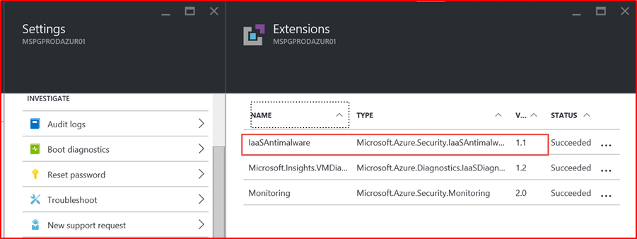
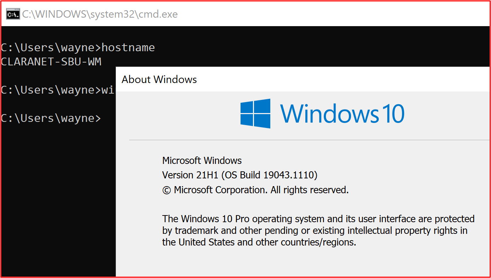
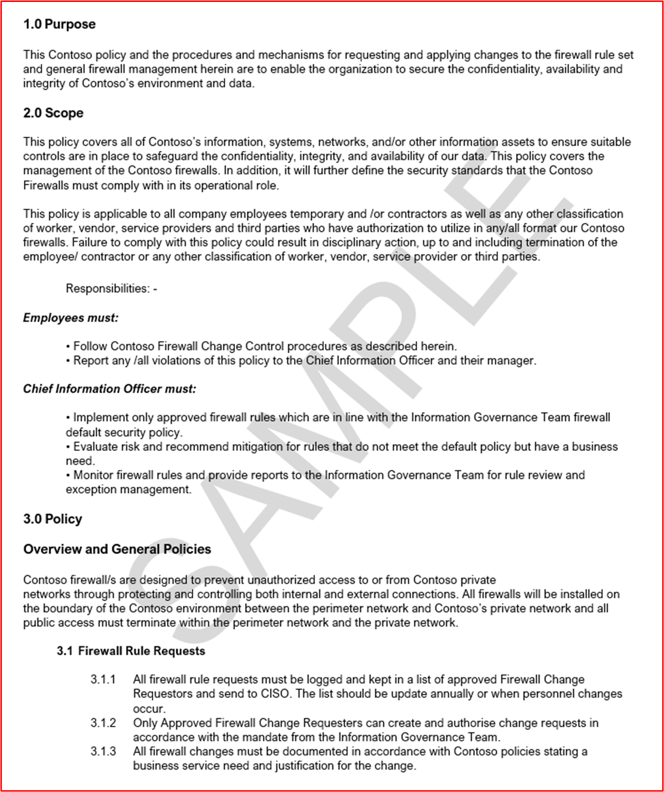
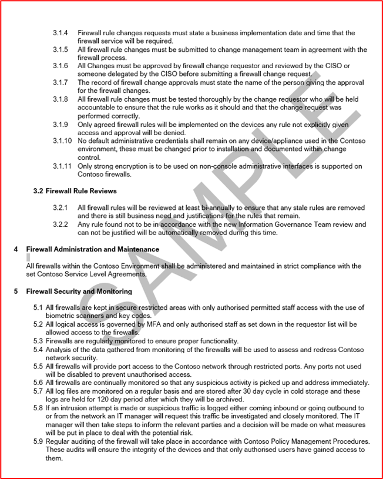
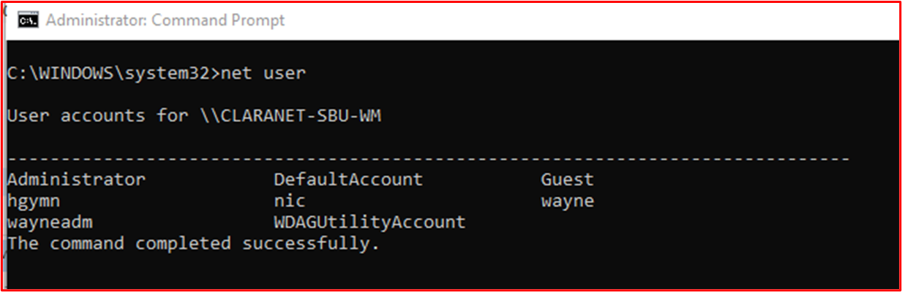
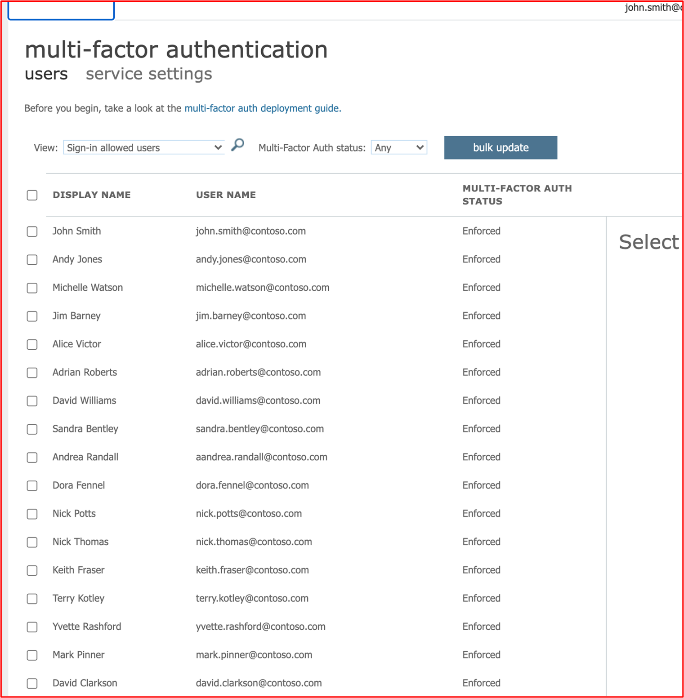
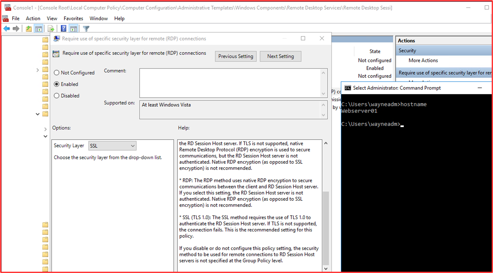
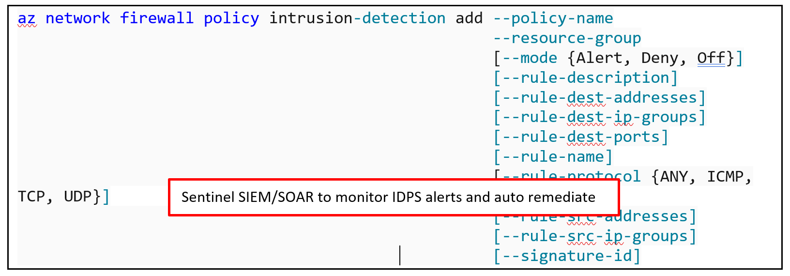
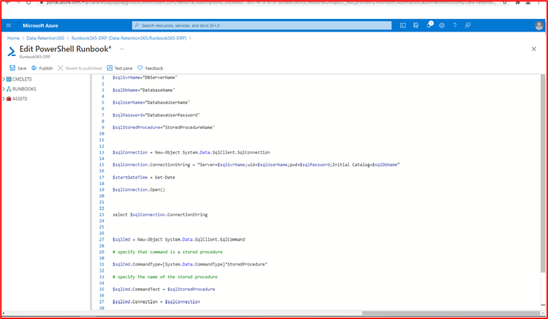

# Microsoft 365认证 - 示例证据指南

## 概述

本指南的创建是向 ISV 提供每个认证控制措施所需的证据类型和详细级别Microsoft 365的示例。 本文档中共享的任何示例并不代表可用于证明控制措施是否满足的唯一证据，而只是用作所需证据类型的指南。 

请注意：用于满足要求的实际界面、屏幕截图和文档因产品使用、系统设置和内部流程而异。 此外，请注意，需要策略或过程文档时，ISV 需要发送实际文档，而不是如某些示例中所示的屏幕截图。 

认证有两个部分需要提交：
1. [**初始文档提交：**](../docs/initialdocumentsubguide.md) 确定评估范围所需的一小组高级文档。
1. **证据提交：** 认证评估范围内每个控件所需的完整证据集。 

## 结构 

本文档直接映射到将在合作伙伴中心进行认证期间呈现的控件。 本文档中提供的指南如下所述：
- 安全域：所有控件都分为三个安全域：应用程序安全性、操作安全性以及数据安全和隐私。
- 控制 () ： = 评估活动说明 - 这些 () 和关联号码 (No.) 直接从 Microsoft 365 认证清单获得。  
- 意图：= 计划中包含安全控制的原因以及旨在缓解的特定风险的意图。  我们希望此信息将为 ISV 提供控件背后的逻辑，以更好地了解需要收集的证据类型，以及 ISV 在生成证据时必须关注并了解哪些内容。
- 示例证据指南： = 提供以帮助指导 Microsoft 365 认证清单电子表格中的证据收集任务，这使 ISV 可以清楚地查看证据类型的示例，认证分析员可以使用这些示例来确信控件已到位且保持有条不法， 本质上并不详尽。
- 证据示例：= 本节提供针对 Microsoft 365 认证清单电子表格中每个控件捕获的潜在证据的示例屏幕截图和图像，特别是针对电子表格) 中的操作安全和数据安全和隐私安全域 (选项卡。 请注意示例中带红色箭头和框的任何信息，都是为了进一步帮助了解满足任何控制要求所必需的。

## 安全域：应用程序安全性

**控件 1 - 控件 16**：

可以通过最近 12 个月内发布的渗透测试报告来验证应用程序安全域控件，该报告表明你的应用没有未解决的漏洞。 唯一所需的提交是由信誉良好的独立公司提交的干净报告。 

## 安全域：操作安全性/安全开发

"操作安全性/安全开发"安全域旨在确保 ISV 针对威胁参与者所面临的威胁实施一组强大的安全缓解技术。  这旨在保护操作环境和软件开发过程，以构建安全环境。

#### 恶意软件保护 - 防病毒

**控件 No 1：** 提供控制防病毒实践和过程的策略文档。
- 意图：此控件的目的是评估 ISV 对他们在考虑计算机病毒威胁时所面临问题的了解。 通过建立和使用开发防病毒策略和流程的行业最佳做法，ISV 提供了一种资源，该资源专为其组织缓解恶意软件所面临风险的能力而定制，列出了病毒检测和消除最佳做法，并提供了所记录的策略为组织及其员工提供建议的安全指南的证据。 通过记录 ISV 如何部署反恶意软件机制的策略和过程，这可确保在降低环境中恶意软件风险方面持续部署和维护此技术。

- 示例证据指南：提供防病毒/反恶意软件策略的副本，其中详细说明了在基础结构中实现的过程和过程，以推广防病毒/恶意软件最佳做法。
示例证据

- 示例证据：

**注意：** 此屏幕截图显示了一个策略/流程文档，预期是 ISV 共享实际支持策略/过程文档，而不只是提供屏幕截图。

**控件 No. 2：** 提供可证明防病毒软件正在所有采样系统组件中运行的可证明证据。

- 意图：在你的环境中运行防病毒 (AV)  (或反恶意软件防护) ，这一点非常重要，以避免你可能或可能不知道的网络安全风险，因为潜在的破坏性攻击正在增加，无论是复杂程度还是数量上。 将 AV 部署到支持其使用的所有系统组件，将有助于降低环境中引入的反恶意软件的一些风险。 它仅需要取消保护单个终结点，以可能为威胁参与者提供攻击途径以进入环境。 因此，AV 应用作多个防护层之一，以抵御这种类型的威胁。

- 示例证据指南：证明 AV 活动实例正在评估的环境中运行。 为示例中支持使用防病毒的每台设备提供屏幕截图，该防病毒过程显示运行的防病毒过程、防病毒软件处于活动状态，或者如果您有用于防病毒的集中管理控制台，则您可能能够通过该管理控制台进行演示。 如果使用管理控制台，请确保在屏幕截图中证明已连接并正常工作的采样设备。

- 证据示例 1：以下屏幕截图取自 Azure 安全中心;它显示已在名为 MSPGPRODAZUR01 的 VM &quot;上部署了反恶意软件扩展&quot;。

- 证据示例 2

以下屏幕截图取&quot;&quot;&quot;自 Windows 10设备，显示为主机名 CLARANET-SBU-WM 开启了实时保护。&quot;

**控件 No. 3：** 提供可证明防病毒签名在 1 天内在所有环境中 (是最新的) 。

- 意图：每天识别 PUA (成千上万个新恶意软件) 可能不需要的应用程序。 为了针对新发布的恶意软件提供充分保护，需要定期更新 AV 签名，以考虑新发布的恶意软件。

- 存在此控件是为了确保 ISV 已考虑环境的安全性以及过时 AV 对安全性的影响。

- 示例证据指南：提供来自每个采样设备的防病毒日志文件，显示每天应用更新。

- 示例证据：以下屏幕截图显示 Microsoft Defender 更新至少每天一次，&#39;事件 2000，Windows Defender&#39;更新。 将显示主机名，显示该名称取自作用域内系统 &quot;CLARANET-SBU-WM&quot;。

**注意：** 提供的证据需要包括日志导出，以显示更长时段的每日更新。 某些防病毒产品将生成更新日志文件，因此应提供这些文件或从事件查看器中导出日志。

**控件 No. 4：** 提供可证明防病毒已配置为跨所有采样的系统组件执行访问扫描或定期扫描的可证明证据。

**注意：** 如果未启用访问扫描，则每日至少扫描和alerting_ **必须** _be扫描。

- 意图：此控件的目的是确保快速识别恶意软件，以最大限度地减少这对环境的影响。 执行访问扫描并结合自动阻止恶意软件时，这有助于阻止防病毒软件已知的恶意软件感染。 如果由于误报&#39;服务中断，不需要访问扫描，需要实施适合的每日 (或更多的) 扫描和警报机制，以确保及时响应恶意软件感染，以最大限度地减少损害。

- 示例证据指南：为样本中支持防病毒的每台设备提供屏幕截图，显示防病毒正在设备上运行，并配置为用于访问 (实时扫描) 扫描，或者提供一个屏幕截图，显示为每日扫描启用了定期扫描、配置了警报以及示例中每个设备的上次扫描日期。

- 示例证据：以下屏幕截图显示 &quot;为主机 CLARANET-SBU-WM 启用了实时保护&quot;。

**控件 No. 5：** 提供可证明防病毒配置为在所有采样的系统组件中自动阻止恶意软件或隔离并发出警报的可证明证据。

- 意图：恶意软件的复杂程度一直在变化，以及它们可以带来的不同程度。 此控件的目的是阻止恶意软件执行，从而阻止它执行其潜在的负载负载，或者如果自动阻止不是一个选项，则通过发出警报并立即响应潜在的恶意软件感染来限制恶意软件可能破坏的时间量。

- 示例证据指南：为示例中支持防病毒的每台设备提供屏幕截图，显示防病毒正在计算机上运行，并配置为自动阻止恶意软件、警报或隔离和警报。

- 示例证据 1：以下&quot;屏幕截图显示了主机 CLARANET-SBU-WM&quot; 配置了实时保护，Microsoft Defender 防病毒。 如该设置所表示，这将查找并阻止恶意软件在设备上安装或运行。

**控件 No.6：** 提供可证明应用程序在部署之前得到批准的可证明证据。

- 意图：通过应用程序控制，组织将批准允许在操作系统上运行的每个应用程序/进程。 此控制的目的是确保已实施审批流程，以授权可以运行哪些应用程序/流程。

- 示例证据指南：可以提供证据，表明正在遵循审批流程。 这通过签名文档、在变更控制系统内跟踪，或者使用 Azure DevOps 或 JIRA 等方法进行提供，以跟踪这些请求和授权。

- 示例证据：以下屏幕截图演示管理层批准每个允许在环境中运行的应用程序都遵循审批流程。 这是 Contoso 的基于纸张的过程，但可能会使用其他机制。

**控件 No.7：** 提供证明存在并维护具有业务理由的已批准应用程序的完整列表的可证明证据。

- 意图：组织应维护一个已审批的所有应用程序的列表，以及应用程序/流程批准原因的信息，这一点非常重要。 这将有助于确保配置保持最新，并可以针对基线进行审阅，以确保未配置未经授权的应用程序/进程。

- 示例证据指南：提供经记录的应用程序/流程列表以及业务理由。

- 示例证据：以下屏幕截图列出了具有业务理由的已批准应用程序。

**注意：** 此屏幕截图显示了一个文档，预期是 ISV 共享实际支持文档，而不是仅提供屏幕截图。

**控件 No.8：** 提供支持文档，详细说明应用程序控制软件配置为符合特定应用程序控制机制。

- 意图：应用程序控制技术的配置应该与如何维护技术（即添加和删除应用程序/进程）的过程一起记录。 作为本文档的一部分，应详细说明每个应用程序/进程所使用的机制类型。 这将馈送到下一个控件中，以确保技术已配置为已记录。

- 示例证据指南：提供支持文档，详细说明如何设置应用程序控制以及如何在技术内配置每个应用程序/进程。

- 示例证据：以下屏幕截图列出了用于实现应用程序控件的控制机制。 你可以在下面看到，1 个应用正在使用证书控件和其他使用文件路径的应用。

**注意：** 此屏幕截图显示了一个文档，预期是 ISV 共享实际支持文档，而不是仅提供屏幕截图。

**控件 No. 9：** 提供可证明应用程序控制已配置为记录的所有采样系统组件的证据。

- 意图：这样做的目的是根据文档验证是否在整个示例中配置了应用程序控件。

- 示例证据指南：为 _示例中的每台设备_ 提供屏幕截图，以显示其配置并激活了应用程序控件。 这应显示计算机名称、它们所属的组以及应用于这些组和计算机的应用程序控制策略。

- 证据示例：以下屏幕截图显示了启用了软件限制策略的组策略对象。

下一张屏幕截图显示了与上述控件一起配置。

下一张屏幕截图显示了"M365 环境"和要应用于此 GPO 对象作用域内的计算机&#39;计算机设置&#39;。

最后一张屏幕截图显示作用域内服务器 &quot;DBServer1&quot; 位于以上屏幕截图内的 OU 内。

### 修补程序管理 – 风险排名

快速识别和修复安全漏洞有助于最大限度地降低威胁参与者危害环境或应用程序的风险。 修补程序管理分为两个部分：风险排名和修补。 这三种控制措施涵盖安全漏洞的标识，以及根据安全漏洞带来的风险对漏洞进行分级。

此安全控制组适用于平台即服务 (PaaS) 宿主环境，因为应用程序/外接程序第三方软件库和代码库必须基于风险分级进行修补。

**控件 No. 10：** 提供控制如何识别新安全漏洞并为其分配风险评分的策略文档。

- 意图：此控制的目的是获得支持文档，以确保快速识别安全漏洞，以减少威胁参与者利用这些漏洞的机会窗口。 需要建立可靠的机制，以识别涵盖组织使用的所有系统组件的漏洞;例如，操作系统 (Windows Server、Ubuntu 等 ) 、应用程序 (Tomcat、MS Exchange、将Winds 等) 、代码依赖项 (AngularJS、jQuery 等) 。 组织不仅需要确保及时识别资产内的漏洞，而且还需要相应地对漏洞进行排名，以确保根据漏洞存在的风险在合适的时间范围内进行修正。

**注意** 即使你在纯平台即服务环境中运行，你仍然有责任识别代码库中的漏洞：即第三方库。

- 示例证据指南：提供支持文档 (屏幕截图) 

- 示例证据：此屏幕截图显示了风险排名策略的代码段。

**注意：** 此屏幕截图显示了策略/流程文档，ISV 期望共享实际支持策略/过程文档，而不只是提供screenshot._

**控件 No. 11：** 提供如何识别新安全漏洞的证据。

- 意图：此控件的目的是确保遵循此过程，并且它&#39;足以识别环境中的新安全漏洞。 这不仅仅是操作系统;它可能包括环境中运行的应用程序和任何代码依赖项。

- 示例证据指南：证据可能通过以下方法提供：显示邮件列表订阅，手动查看新发布的漏洞的安全源 (将需要使用活动时间戳（例如，使用 JIRA 或 Azure DevOps) ）进行充分跟踪，在查找过期的软件库时，查找过期软件库时 (工具可能是 Snyk， 或者可能是使用经过身份验证的扫描识别过期软件的 Nessus。) 。

**注意** 如果使用 Nessus，则需要定期运行它以快速识别漏洞。 建议至少每周一次。

- 示例证据：此屏幕截图演示邮件组用于收到安全漏洞的通知。

**控件 No. 12：** 提供证据，证明所有漏洞在识别后都分配有风险分级。

- 意图：修补需要基于风险，漏洞的风险越小，需要修复的就更快。 识别的漏洞的风险分级是此过程的组成部分。 此控制的目的是确保遵循记录的风险排名流程，以确保所有识别的漏洞都基于风险进行适当排名。 组织通常使用 CVSS (由供应商或安全) 提供的常见漏洞评分系统分级。 如果组织依赖 CVSS，建议在流程中包含重新排名机制，以允许组织根据内部风险评估更改排名。 有时，由于应用程序在环境中部署的方式，漏洞可能不是应用程序。 例如，Java漏洞可能会释放，从而影响组织未使用的特定库。

- 示例证据指南：通过屏幕截图或其他方式（例如，DevOps/Jira）提供证据，它演示了漏洞正在经历风险排名过程，并且由组织分配了适当的风险级别。

- 示例证据：如果组织执行风险评估并确定风险可以降级，则此屏幕截图显示 D 列内发生的风险排名，以及按 F 和 G 列重新排名的风险。 需要将风险评估的重新排名证据作为支持性证据提供

### 修补程序管理 – 修补

以下控件适用于修补程序管理的修补元素。 若要维护安全的操作环境，必须适当修补应用程序/加载项和支持系统。 需要管理标识 (或公开发布) 和修补之间的适当时间范围，以减少威胁参与者利用漏洞的机会窗口。 该Microsoft 365认证未规定&#39;修补窗口&#39;，但是认证分析师将拒绝不合理的时间范围。

此安全控制组适用于平台即服务 (PaaS) 宿主环境，因为应用程序/外接程序第三方软件库和代码库必须基于风险分级进行修补。

**控件 No. 13：** 提供用于修补范围内系统组件的策略文档，其中包括针对关键、高和中等风险漏洞的合适最小修补时间范围;并停止使用任何不受支持的操作系统和软件。

- 意图：许多安全合规性框架（例如 PCI-DSS、ISO 27001、NIST (SP) 800-53）都需要修补程序管理。 良好的修补程序管理的重要性不能超过要求，因为它可以纠正软件、固件中的安全和功能问题并缓解漏洞，从而有助于减少利用机会。 此控制的目的是最大程度地减少威胁参与者利用范围内环境中可能存在的漏洞的机会窗口。

- 示例证据指南：提供详细阐述修补程序管理过程的所有策略和过程的副本。 这应包括在最小修补窗口上的部分，并且不支持的操作系统和软件不得在环境中使用。

- 示例证据：下面是一个示例策略文档。

**注意：** 此屏幕截图显示了策略/流程文档，ISV 期望共享实际支持策略/过程文档，而不只是提供screenshot._

**控件 No. 14：** 提供可证明所有已采样系统组件都正在修补的可证明证据。

**注意：** 包括任何软件/第三方库。

- 意图：修补漏洞可确保构成信息技术基础结构的一部分的不同模块 (硬件、软件和服务) 保持最新，并且没有已知漏洞。 需要尽快执行修补，以尽可能降低漏洞详细信息发布和修补之间发生安全事件的可能性。 如果已知漏洞的利用是通配符，则这一点变得更加重要。

- 示例证据指南：为示例中的所有设备和支持软件组件提供屏幕截图，显示修补程序是按照所记录修补过程安装的。

- 示例证据：以下屏幕截图显示&quot;作用域内系统组件 CLARANET-SBU-WM&quot; 正在Windows修补策略执行更新。

**注意：** 修补所有范围内系统组件需要作为证据。 这包括以下操作：操作系统更新、应用程序/组件更新 (i.e__.、_ _Apache Tomcat、OpenSSL 等 ) 、软件依赖项 (例如 JQuery、AngularJS 等 )_ 等。

**控件 No. 15：** 提供一个明显证据，表明环境中未使用任何不受支持的操作系统和软件组件。

- 意图：供应商未维护的软件将遭受未修复的已知漏洞的影响。 因此，不得在生产环境中使用不受支持的操作系统和软件组件。

- 示例证据指南：为示例中显示运行  (的操作系统版本（包括&#39;服务器名称）提供) 。 除此之外，还提供在环境中运行的软件组件正在运行受支持版本的证据。 这可以通过提供内部漏洞扫描报告的输出 (提供经过身份验证的扫描包含在) 和/或检查第三方库的工具输出（如 [Snyk](https://snyk.io/)、 [Trivy](https://github.com/aquasecurity/trivy) 或 [NPM 审核](https://docs.npmjs.com/cli/v7/commands/npm-audit)）中。 如果仅在 PaaS 中运行，修补控制组仅需要涵盖第三方库修补。

- 示例证据：以下证据表明范围内系统组件 THOR 正在运行供应商支持的软件，因为 Nessus 尚未&#39;任何问题。

**注意：** 必须与认证分析师共享完整报告。

- 示例证据 2

此屏幕截图显示作用域内系统&quot;组件 CLARANET-SBU-WM&quot; 正在受支持的 Windows 版本上运行。

- 示例证据 3

以下屏幕截图是 [Trivy](https://github.com/aquasecurity/trivy) 输出，完整报告&#39;不列出任何不受支持的应用程序。

**注意：** 必须与认证分析师共享完整报告。

### 漏洞扫描

通过引入常规漏洞评估，组织可以检测其环境中可能为恶意参与者危害环境提供入口点的漏洞和不安全。 漏洞扫描可帮助识别环境中缺少的修补程序或错误配置。 通过定期执行这些扫描，组织可以提供相应的修正，以最大限度地降低由于这些漏洞扫描工具通常选取的问题而泄露的风险。

**控件 No. 16：** 提供季度基础结构和 Web 应用程序漏洞扫描报告。 需要针对 IP 地址和 URL 和内部 IP (整个公用) 执行扫描。

**注意：****这必须** 包括环境的完整范围。

- 意图：漏洞扫描查找组织计算机系统、网络和 Web 应用程序中可能存在的漏洞，以识别可能导致安全漏洞和敏感数据泄露的漏洞。 漏洞扫描通常是行业标准和政府法规（例如，PCI DSS (支付卡行业数据安全标准）要求) 。

- &quot;安全指标报告（[标题为 PCI DSS](https://info.securitymetrics.com/pci-guide-2020)&quot; 合规性的 2020 年安全指标指南）指出，从发现组织存在漏洞来破坏系统起，&#39;平均需要 166 天。 一旦泄露，攻击者平均可以访问敏感数据 127 天&#39;因此此控制旨在识别范围内环境中的潜在安全漏洞。

- 示例证据指南：提供 (过去 12) 季度&#39;漏洞扫描的完整扫描报告。 报告应清楚地说明用于验证是否包含完整公共占用以及每个内部子网（如果适用）的目标。 提供 **每个季度** 的所有 **扫描** 报告。

- 示例证据：示例证据是提供所使用的扫描工具中的扫描报告。 应&#39;每个季度的扫描报告进行审阅。 扫描需要包括整个环境系统组件，因此;每个内部子网以及环境可用的每个公共 IP 地址/URL。

**控件 No. 17：** 提供可证明证据，证明漏洞扫描过程中发现的漏洞修正已按照您记录修补时间范围进行修补。

- 意图：如果无法快速识别、管理和修正漏洞和错误配置，&#39;导致潜在数据泄露的风险。 正确识别和修正问题对于组织来说&#39;整体安全状况和环境非常重要，符合各种安全框架的最佳实践;例如，ISO 27001 和 PCI DSS。

- 示例证据指南：提供合适的项目 (即屏幕截图) ，显示根据上述控件 13 中已提供的修补窗口修正漏洞扫描中发现漏洞的示例。

- 示例证据：以下屏幕截图显示了 Nessus 对作用域内环境扫描 (&quot;此示例中名为 THOR&quot;) 的单个计算机在 2021 年 8 月 2 日显示漏洞。

以下屏幕截图显示问题已解决（2 天后，在修补策略中定义的修补窗口中）。

**注意：** 对于此控制，认证分析师需要查看过去 12 个月内每个季度的漏洞扫描报告和修正。

### 防火墙

防火墙通常提供受信任 (内部网络) 、不受信任的 (Internet) 和 DMZ (安全) 边界。 这些通常是组织深度防御安全策略的第一道防线，旨在控制入口和出口服务的流量流并阻止不需要的流量。 这些设备必须受到严格控制，以确保它们有效运行，并且不会受到可能给环境带来风险的错误配置。

**控件 No. 18：** 提供控制防火墙管理实践和过程的策略文档。

- 意图：防火墙是分层安全策略中的重要第一道 (深度防御) 策略，可保护环境免受信任程度低的网络区域的影响。 防火墙通常会根据 IP 地址和协议/&quot;&quot;端口控制流量，功能更丰富的防火墙还可以通过检查应用程序流量来提供额外的应用程序层防御，以防范基于所访问的应用程序的滥用、漏洞和威胁。 这些保护仅与防火墙的配置一样好，因此需要制定强防火墙策略和支持过程，以确保它们配置为提供足够的内部资产保护。 例如，具有允许从 ANY 源到 ANY 目标的所有流量的规则的防火墙只是充当路由器。

- 示例证据指南：提供完整的防火墙策略/过程支持文档。 本文档应涵盖以下所有要点以及适用于您的环境的其他最佳实践。

- 示例证据：下面是我们需要的防火墙策略文档类型的示例 (这是演示，可能不会) 。

**控件 No. 19：** 提供可证明在安装到生产环境之前更改了任何默认管理凭据的证据。

- 意图：组织需要注意供应商提供的默认管理凭据，这些凭据在设备或软件配置过程中配置。 默认凭据通常由供应商公开提供，并且可为外部威胁参与者提供一个破坏环境的机会。 例如，在 Internet 上简单搜索默认的 iDrac (集成 Dell 远程访问控制器) 凭据将突出显示 _root：：calvin_ 作为默认用户名和密码。 这将允许某人远程访问远程服务器管理。 此控件的目的是确保环境不易受在设备/应用程序强化期间未更改的默认供应商凭据的攻击。

- 示例证据指南

- 这可以通过屏幕共享会话来证实，其中认证分析师可以尝试使用默认凭据对范围内设备进行身份验证。

- 示例证据

以下屏幕截图显示了认证分析师从 WatchGuard 防火墙看到的无效用户名/密码。

**控件 No. 20：** 提供可信赖的证据，表明防火墙安装在范围内环境的边界上，并安装在外围网络 (（也称为 DMZ、外围安全区域、屏蔽子网) 和内部受信任网络）之间。

- 意图：防火墙提供控制不同安全级别的不同网络区域之间的流量的能力。 由于所有环境都连接了 Internet，防火墙需要安装在边界上，即 Internet 和作用域内环境之间。 此外，需要在信任度较低 DMZ 和 De- (区域之间安装防火墙) 网络与内部受信任网络之间。 DMZ 通常用于为来自 Internet 的流量提供服务，因此是攻击目标。 通过实施 DMZ 和使用防火墙控制流量，DMZ 泄露&#39;不一定意味着内部受信任网络和公司/客户数据受到威胁。 应提供足够的日志记录和警报来帮助组织快速识别泄露，以最大限度地降低威胁参与者进一步破坏内部受信任网络的机会。 此控件的目的是确保受信任网络与受信任度低的网络之间有足够的控制。

- 示例证据指南：应该通过防火墙配置文件或屏幕截图提供证据，以证明 DMZ 已就位。 这应该与提供的体系结构图表匹配，这些图表演示了支持环境的不同网络。 防火墙上的网络接口的屏幕截图，与作为初始文档提交一部分提供的网络图一起应提供此证据。

- 示例证据：下面是演示两个 DMZ 的 WatchGuard 防火墙的屏幕截图，一个适用于名为 DMZ) 的入站服务 ( (Bastian Host) 。

**控件 No. 21：** 提供可证明所有公共访问终止于 DMZ 安全区的 (证据) 。

- 意图：可公开访问的资源对攻击的开始开放。 如上所述，DMZ 的目的是将信任程度低的网络与可能包含敏感数据的受信任内部网络进行分段。 DMZ 被视为信任程度较低，因为外部威胁参与者公开访问的主机存在极大风险。 公共访问应始终终止于这些受信任程度低的网络中，这些网络被防火墙充分分段，以帮助保护内部资源和数据。 此控制的目的是确保所有公共访问终止在这些信任程度较低 DMZS 中，就像受信任内部网络的资源是面向公众的一样，泄露这些资源会为威胁参与者提供一个进入保留敏感数据的网络的后门。

- 示例证据指南

- 为此提供的证据可能是防火墙配置，该配置显示入站规则以及这些规则在何处终止，方法为将公用 IP 地址路由到资源，或提供入站流量的 NAT (网络地址转换) 。

- 示例证据

在下面的屏幕截图中，有三个传入规则，每个规则都显示 10.0.3.x 和 10.0.4.x 子网（即 DMZ 子网）的 NAT

**控件 No. 22：** 提供可证明允许通过防火墙的所有流量通过审批流程的可证明证据。

- 意图：由于防火墙是不受信任的流量和内部资源之间以及不同信任级别的网络之间的防御屏障，因此需要安全配置防火墙，并确保仅启用业务运营所需的流量。 通过允许不必要的流量流或过于宽松的流量，这可能会在这些各种网络区域的边界处引入防御漏洞。 通过建立针对所有防火墙更改的稳固审批流程，引入给环境带来高风险的规则的风险将降低。 Verizon&#39;[2020](https://enterprise.verizon.com/en-gb/resources/reports/dbir/) &quot;数据泄露调查报告重点介绍了错误&#39;（&quot;包括错误配置）是唯一一个每年不断增加的操作类型。

- 示例证据指南：证据可能以文档形式显示正在授权的防火墙更改请求，这可能是来自 CAB (Change Advisor Board) 会议或由变更控制系统跟踪所有更改的分钟数。

- 示例证据：以下屏幕截图显示了使用基于纸张的过程请求和授权的防火墙规则更改。 例如，这可以通过类似 DevOps Jira 实现。

**控件 No. 23：** 提供可证明防火墙规则基础已配置为丢弃未明确定义的流量的可证明证据。

- 意图：大多数防火墙将采用自上而下的方法处理规则，以尝试并查找匹配的规则。 如果规则匹配，将应用该规则的操作，并且将停止对规则的所有进一步处理。 如果未找到匹配规则，则默认情况下拒绝通信。 &quot;此控件的目的是，如果防火墙不默认&#39;如果未找到匹配的规则，则规则基础必须在所有防火墙列表的末尾包含"&quot;全部 **拒绝"规则**。 这是为了确保防火墙不会在处理规则&#39;默认允许状态，从而允许尚未明确定义&#39;流量。

- &quot;&quot;示例证据指南：可通过防火墙配置提供证据，或者通过显示在末尾显示"全部拒绝"规则的防火墙规则的屏幕截图提供证据，或者如果防火墙丢弃了默认不与规则匹配的&#39;流量，则提供所有防火墙规则的屏幕截图和指向供应商管理指南的链接，突出显示默认情况下防火墙将丢弃所有不匹配的流量。

- 示例证据：下面是 WatchGuard 防火墙规则基础的屏幕截图，它演示了未将任何规则配置为允许所有流量。 末尾没有拒绝规则，因为 WatchGuard 将丢弃&#39;不匹配的流量。

以下 WatchGuard 帮助中心链接; [https://www.watchguard.com/help/docs/help-center/en-US/Content/en-US/Fireware/policies/policies\_about\_c.html](https://www.watchguard.com/help/docs/help-center/en-US/Content/en-US/Fireware/policies/policies_about_c.html) 包括以下信息：

**控件 No. 24：** 提供可证明防火墙在所有非控制台管理界面上仅支持强加密的可证明证据。

- 意图：若要缓解管理流量的中间人攻击，所有非控制台管理界面应仅支持强加密。 此控件的主要目的是在设置非控制台连接时保护管理凭据。 此外，这还有助于防止窃听连接、尝试重播管理功能以重新配置设备或作为重新连接的一部分。

- 示例证据指南：如果配置提供非控制台管理接口的加密配置，则提供防火墙配置 (并非所有设备都将此配置作为可配置选项) 。 如果未在&#39;，你可能会向设备发出命令，以显示为这些连接配置了哪些内容。 某些供应商可能在文章中发布此信息，因此这也可能成为证明此信息的一种方法。 最后，您可能需要运行工具以输出支持哪些加密。

- 示例证据：以下屏幕截图显示了针对 TCP 端口 8080 上 WatchGuard 防火墙的 Web 管理界面的 [SSLScan](https://github.com/rbsec/sslscan) 输出。 这将显示最小加密密码为 AES-128bit 的 TLS 1.2 或以上。

注意：WatchGuard 防火墙还支持使用 SSH (TCP 端口 4118) 和 WatchGuard 系统管理器 (TCP 端口 4105 &amp; 4117) 。 还需要提供这些非控制台管理界面的证据。

**控件 No. 25：** 至少每 6 个月提供一次执行防火墙规则评审的可证明证据。

- 意图：随着时间的推移，在系统组件和范围内环境中存在配置错误的风险。 这通常可能会引入不安全或错误配置，这会增加环境泄露的风险。 可以出于多种原因引入配置配置，例如，用于帮助疑难解答的临时更改、临时功能更改，以引入快速修复问题（这些问题有时可能由于引入快速修复压力而过于宽松）。 例如，你可以引入临时防火墙规则"&quot;全部允许&quot;"来克服紧急问题。 此控件有双重目的，首先确定哪些错误配置可能导致不安全，第二种是帮助识别不再需要的防火墙规则，从而可以删除这些规则，即服务已停用，但防火墙规则已被删除。

- 示例证据指南：证据需要能够证明审查会议已经发生。 这可以通过共享防火墙审查的会议分钟数和任何其他更改控制证据（显示从审查中执行的任何操作）来完成。 确保日期存在，&#39;至少需要查看其中两个会议 (即每六个月查看一次) 

- 示例证据：以下屏幕截图显示了 2021 年 1 月进行防火墙审查的证据。

以下屏幕截图显示了 2021 年 7 月进行防火墙审查的证据。

### 防火墙 – WAF

可以选择将 Web 应用程序防火墙 (WAF) 解决方案中。 如果使用 WAF，这将计为"操作安全"和"安全"域中&#39;评分&#39;额外评分。 WAF 可以检查 Web 流量，以筛选和监视 Internet 和已发布 Web 应用程序之间的 Web 流量，以确定特定于 Web 应用程序的攻击。 Web 应用程序可能会遭受许多特定于 Web 应用程序的攻击，如 SQL 注入 (SQLi) 、跨站点脚本 (XSS) 、跨站点请求伪造 (CSRF/XSRF) 等。WAF 旨在防范这些类型的恶意负载，以帮助保护 Web 应用程序免受攻击和潜在威胁。

**控件 No. 26：** 提供可证明的证明， (WAF) 配置为主动监视、警报和阻止恶意流量。

- 意图：此控件用于确认 WAF 已针对所有传入 Web 连接就位，并且已配置为阻止恶意流量或向恶意流量发出警报。 若要为 Web 流量提供额外的防护层，需要针对所有传入的 Web 连接配置 WAF，否则外部威胁参与者可以绕过旨在提供此额外保护层的 WAF。 如果未将 WAF&#39;以主动阻止恶意流量，则 WAF 需要能够立即向可快速响应潜在恶意流量的员工发出警报，以帮助维护环境的安全性并停止攻击。

- 示例证据指南：提供来自 WAF 的配置输出，该输出突出显示了要提供的传入 Web 连接，并且该配置会主动阻止恶意流量或正在监视和警报。 或者，可以共享特定设置的屏幕截图，以演示组织是否满足此控制要求。

- 示例证据：以下屏幕截图显示了 Contoso 生产 Azure 应用程序网关 WAF 策略已启用，并且配置为 &#39;保护&#39; 模式，该模式将主动丢弃恶意流量。

以下屏幕截图显示了前端 IP 配置

**注意：** 证据应演示环境使用的所有公共 IP，以确保涵盖所有入口点，这也是包含此屏幕截图的原因。

以下屏幕截图显示了使用此 WAF 的传入 Web 连接。

以下屏幕截图显示了 ContosoAppGWCoreRules\_\_，其中显示这适用于 api.contoso.com 服务。

**控件 No. 27：** 提供 WAF 支持 SSL 卸载的可证明证据。

- 意图：将 WAF 配置为支持 SSL 卸载的能力非常重要，否则 WAF 将无法检查 HTTPS 流量。 由于这些环境需要支持 HTTPS 流量，因此这是 WAF 的关键功能，可确保可以标识和停止 HTTPS 流量中的恶意负载。

- 示例证据指南：通过配置导出或显示 SSL 卸载受支持和配置的屏幕截图提供配置证据。

- 示例证据：在 Azure 应用程序网关中，配置启用了 SSL 侦听器的 SSL 卸载，请参阅 Overview [of TLS termination and end to end TLS with Application Gateway](https://docs.microsoft.com/azure/application-gateway/ssl-overview) Microsoft docs 页。 以下屏幕截图显示了为 Contoso 生产 Azure 应用程序网关配置的此配置。

**控件 No. 28：** 'Provide a evidencestrastratable evidence that the WAF is protects against some， or all of the following classes of vulnerabilities as per per the OWASP Core Rule Set (3.0 or 3.1) ：
- 协议和编码问题，
- 标头注入、请求拆分和响应拆分，
- 文件和路径遍历攻击，
- 远程文件包含 (RFI) 攻击，
- 远程代码执行攻击，
- PHP 注入攻击，
- 跨网站脚本攻击，
- SQL式注入攻击，
- 会话修复攻击。

- 意图：需要将 WAF 配置为识别常见漏洞类的攻击负载。 此控件旨在利用 OWASP 核心规则集来确保充分检测漏洞类。

- 示例证据指南：通过配置导出或屏幕截图提供配置证据，表明扫描涵盖了上述标识的多数漏洞类。

- 示例证据：以下屏幕截图显示 Contoso 生产 Azure 应用程序网关 WAF 策略配置为针对 OWASP 核心规则集版本 3.2 进行扫描。

### 更改控件

建立和了解的更改控制过程对于确保所有更改都经过可重复的结构化过程至关重要。 通过确保所有更改都经过结构化过程，组织可以确保更改得到有效管理、对等审查并经过充分测试，然后才能注销。 这不仅有助于最大程度地降低系统中断的风险，还有助于最大限度地降低由于引入的不当更改而发生潜在安全事件的风险。

**控件 No. 29：** 提供控制变更控制流程的策略文档。

- 意图：若要维护安全的环境和安全的应用程序，必须建立可靠的变更控制流程，以确保所有基础结构和代码更改都通过强大的监管和定义的流程执行。 这将确保记录更改、考虑安全隐患、考虑更改将对环境产生哪些影响等。目的是确保记录更改控制过程，以确保对环境和应用程序开发实践内的所有更改采用安全且一致的方法。

- 示例证据指南：记录变更控制策略/过程应与认证分析师共享。

- 示例证据：下面显示了更改管理策略示例的开始。 请在评估中提供完整策略和过程。

**注意：** 此屏幕截图显示了一个策略/流程文档，预期是 ISV 共享实际支持策略/过程文档，而不只是提供屏幕截图。

**控件 No. 30：** 提供可证明开发和测试环境强制将职责与生产环境分开的明显证据。

- 意图：大多数&#39;开发/测试环境的组织未配置为与生产环境相同的功能，因此安全性较低。 此外，不应在生产环境中执行测试，因为这样做可能会引入安全问题，或者可能对客户的服务交付产生不利影响。 通过维护实施职责分离的单独环境，组织可以确保将更改应用于正确的环境，从而在针对开发/测试环境实施生产环境更改时，通过实现对生产环境的更改来降低错误的风险。

- 示例证据指南：可以提供屏幕截图，以演示用于开发/测试环境和生产环境的不同环境。 通常，你将让不同的人员/团队访问每个环境，或者如果不可能，则环境将使用不同的授权服务，以确保用户不能错误地登录到错误的环境来应用更改。

- 示例证据：以下屏幕截图显示了 Contoso&#39;TEST 环境的 Azure 订阅。

下一张屏幕截图显示了 Contoso&#39;PRODUCTION &#39;环境&#39; Azure 订阅。

**控件 No. 31：** 提供敏感生产数据未在开发或测试环境中使用的可证明证据。

- 意图：如上文所述，组织不会将开发/测试环境的安全措施实现到与生产环境相同的功能。 因此，通过在这些开发/测试环境中利用敏感的生产数据，您将增加泄露的风险，并且必须避免在这些开发/测试环境中使用实时/敏感数据。

**注意：** 可以在开发/测试环境中使用实时数据，提供开发/测试包含在评估范围内，以便根据认证控制措施评估Microsoft 365安全。

- 示例证据指南：可通过共享针对生产数据库 (的相同 SQL 查询的输出屏幕截图来提供证据) 以及开发/测试数据库。 相同命令的输出应生成不同的数据集。 在存储文件的位置，查看两个环境中的文件夹的内容还应演示不同的数据集。

- 示例证据：以下屏幕截图显示了用于 (记录的前 3 个记录，请提供来自生产) 前 20 个记录。

下一个屏幕截图显示来自开发数据库的相同查询，显示不同的记录。

这说明数据集不同。

**控件 No. 32：** 提供具体证据，证明已记录更改请求包含更改影响、退出过程的详细信息以及要执行的测试。

- 意图：此控件的目的是确保已考虑所请求的变化。 需要考虑和清楚地记录更改对系统/环境安全的影响，任何退出过程都需要记录在出现问题时帮助恢复，最后还需要考虑和记录验证更改是否成功所需的测试详细信息。

- 示例证据指南：可通过导出更改请求示例、提供纸张更改请求或提供更改请求的屏幕截图（显示更改请求中保存的这三个详细信息）提供证据。

- 示例证据：下图显示了分配的新跨站点脚本漏洞 (XSS) 并记录了更改请求。

以下票证显示了在其解析之旅中已设置或添加到票证的信息。

 

下面的两个票证显示了更改系统的影响，以及发生问题时可能需要的任何退出过程。 可以看到更改和退出过程的影响已经过审批过程，并且已经过批准进行测试。

在屏幕左侧，可以看到测试更改已获得批准，在右侧，可以看到更改现已获得批准和测试。

在整个过程中，请注意完成工作的人、报告该工作的人和批准要完成的工作的人是不同的人。

上面的票证显示更改现已获得批准，可实施到生产环境。 右侧框显示测试有效且成功，并且更改现已实现到 Prod Environment。

**控件 No. 33：** 提供可证明更改请求经过授权和注销过程的证据。

- 意图：必须实施进程，这将禁止在未经适当授权和注销的情况下执行更改。 实施更改之前需要获得授权，并且需要在完成更改后注销更改。 这将确保已正确审阅更改请求，并且当权者已注销更改。

- 示例证据指南：可通过导出更改请求示例、提供纸张更改请求或提供更改请求的屏幕截图（显示实施前已授权更改，并且更改在完成后已注销）提供证据。

- 示例证据：以下屏幕截图显示了一个示例 Jira 票证，其中显示需要先授权更改，然后才能由开发人员/请求者外的其他人员实施和批准。 你可以在此处看到更改已由有权限的人批准。 完成后，DP 在右侧进行了签名。

在下面的票证中，你可以看到更改在完成后即已注销，并且显示作业已完成和已关闭。

### 安全软件开发/部署

参与软件开发活动的组织经常面临安全和 TTM (上市时间) 压力之间的竞争优先级，但是，在整个软件开发生命周期 (SDLC) 中实施与安全相关的活动不仅可以节省资金，还可以节省时间。 将安全性作为后向安全处理时，通常仅在 () 的测试阶段识别问题，这通常更耗时且修复成本也高。 此安全部分的目的是确保遵循安全软件开发实践，以减少在开发的软件中引入编码缺陷的风险。 此外，本节还介绍一些控件，帮助安全部署软件。

**控件 No. 34：** 提供支持安全软件开发和部署的策略和过程，包括针对常见漏洞类（如 OWASP Top 10 或 SANS Top 25 CWE）的安全编码最佳实践指南。

- 意图：组织需要尽一切能力确保软件得到安全开发且没有漏洞。 为实现这一目标，应建立可靠的安全软件开发生命周期 (SDLC) 和安全编码最佳实践，以在整个软件开发过程中促进安全编码技术和安全开发。 目的是减少软件中漏洞的数量和严重性。

- 示例证据指南：提供已记录 SDLC 和/或支持文档，这些文档演示了安全开发生命周期的使用，并提供了针对所有开发人员的指导，以提升安全编码最佳实践。 了解 [SDLC 中的 OWASP](https://owasp.org/www-project-integration-standards/writeups/owasp_in_sdlc/) 和 [SAMM (OWASP](https://owaspsamm.org/model/) 软件保障) 。

- 示例证据：以下是 Contoso&#39;安全软件开发过程（演示安全开发和编码实践）的提取内容。

**注意：** 这些屏幕截图显示了安全软件开发文档，ISV 期望共享实际支持文档，而不只是提供屏幕截图。

**控件 No. 35：** 提供可证明代码更改正由另一个审阅者进行审阅和授权过程的可证明证据。

- 意图：此控件的目的是由另一个开发人员执行代码检查，以帮助识别任何可能导致软件中漏洞的编码错误。 应建立授权以确保执行代码评审、测试完成等。 部署之前。 授权步骤可以验证是否遵循了正确的过程，这些过程与上面定义的 SDLC 相同。

- 示例证据指南：提供代码经过对等审查且必须经过授权才能应用于生产环境的证据。 此证据可能是通过导出更改票证，证明已执行代码评审并授权更改，或者可以通过代码审阅软件（如 Crucible () [https://www.atlassian.com/software/crucible](https://www.atlassian.com/software/crucible) ）。

- 示例证据

下面是一个票证，显示代码更改由原始开发人员外的其他人员进行审阅和授权过程。 它显示代码评审已由被分配者请求，并将分配给其他人进行代码审阅。

下图显示了代码审阅已分配给原始开发人员外的其他人员，如下图右侧突出显示的部分所示。 在左侧，可以看到代码已经过审阅，并&#39;代码审阅&#39;通过的代码审阅状态。

现在，该票证必须获得经理的批准，然后才能将更改放入实时生产系统中。

 上图显示已审阅的代码已获得批准，可以在实时生产系统上实施。

 代码更改完成后，最终作业将注销，如上图所示。

请注意，在整个过程中有三个人参与，即代码的原始开发人员、代码审阅者和经理进行审批和签署。 为了符合此控制的条件，预期你的票证将遵循此过程。 在代码审阅的变更控制过程中至少涉及三个人。

**控件 No. 36：** 提供可证明开发人员每年接受安全软件开发培训的明显证据。

- 意图：所有编程语言都存在编码最佳做法和技术，以确保代码得到安全开发。 还有一些外部培训课程旨在向开发人员介绍不同类型的软件漏洞类以及可用于停止向软件中引入这些漏洞的编码技术。 此控件的目的是向所有开发人员介绍这些技术，并确保不会忘记这些技术，或者通过每年执行一次来学习较新的技术。

- 示例证据指南：如果由外部培训公司执行，则通过证书提供证据，或者通过提供培训资料或其他项目屏幕截图（证明开发人员已参加培训）来提供证据。 如果此培训是通过内部资源进行的，请提供培训材料的证据。

- 示例证据：下面是请求加入 OWASP 十大培训年度DevOps团队中的员工的电子邮件

下面显示了已请求进行业务理由和审批的培训。 然后，这是从培训中截取的屏幕截图和显示该人员已完成年度培训的完成记录。

**控件 No. 37：** 提供可证明代码存储库使用多重身份验证和 MFA (保护的) 。

- 意图：如果威胁参与者可以访问和修改软件&#39;代码库，他/她可能会向代码库（从而向应用程序）引入漏洞、后门或恶意代码。 这已经有很多实例，其中最公开的可能是 NotPetya 勒索软件攻击，该攻击被报告通过名为 M.E.Doc (的乌克兰税务软件更新受到感染，请参阅 What [is NotPetya](https://www.itpro.co.uk/malware/34381/what-is-notpetya)) 。

- 示例证据指南：通过代码存储库中的屏幕截图提供证据， **其中所有用户都** 启用了 MFA。

- 示例证据：以下屏幕截图显示所有 8 个 GitLab 用户都启用了 MFA。

**控件 No. 38：** 提供可证明访问控制已就位以确保代码存储库安全的可证明证据。

- 意图：应实现访问控制，以从上一个控件开始，以限制仅对正在处理特定项目的单个用户的访问。 通过限制访问，您可以限制执行未经授权的更改的风险，从而引入不安全的代码更改。 应采用最小特权方法来保护代码存储库。

- 示例证据指南：通过代码存储库中的屏幕截图提供证据，其中访问权限仅限于所需的个人，包括不同的权限。

- 示例证据：以下屏幕截图显示了 &quot;GitLab 中作为 Contoso &quot;客户门户的 Customers&quot; 项目的成员&quot;。 如屏幕截图中所示，用户具有不同的 &quot;角色&quot; 来限制对项目的访问权限。

### 帐户管理

安全帐户管理做法非常重要，因为用户帐户是允许访问信息系统、系统环境和数据的基础。 由于用户&#39;凭据泄露，用户帐户需要获得适当的保护，不仅可以提供进入环境和访问敏感数据的页脚，还可以提供对整个环境或关键系统的管理控制（如果用户&#39;凭据具有管理权限）。

**控件 No. 39：** 提供管理帐户管理实践和过程的策略文档。

- 意图：用户帐户继续成为威胁参与者的目标，并且经常成为数据泄露的来源。 通过配置过度允许的帐户，组织不仅会增加 &#39;特权&#39; 帐户的池，威胁参与者可以利用这些帐户执行数据泄露，而且还会增加成功利用需要特定权限才能成功的漏洞的风险。

-  BeyondTrust 每年 &quot;会生成一份 Microsoft&quot; 漏洞报告，该报告分析上一年的 Microsoft 安全漏洞，并详细介绍依赖于具有管理员权限的用户帐户的这些漏洞的百分比。 &quot;最近的博客文章"新 Microsoft 漏洞报告"显示漏洞的"使用最小特权如何缓解"增加了 [48&amp;](https://www.beyondtrust.com/blog/entry/microsoft-vulnerabilities-report)&quot;%，Internet Explorer 中 90% 的关键漏洞、Microsoft Edge 中 85% 的关键漏洞和 Microsoft Outlook 中 100% 的关键漏洞可以通过删除管理员权限来缓解。 为了支持安全帐户管理，组织需要确保制定支持性策略和程序，以提升安全性最佳做法，并遵循这些策略和过程来缓解这些威胁。

- 示例证据指南：提供涵盖帐户管理实践的已记录策略和过程文档。 涵盖的主题至少应该与认证Microsoft 365一致。

- 示例证据：以下屏幕截图显示了 Contoso 的帐户管理策略示例。

**注意：** 此屏幕截图显示了一个策略/流程文档，预期是 ISV 共享实际支持策略/过程文档，而不只是提供屏幕截图。

**控件 No. 40：** 提供可证明在采样的系统组件中禁用、删除或更改默认凭据的证据。

- 意图：尽管这不太受欢迎，但在某些情况下，威胁参与者仍可以利用默认和记录良好的用户凭据来破坏生产系统组件。 一个热门示例是 Dell iDRAC (集成 Dell 远程访问控制器) 。 此系统可用于远程管理 Dell Server，威胁参与者可以利用它来控制 Server&#39;操作系统。 root：：calvin 的默认凭据已记录，威胁参与者通常可以利用它获取对组织使用的系统的访问权限。 此控件的目的是确保禁用或删除这些默认凭据

- 示例证据指南：可通过多种方式收集证据以支持此控制。 所有系统组件中已配置用户的屏幕截图都可以帮助，例如 Linux /etc/shadow 和 /etc/passwd 文件的屏幕截图将有助于演示帐户是否已被禁用。 请注意，需要 /etc/shadow 文件才能通过观察密码哈希以指示密码不可用的无效字符（如 &#39;！&#39;）开头来证明帐户确实被禁用。 建议仅禁用密码的少数字符，并修订其余字符。 其他选项适用于评估员能够手动尝试默认凭据的屏幕共享会话，例如，在 Dell iDRAC 上的上述讨论中，评估员需要尝试使用默认凭据针对所有 Dell iDRAC 接口进行身份验证。

- 示例证据：以下屏幕截图显示了为 &quot;范围内系统组件 CLARANET-SBU-WM 配置的用户帐户&quot;。 显示几个默认帐户;但是，管理员、DefaultAccount 和来宾屏幕截图显示这些帐户已禁用。

下一张屏幕截图显示了在 &quot;作用域内系统组件 CLARANET-SBU-WM 上禁用管理员帐户&quot;。

下一张屏幕截图显示了 &quot;在作用域内系统组件 CLARANET-SBU-WM 上禁用来宾帐户&quot;。

下一张屏幕截图显示了在作用域内系统组件 CLARANET-SBU-WM&quot; 上已禁用 DefaultAccount&quot;。

**控件 No. 41：** 提供可证明证据，说明帐户创建、修改和删除过程是通过已建立的审批流程。

- 意图：目的是建立一个过程，以确保所有帐户管理活动都得到批准，确保帐户特权保持最小特权原则，并且可以正确审阅和跟踪帐户管理活动。

- 示例证据指南：证据的形式通常为更改请求票证、ITSM (IT 服务管理) 请求或书面材料，其中显示要创建、修改或删除的帐户请求已经过审批过程。

- 示例证据：下图显示了新入门者的帐户创建，DevOps 团队需要具有基于生产环境权限的 RBAC 设置，且无权访问开发环境和对任何其他内容的标准非特权访问。

帐户创建和票证关闭后，帐户创建已经历审批过程和注销过程。

**控件 No. 42：** 提供可证明已就位以禁用或删除 3 个月内未使用的帐户的流程的可证明证据。

- 意图：非活动帐户有时可能会受到威胁，原因是它们受到暴力攻击（可能不会标记为用户不会尝试登录帐户）或者由于密码数据库泄露（其中用户&#39;密码已被重复使用且在 Internet 上的用户名/密码转储中可用） 应禁用/删除未使用的帐户，以减少威胁参与者必须执行帐户泄露活动的攻击面。 这些帐户可能是由于未正确执行离开者流程、长期休假的员工或正在休假/休假的员工。 通过实施季度流程来标识这些帐户，组织可以最大程度地减少攻击面。

- 示例证据指南：证据应为双重证据。 首先，显示范围内&quot;&quot;环境中所有用户帐户的上次登录的屏幕截图或文件导出。 这可能是本地帐户以及集中目录服务中的帐户，例如AAD (Azure Active Directory) 。 这将演示未启用任何超过 3 个月的帐户。 其次，季度审阅流程的证据，可能是 ADO (Azure DevOps) 或 JIRA 票证中完成的任务的书面证据，或者通过应注销的书面记录。

- 示例证据：第一张屏幕截图显示每季度执行的脚本输出，以查看用户最后一次登录AAD。

如上面的屏幕截图所示，两个用户显示有一段时间没有登录。 以下两张屏幕截图显示这两个用户已禁用。

**控件 No. 43：** 提供可证明强密码策略或其他合适的缓解措施已就位以保护用户凭据的可证明证据。  应当将以下内容用作最低准则：
- 最短密码长度为 8 个字符
- 帐户锁定阈值不超过 10 次
- 至少 5 个密码的密码历史记录
- 强制使用强密码

- 意图：如前面所讨论，用户凭据通常是威胁参与者尝试在环境中获取对组织的访问权限&#39;攻击的目标。 强密码策略的目的是尝试并强制用户选取强密码，以减少威胁参与者能够暴力攻击他们的可能性。 添加 或其他合适的缓解措施的目的是认识到，组织可能会实施其他安全措施，以帮助保护基于行业开发（如 [NIST 特殊出版物 800-63B](https://pages.nist.gov/800-63-3/sp800-63b.html)&quot;）的用户凭据。&quot;&quot; &quot;

- 示例证据指南&quot;：用于证明强密码策略的证据可能是组织组策略对象或本地安全策略帐户策略与&quot;&quot;密码策略和帐户策略与&quot;帐户锁定策略设置的屏幕截图形式。 证据取决于所使用的技术;例如，对于 Linux，它可以是 /etc/pam.d/common-password 配置文件，对于 BitBucket &quot;&quot; [https://support.atlassian.com/security-and-access-policies/docs/manage-your-password-policy/](https://support.atlassian.com/security-and-access-policies/docs/manage-your-password-policy/) ，可以是管理门户 () 等中的身份验证策略部分。

- 示例证据：以下证据显示在&quot;&quot;&quot;范围内系统组件 CLARANET-SBU-WM 的本地安全策略中配置的密码策略。&quot;

以下屏幕截图显示了 WatchGuard 防火墙的帐户锁定设置。

下面是 WatchGaurd 防火墙的最小密码长度的示例。

**控件 No. 44：** 提供唯一用户帐户颁发给所有用户的可证明证据。

- 意图：此控件的意图是责任。 通过向用户颁发自己的唯一用户帐户，用户将对其操作负责，因为用户活动可以跟踪到单个用户。

- 示例证据指南：证据将采用屏幕截图的方式显示跨作用域内系统组件（可能包括服务器、代码存储库、云管理平台、Active Directory、防火墙等）配置的用户帐户。

- 示例证据：以下屏幕截图显示了为 &quot;范围内系统组件 CLARANET-SBU-WM 配置的用户帐户&quot;。

下一张屏幕截图显示了在 &quot;作用域内系统组件 CLARANET-SBU-WM 上禁用管理员帐户&quot;。

下一张屏幕截图显示了 &quot;在作用域内系统组件 CLARANET-SBU-WM 上禁用来宾帐户&quot;。

下一张屏幕截图显示了在作用域内系统组件 CLARANET-SBU-WM&quot; 上已禁用 DefaultAccount&quot;。

**控件 No. 45：** 提供可证明环境中遵循最小特权原则的可证明证据。

- 意图：只应为用户提供满足其工作职能所需的权限。 这是为了限制用户有意或无意访问不应访问的数据或&#39;恶意行为的风险。通过遵循此原则，它还减少了潜在的攻击面 (，即特权帐户) 恶意威胁参与者的目标。

- 示例证据指南：大多数组织将利用组来基于组织内的团队分配特权。 证据可能是显示各种特权组和仅来自需要这些特权的团队中的用户帐户的屏幕截图。 通常，这将通过支持策略/流程进行备份，这些策略/流程定义具有所需的权限、业务理由和团队成员层次结构来验证组成员身份是否正确配置的每个定义的组。

- 例如：在 Azure 中，Owners 组应该非常有限，因此应记录这一点，并且分配给该组的人应该有限。 另一个示例可能是具有更改代码功能的员工数量有限，可能会设置具有此权限的组，其中员工认为需要配置此权限。 应记录这一点，以便认证分析师可以与已配置的组等交叉引用文档。

- 示例证据：以下屏幕截图显示环境配置了根据作业功能分配的组。

以下屏幕截图显示根据用户的作业功能将用户分配给组。

**控件 No. 46：** 提供可证明流程已到位以确保服务帐户安全或强化且正在遵循的过程的可证明证据。

- 意图：服务帐户通常由威胁参与者作为目标，因为它们通常使用提升的权限进行配置。 这些帐户可能未遵循标准密码策略，因为服务帐户密码过期通常会中断功能。 因此，它们可能会配置为在组织中重复使用的弱密码或密码。 另一个潜在问题（尤其是在Windows环境中）可能是操作系统缓存密码哈希。 如果任一帐户：服务帐户在目录服务内配置，则可能是一个大问题，因为此帐户可以在配置了特权级别的多个系统中使用访问权限，或者服务帐户是本地帐户，所以在环境中的多个系统中可能会使用相同的帐户/密码。 上述问题可能会导致威胁参与者获取对环境中更多系统的访问权限，并可能导致进一步提升特权和/或横向移动。 因此，目的是确保正确强化和保护服务帐户，以帮助防止威胁参与者接管它们，或限制其中一个服务帐户受到威胁的风险。

- 示例证据指南：Internet 上有许多指南可帮助强化服务帐户。 证据的形式可以是屏幕截图，用于演示组织如何实施帐户的安全强化。 预期 (一些示例是，将使用多个技术) 包括：
- 将帐户限制为 Active Directory 中的一组计算机，
- 将帐户设置为不允许交互式&#39;登录，
- 设置非常复杂的密码，
- 对于 Active Directory，启用 &quot;"帐户"是敏感的，不能委派&quot; 标志。 下面的文章将讨论这些技术，即 &quot;["分段和共享用于持卡人数据环境的 Active Directory"](https://pciramblings.com/2019/12/13/segmentation-and-shared-active-directory-of-a-cardholder-data-environment/)&quot;。

- 示例证据：有多种方法可以强化服务帐户，这依赖于每个单独的环境。 适用于您的环境的机制（使用机制）将记录在之前的帐户管理策略/过程文档中，这有助于查看此证据。 以下是可能采用的一些机制：

以下屏幕截图显示了&#39;帐户为敏感&quot;\_帐户&#39;服务帐户上选择了"SQL代理连接"选项&quot;。

下一张屏幕截图显示&quot;\_服务帐户 SQL 服务&quot;帐户已锁定到 SQL Server并且只能登录到该服务器。

下一张屏幕截图显示仅允许&quot;\_服务帐户SQL服务&quot;帐户作为服务登录。

**控件 No. 47：** 提供可证明为所有远程访问连接以及所有非控制台管理界面配置了 MFA 的可证明证据。

定义为：
- **远程访问** – 通常指用于访问支持环境的技术。 例如，远程访问 IPSec VPN、SSL VPN 或 Jumpbox/Bastian 主机。
- **非控制台管理接口** – 通常，这是指通过网络管理与系统组件的连接。 这可以通过远程桌面、SSH 或 Web 界面实现。

- 意图：此控件的目的是提供缓解措施，防止强制特权帐户和具有安全访问权限的帐户进入环境。 通过为 MFA (多重身份验证) ，应仍然防止泄露的密码成功登录，因为 MFA 机制仍应受到保护。 这有助于确保所有访问和管理操作仅由授权和受信任的员工执行。

- 示例证据指南：证据需要显示在符合上述类别的所有技术上启用了 MFA。 这可能是通过显示 MFA 在系统级别已启用的屏幕截图。 根据系统级别，我们需要证明它针对所有用户启用，而不只是启用了 MFA 的帐户示例。 在将技术备份到 MFA 解决方案时，我们需要证据来证明它已启用并且正在使用。 这意味着;其中该技术针对半径身份验证（指向 MFA 提供程序）进行设置，你还需要证明它所指向的 Radius Server 是一个 MFA 解决方案，并且帐户已配置为利用它。

- 示例证据 1：以下屏幕截图显示了在用于远程访问环境的 Pulse Secure 上配置的身份验证领域。 身份验证由用于 MFA 支持的 Duo SaaS 服务提供支持。

此屏幕截图演示启用了 &quot;指向 Duo-LDAP&quot; 的其他身份验证服务器，该服务器&#39;Duo - 默认路由&#39;身份验证领域。

最后一张屏幕截图显示了 Duo-LDAP 身份验证服务器的配置，该配置演示了它指向用于 MFA 的 Duo SaaS 服务。

示例证据 2：以下屏幕截图显示所有 Azure 用户都启用了 MFA。

**注意：** 你需要提供所有非控制台连接的证据，以证明为它们启用了 MFA。 因此，例如，如果将 RDP 或 SSH RDP 或 SSH (服务器或其他系统组件，例如防火墙) 。

**控件 No. 48：** 提供可证明为所有远程访问连接以及所有非控制台管理界面配置强加密的可证明性证据，包括对任意代码存储库和云管理接口的访问。

定义为：
- **代码存储库** – 需要保护应用的代码库，防止恶意修改，从而将恶意软件引入应用。 需要在代码存储库中配置 MFA。
- **云管理接口** – 其中部分或所有环境托管在云服务提供商 (CSP) 中，此处包含云管理的管理界面。

- 意图：此控件的目的是确保所有管理通信都经过适当加密，以抵御中间人攻击。

- 示例证据指南：证据可以通过显示远程访问技术、RDP、SSH 和 Web 管理界面的加密设置的屏幕截图提供。 对于 Web 管理界面，使用 Qualys SSL 实验室扫描程序 (如果可公开访问（例如，可使用云管理接口、SaaS 代码存储库或 SSL VPN) 访问）。

- 示例证据：以下证据显示了 Webserver01 上的 RDP &quot;加密级别，其配置级别&#39;级别&quot;。&quot; 如帮助文本所示，这是使用强 128 位加密 (这是 Microsoft Windows RDP 的最高级别。

以下证据还显示 RDP 传输安全配置为在 Webserver01 (上使用 TLS 1.0 &quot;&quot; ，这是 Windows Server) 。

**控件 No. 49：** 提供 MFA 用于保护用于管理和维护 DNS 记录的所有公共域名服务的管理门户的可 (证据) 记录。

- 意图：如果恶意威胁参与者可以访问公共 DNS 记录，则存在以下风险：他们可以修改应用使用的 URL，或者清单文件指向引入恶意代码或将用户流量指向参与者控制下的终结点。 这可能会导致用户数据丢失或在整个应用的用户群中受到恶意软件/勒索软件感染。

- 示例证据指南：提供证明公共 DNS 管理门户受 MFA 保护的证据。 即使公共 DNS 承载在作用域内环境（即由组织) 控制和运行）内的服务器上 (也可能有一个管理门户注册域名，DNS 记录是 &#39;托管的&#39;，用于将 DNS 服务器指向你自己的基础结构。 在这种情况下，如果可以修改域 DNS 记录，应在域注册机构管理界面上启用 MFA。 应提供一个屏幕截图，显示系统级别为 MFA 启用了管理界面 (即所有特权帐户) 。

- 示例证据：以下屏幕截图显示了 contoso contoso.com DNS 在 Microsoft Azure内进行管理。

**注意：** IP 地址是专用 RFC 1918 地址，不公开路由。 这仅仅是出于演示目的。

以下屏幕截图显示所有 Azure 用户都启用了 MFA。

### 入侵检测和防护 (可选) 

网关的入侵检测和 (IDPS) 可提供一层额外的防护，抵御基于 Internet 和内部的威胁。 这些系统有助于防止这些威胁成功发生，并可提供关键警报功能，以提醒组织实时入侵尝试，以允许组织实施其他防御策略，以进一步保护环境免受这些活动威胁的攻击。

**此部分用于额外信用，因此是可选的。这不是一项要求，但是，如果你完成它，你的评估将更完整地显示你的环境以及你已实施的控制和标准。**

**控件 No. 50：** 提供入侵检测和防护系统 (IDPS) 部署在范围内环境的外围的可证明证据。

- 意图：尽管一些来源描述内部威胁现在超过外部威胁参与者的威胁，但内部威胁还包括恶意攻击，并且人为错误每年以百分比增加。 在 () 范围内环境外围安装 IDPS 的目的是，由于这些类型威胁使用的性质和技术，通常可以通过 IDPS 机制检测到外部威胁。

- 示例证据指南：应提供证据，以证明 IDPS 安装在外围，如果运行 NextGen 防火墙，这可能直接安装在防火墙上，或者可能由部署 IDPS 传感器提供，这些传感器在镜像交换机端口上配置，以确保已部署的传感器可以看到所有流量。 如果使用 IDPS 传感器，可能需要提供其他证据，以证明传感器能够查看所有外部流量。

- 示例证据：以下屏幕截图显示了在 WatchGuard 防火墙上启用了 IDPS 功能。

下面的其他屏幕截图演示了对 WatchGuard 防火墙策略配置内的所有规则&#39;IDPS。

**控件 No. 51：** 提供可证明 IDPS 签名在 24 小时内 (保持最新状态) 。

- 意图：IDPS 有多种操作模式，最常见的是使用签名来标识攻击流量。 随着攻击的不断演变和发现较新的漏洞，IDPS 签名必须更新，以提供足够的保护。 此控件的目的是确保维护 IDPS。

- 示例证据指南：证据可能通过屏幕截图显示 IDPS 配置为至少每天更新签名，并显示最后一次更新。

- 示例证据：尽管此屏幕截图&#39;24 小时内 IDPS 签名已更新，但它确实演示了已安装最新版本，该版本是自) 年 5 月 18__th 日收集的一周前收集的 (证据。  这一点与下面的屏幕截图相结合，显示签名将在 24 小时内是最新的。

**控件 No. 52：** 提供可证明 IDPS 配置为支持所有传入 Web 流量的 TLS 检查的可证明证据。

- 意图：由于 IDPS 依赖于签名，它需要能够检查所有流量以标识攻击流量。 TLS 流量已加密，因此 IDPS 将无法正确检查流量。 这对 HTTPS 流量至关重要，因为 Web 服务存在一些常见的威胁。 此控件的目的是确保还可以检查加密流量是否包含 IDPS。

- 示例证据指南：应该通过屏幕截图提供证据，以证明 IDPS 解决方案也正在检查加密的 TLS 流量。

- 示例证据：此屏幕截图显示了防火墙上的 HTTPS 规则

下一张屏幕截图显示对这些规则启用了 IDPS。

以下屏幕截图显示代理&quot;&quot;操作应用于 &#39;InboundBotTraffic\_\_&#39;规则，该规则用于启用内容检查。

以下屏幕截图显示内容检查已启用。

**控件 No. 53：** 提供可证明 IDPS 已配置为监视所有入站流量的可证明证据。

- 意图：如前面所讨论，所有入站通信流都由 IDPS 监控以标识任何形式的攻击流量，这一点非常重要。

- 示例证据指南：应提供通过屏幕截图提供的证据，以证明监控所有入站通信流。 这可以使用 NextGen 防火墙，显示所有传入规则都启用了 IDPS，或者可以通过使用 IDPS 传感器并证明所有流量都配置为到达 IDPS 传感器。

- 示例证据：此屏幕截图显示所有 WatchGuard 防火墙策略策略&#39;IDPS (策略) 。

**控件 No. 54：** 提供 IDPS 配置为监视所有出站流量的可证明证据。

- 意图：如前面所讨论，所有出站流量都由 IDPS 监视以标识任何形式的攻击流量，这一点非常重要。 某些 IDPS 系统还可通过监视所有出站流量来识别潜在的内部违规。 这可以通过标识发往命令和控制终结点&#39;的流量&#39;实现。

- 示例证据指南：应提供通过屏幕截图提供的证据，以证明监控所有出站流量。 这可以使用 NextGen 防火墙，显示所有传出规则都启用了 IDPS，或者可以通过使用 IDPS 传感器并演示所有流量已配置为到达 IDPS 传感器。

- 示例证据：此屏幕截图显示所有 WatchGuard 防火墙策略策略&#39;IDPS (策略) 。

- 示例证据 2：Azure 通过第三方应用提供 IDPS。 在下面的示例中，Netwatcher 数据包捕获已用于捕获数据包，并和 Suricata 一起使用，这是一个Open-Source IDS 工具。

结合网络观察程序提供的数据包捕获和开放源代码 IDS 工具（如 Suricata）可以针对各种威胁执行网络入侵检测。 下图显示了 Suricata 接口。

签名用于触发警报，并且可以轻松安装和更新这些警报。 下图显示了一些签名的快照。

下图显示了如何使用 Sentinel SIEM/SOAR 监视 Netwatcher 和 Suricata 第三方软件的 IDPS 设置。

- 示例证据 3：下图显示了如何为入侵检测添加替代入侵签名或绕过规则。 使用 CLI

下图显示了如何使用 CLI 列出所有入侵检测配置

- 示例证据 4：Azure 最近开始提供名为"Azure 防火墙 高级版"的 IDPS，这将允许通过策略配置 TLS、威胁智能、IDPS，但请注意，由于 Azure 防火墙 高级版 不支持入站 SSL 连接上的 IDPS，因此仍然需要使用前端网关或应用程序网关对入站流量进行 SSL 卸载。

在下面的示例中，默认高级设置已用于策略规则和 TLS 检查的配置、IDPS 模式，威胁智能已与 Vnet 保护一起启用。

### 安全事件日志记录

安全事件日志记录是组织在安全&#39;的组成部分。 通过充分记录安全事件以及优化的警报和审阅流程，可帮助组织识别组织可用于增强安全和防御安全策略的泄露或尝试的泄露。 此外，适当的日志记录将有助于组织事件响应功能，该功能可馈送到其他活动中，例如能够准确识别哪些内容及谁&#39;数据遭到泄露、泄露期间、向政府机构提供详细分析报告等。

**控件 No. 55：** 提供用于管理安全事件日志记录的最佳实践和过程的策略文档。

- 意图：安全事件日志记录是安全计划&#39;的重要功能。 必须制定相关策略和过程，以提供清楚和一致性，以帮助确保组织根据供应商和行业建议的做法实现日志记录控制。 这有助于确保使用相关和详细的日志，这些日志不仅可用于识别潜在或实际安全事件，还有助于事件响应活动识别安全漏洞的范围。

- 示例证据指南：提供组织记录的策略和过程文档，这些文档涉及安全事件日志记录最佳实践。

- 示例证据：下面是从日志记录策略/过程提取的。

**注意：** 此屏幕截图显示了一个策略/流程文档，预期是 ISV 共享实际支持策略/过程文档，而不只是提供屏幕截图。

**控件否。56：** 提供可证明的证据，表明在所有采样的系统组件中设置安全事件日志记录以记录以下事件：
- 用户对系统组件和应用程序的访问权限
- 高特权用户执行的所有操作
- 无效的逻辑访问尝试
- 特权帐户创建或修改
- 事件日志篡改
- 禁用安全工具，如反恶意软件或事件日志记录
- 反恶意软件日志记录，例如更新、恶意软件检测和扫描失败
- IDPS 和 WAF 事件（如果已配置）

- 意图：若要确定尝试和实际违规，由环境的所有系统收集足够的安全事件日志非常重要。 此控件的目的是确保捕获正确类型的安全事件，然后可以进入审阅和警报流程，以帮助识别和响应这些事件。

- 示例证据指南：应跨所有采样设备和任何相关系统组件提供通过屏幕截图或配置设置提供的证据，以演示如何配置日志记录以提供捕获这些类型的安全事件的保证。

- 示例证据 1：以下屏幕截图 &quot;显示了名为"一个被采样的设备（名为"VICTIM1-WINDOWS"）的配置设置&quot;。 这些设置显示在"本地安全策略"&#39;"本地策略审核策略"设置&#39;设置。

下一个屏幕截图显示了一个 &quot;事件，其中用户从名为"一个-WINDOWS"的采样设备中清除了事件日志&quot;。

最后一张屏幕截图显示了集中日志记录解决方案中的日志消息。

**注意**：所有采样的系统组件都需要屏幕截图 **，并且****必须** 证明上面详述的所有安全事件。

**控件 No. 57：** 提供记录的安全事件包含以下最低信息的可证明证据：
- 用户
- 事件类型
- 日期和时间
- 成功或失败指示器
- 标识受影响系统的标签

- 意图：记录的安全事件需要提供足够信息，以帮助确定攻击流量是否成功、已访问哪些信息、级别、负责人、来源位置等。

- 示例证据指南：证据应显示来自所有系统组件的日志示例，这些日志显示了这些类型的安全事件。 日志应包含上面列出的所有信息。

- 示例证据：以下屏幕截图显示了来自作用域内系统组件 SEGSVR02 Windows事件&quot;查看器中安全事件的信息&quot;。

**注意**：所有采样的系统组件都需要屏幕截图， **并且必须** 证明上述控件中详述的所有安全事件。 为上述控件收集的证据也可能满足此控制，从而提供了日志记录信息的足够详细信息。

**控件 No. 58：** 提供可证明所有采样的系统组件已同步到相同主服务器和辅助服务器的可证明证据。

- 意图：日志记录的一个关键组件是确保所有系统的日志都有同步的系统时钟。当需要调查以跟踪泄露和/或数据泄露时，这一点非常重要。 如果日志具有不同程度时间戳，则在不同系统中跟踪事件几乎不可能，因为可能会丢失重要日志，并且很难跟踪。

- 示例证据指南：理想情况下，应维护时间同步拓扑，以演示如何跨空间同步时间。 然后，可通过跨采样系统组件的时间同步设置的屏幕截图提供证据。 这应显示所有时间同步都到同一主 (或是否就地同步到) 服务器。

- 示例证据：此图显示了使用的时间同步拓扑。

下一个屏幕截图显示了配置为 NTP 服务器的 WatchGuard，time.windows.com 它&#39;源时指向该服务器。

最后一 &quot;张屏幕截图显示了作用域内系统组件 CLARANET-SBU-WM&quot; 配置为 NTP，以指向作为 WatchGuard 防火墙 (10.0.1.1) 的主服务器。

**控件 No. 59：** 在使用面向公众的系统时，提供可证明证据的安全事件日志将发送到不在外围网络内部的集中日志记录解决方案。

- 意图：此控件的目的是确保 DMZ 和日志记录终结点之间的逻辑或物理分离。 DMZ 是面向公众的，这向外部威胁参与者公开，因此比环境中的其他组件的风险要大。 如果 DMZ 组件受到威胁，需要维护日志记录数据的完整性，不仅防止威胁参与者篡改日志来隐藏泄露，而且还有助于进行可能需要的任何取证调查工作。 通过登录到 DMZ 之外的系统，用于限制从 DMZ 到这些安全系统的流量的安全控制应有助于防止这些流量受到恶意活动和篡改尝试。

- 示例证据指南：应该通过屏幕截图或配置设置提供证据，以证明日志配置为立即 (或接近) 发送到 DMZ 之外的集中日志记录解决方案。 我们正在寻找几乎立即传输日志的信息，因为将日志交付到集中日志记录解决方案所花的时间越长，处理参与者在交付之前必须篡改本地日志的时间就越长。

- 示例证据：Contoso DMZ 系统利用 NXLog 来寄送日志文件。 以下屏幕截图显示了在用于&#39;DMZ 服务器的 DESKTOP-7S65PN&quot; DMZ 跳转框上运行的 nxlog&#39; nxlog &quot;服务。

以下屏幕截图显示从 nxlog.conf 文件中提取的内容，显示目标是应用程序子网 10.0.1.250 中的内部日志收集器，该收集器用于发至为一个在一个 NxlogVault 中。

以下 NXLog [https://nxlog.co/documentation/nxlog-user-guide/modes.html](https://nxlog.co/documentation/nxlog-user-guide/modes.html) () 日志通过以下提取来实时进行日志交付：

**控件 No. 60：** 提供可证明证据，以表明集中日志记录解决方案受到保护，防止日志记录数据遭到未经授权的篡改。

- 意图：尽管日志记录设备和集中日志记录解决方案之间通常存在逻辑/物理分离，但还有一种风险，即有人可能会尝试和篡改日志来隐藏其活动。 此控制的目的是确保具有足够的授权机制，以限制可以针对集中日志记录解决方案执行管理操作的用户数。

- 示例证据指南：证据通常是通过显示集中日志记录解决方案的授权和身份验证配置的屏幕截图，证明用户仅限于其工作角色/职能所需的用户。

- 示例证据：Contoso 外包 SOC 将一个使用"一体形"Vault 作为集中式 SIEM 工具。 在 2018 年，一直由 ATT&amp; 购买，现在由 USM Anywhere 购买。 以下网页 ([https://cybersecurity.att.com/documentation/usm-anywhere/deployment-guide/admin/usm-anywhere-data-security.htm](https://cybersecurity.att.com/documentation/usm-anywhere/deployment-guide/admin/usm-anywhere-data-security.htm)) USM Anywhere 如何保护数据免受未经授权的篡改。 以下链接 ([https://cybersecurity.att.com/documentation/usm-appliance/raw-logs/raw-log-management.htm](https://cybersecurity.att.com/documentation/usm-appliance/raw-logs/raw-log-management.htm)) 突出显示了 USM Anywhere 产品如何确保存档日志的完整性。

**注意：** 如果 SIEM 是内部的，则需要提供证据以证明根据用户的工作需求，对日志记录数据的访问权限仅限于选定数量的用户，并且平台本身受到篡改 (大多数解决方案都会将其构建到日志记录解决方案) 的功能中。

**控件 No. 61：** 提供可证明至少 30 天的安全事件日志记录数据可立即使用，并保留 90 天的安全事件日志。

- 意图：有时，泄露或安全事件与组织识别事件之间存在时间差异。 此控制的目的是确保组织有权访问历史事件数据，以帮助处理事件响应和可能需要的任何取证调查工作。

- 示例证据指南：证据通常通过显示集中日志记录解决方案&#39;显示数据的保留时间的配置设置。 需要立即在解决方案中提供 30 天的安全事件日志记录数据，但在存档数据的地方，需要证明 90 天可用。 这可能是通过显示包含导出数据日期的存档文件夹。

- 示例证据 1：以下屏幕截图显示，在一个 30 天的日志内，在一个在一个 30 天内可以使用。

注意：由于这是面向公众的文档，防火墙序列号已被修订，但我们&#39;ISV 支持任何修订的屏幕截图，除非它包含个人身份信息。

接下来的屏幕截图显示日志可用，显示后退 5 个月的日志提取。

注意：由于这是一个面向公众的文档，公用 IP 地址已被修订，但我们不会&#39;ISV 来支持任何修订的屏幕截图，除非它包含个人身份信息。

- 示例证据 2：以下屏幕截图显示日志事件在 Azure 内的冷存储中可实时保留 30 天、冷存储保留 90 天。

### 查看 (安全事件日志记录) 

查看安全日志是帮助组织识别安全事件的重要功能，这些事件可能是安全漏洞或重新运行活动的迹象，这些事件可能是未来发生事件的指示。 这可以通过每天的手动过程完成，或者通过使用 SIEM (安全信息和事件管理) 解决方案实现，该解决方案通过分析审核日志、查找可标记为进行手动检查的相关和异常来提供帮助。

**控件 No. 62：** 提供管理日志审阅实践和过程的策略文档。

- 意图：IBM &quot; 标题为 Cost [of a data breach Report 2020](https://www.ibm.com/security/digital-assets/cost-data-breach-report/#/)&quot;的报告重点介绍标识和包含数据泄露的平均时间可能需要 280 天，如果泄露是由恶意威胁参与者（报告为 315 天）执行的，则此时间会更大。 由于报告的数据泄露的平均成本为几百万美元，因此，关键一点就是，此数据泄露的生命周期不仅能够最大程度地减少数据泄露窗口，还可以减少威胁参与者从环境中泄露数据所必须的时间范围。 通过减少此窗口，组织可以减少数据泄露的总成本。

- 通过实施可靠的审阅和警报流程，组织可以更快速地识别数据泄露生命周期中的泄露，以最大限度地降低对组织的影响。 此外，强大的流程有助于识别泄露尝试，让组织能够利用安全防御机制来缓解这一不断增加的威胁，从而进一步降低攻击活动泄露的可能性。

- 示例证据指南：提供组织记录的策略和过程文档，这些文档涉及日志审阅最佳做法。

- 示例证据：下面是日志审阅策略/过程提取的。

**注意：** 此屏幕截图显示了一个策略/流程文档，预期是 ISV 共享实际支持策略/过程文档，而不只是提供屏幕截图。

**控件 No. 63：** 提供可证明证据，证明日志由人工或自动化工具每天查看，以确定潜在的安全事件。

- 意图：此控件的目的是确保执行每日日志检查。这一点对于识别配置为提供安全事件警报的警报脚本/查询可能无法选取的任何异常非常重要。

- 示例证据指南：证据通常由屏幕截图或屏幕共享提供，以证明正在进行日志审查。 这可能是通过每天完成的表单，或者通过 JIRA 或 DevOps 票证（发布相关注释来显示每天执行一次）。 例如，2021&quot; 年 6 月 26 日（每天有人发布每日日志审阅的结果）可能会创建每周 JIRA &quot;票证。 如果标记了任何异常，这可记录在此同一票证中，以演示单个 JIRA 中的下一个控件。

- 如果使用自动化工具，可以提供屏幕截图证据来演示配置的自动化，并提供其他证据来表明自动化正在运行，并且有人正在查看自动输出。

- 示例证据：Contoso 利用第三方 SOC 提供程序 Claranet 网络安全进行日志关联和审阅。 一个 SOC 提供程序使用，SOC 提供程序具有针对异常日志和链接事件提供自动日志分析的功能，这些异常日志和链接事件可能突出显示潜在的安全事件。 以下三张屏幕截图显示了一些 CorrelationVault 中的相关规则。

第一张屏幕截图标识用户已添加到"域管理员&#39;组&#39;位置。

下一张屏幕截图标识了多次登录尝试失败后登录成功的地方，这可能会突出显示成功的暴力攻击。

最后一张屏幕截图标识设置策略时发生密码策略更改的位置，因此帐户密码&#39;不会过期。

下一张屏幕截图显示，在 SOC&#39;ServiceNow 工具中自动引发票证，从而触发上述规则。

**控件 No. 64：** 提供可证明已调查和修正潜在安全事件和异常的可证明。

- 意图：目的是调查在每日日志检查过程中发现的任何异常，并执行适当的修正或操作。这通常涉及到一个会审过程，以确定异常是否需要操作，然后可能需要调用事件响应过程。

- 示例证据指南：应该通过屏幕截图提供证据，以证明将跟踪作为每日日志审阅的一部分标识的异常。 如上所述，这可能是通过显示标记异常的 JIRA 票证，然后详细说明之后执行的活动。 这可能会提示引发特定的 JIRA 票证以跟踪执行的所有活动，或者可能只记录在每日日志审阅票证中。 如果需要事件响应操作，应在事件响应过程中记录此操作，并且应提供证据来证明这一点。

- 示例证据：以下屏幕截图示例显示 Claranet 网络安全 MDR 在 ServiceNow 中跟踪的安全警报 (SoC 托管检测和响应) 警报。

下一张屏幕截图显示确认 David Ashton @ Contoso 已通过 ServiceNow 客户门户中的更新解决了这一问题。

### 安全事件警报

需要立即调查关键安全事件，以最大限度地减少对数据和运营环境的影响。 警报有助于立即向员工突出显示潜在的安全漏洞，以确保及时响应，以便组织能够尽快包含安全事件。 通过确保警报有效运行，组织可以最大程度地降低安全漏洞的影响，从而减少发生严重泄露（可能损害组织品牌并因罚款和信誉受损而遭受财务损失）的机率。

**控件 No. 65：** 提供控制安全事件警报做法和过程的策略文档。

- 意图：警报应该用于需要组织立即响应的关键安全事件，因为事件可能表明存在环境泄露和/或数据泄露。 应记录围绕警报流程的强流程，以确保以一致且可重复的方式执行此过程。 希望这有助于减少数据泄露 &quot;生命周期&quot; 时间线。

- 示例证据指南：为组织提供涵盖安全事件警报最佳做法的已记录策略和过程文档。

- 示例证据：下面是安全事件警报策略/过程提取的。 请提供完整的策略和过程文档来支持你的评估。

**注意：** 此屏幕截图显示了一个策略/流程文档，预期是 ISV 共享实际支持策略/过程文档，而不只是提供屏幕截图。

**控件否。66：** 提供可证明触发警报以便立即对以下类型的安全事件分类的证据：
- 特权帐户创建或修改
- 病毒或恶意软件事件
- 事件日志篡改
- IDPS 或 WAF 事件（如果已配置）

- 意图：上面列出了某些类型的安全事件，这些事件可能会突出显示已发生的可能指向环境泄露和/或数据泄露的安全事件。

- 示例证据指南：证据应该通过警报配置的屏幕截图和所接收警报的证据提供。 配置屏幕截图应显示触发警报的逻辑以及警报的发送方法。 通知可以通过短信、电子邮件、Teams频道、Slack 频道等发送...

- 示例证据：Contoso 利用 [Claranet](https://www.claranet.co.uk/services/cybersecurity/managed-detection-and-response) 网络安全提供的第三方 SOC。 以下示例显示，由 SOC 利用的在一个在 Claranet 网络安全中向 SOC 团队成员 Dan Turner 发送警报。

下一张屏幕截图显示 Dan 接收到的警报。

**控件 No. 67：** 提供可证明证据，表明员工始终可以全天响应安全警报。

- 意图：尽快对安全警报进行会审，以限制环境和/或数据的曝光，这一点很重要。 如果发现泄露，员工必须始终能够响应警报并提供重要的调查工作。 此过程启动得最快，包含安全事件以保护数据或限制泄露影响的时间就更快。

- 示例证据指南：应提供证据，以证明员工成员可以一天 24 小时响应安全警报。 这可能是通过呼叫时旋转的。

- 示例证据：以下屏幕截图显示了 2020 年 12 月 Contoso 的呼叫中旋转。 Claranet 网络安全 SOC 团队会向 Contoso 呼叫团队的成员发出警报。

### 信息安全风险管理

信息安全风险管理是一项重要活动，所有组织都应至少每年执行一次。 组织必须了解其威胁和风险才能有效缓解这些威胁。 如果没有有效的风险管理，组织可能会实施他们认为非常重要的领域的安全最佳做法，因此，如果其他威胁的可能性很大，因此应该缓解这些威胁，则这些组织可能会在这些方面投入资源、时间和资金。 有效的风险管理可帮助组织重点关注对业务构成最大威胁的风险。 由于安全环境不断变化，因此威胁和风险可能会更改加班时间，因此应每年执行一次。 在 COVID-19 中可以发现一个很好的示例，该 COVID-19 对数百或数千名工作人员进行远程工作的远程工作的批量 (和快速) 部署成倍增加。

**控件 No. 68：** 提供可证明已建立正式信息安全风险管理流程的可证明证据。

- 意图：如上文所述，可靠的信息安全风险管理过程对于帮助组织有效地管理风险非常重要。 这将帮助组织规划针对环境威胁的有效缓解措施。

**风险评估包括信息安全风险，而不只是一般业务 &quot;风险，这一点很重要&quot; 。**

- 示例证据指南：应提供正式记录的风险评估管理流程。

- 示例证据：以下证据是 Contoso&#39;风险评估流程的屏幕截图。

**注意：** 此屏幕截图显示了一个策略/流程文档，预期是 ISV 共享实际支持策略/过程文档，而不只是提供屏幕截图。

**控件 No. 69：** 至少每年提供一次正式风险评估的可证明证据。

- 意图：安全威胁会根据环境更改、所提供的服务更改、外部影响、安全威胁形势的变化等而不断变化。组织需要至少每年执行一次此过程。 建议在出现重大更改时也执行此过程，因为威胁可能会发生变化。

- 示例证据指南：证据可能是通过版本跟踪或日期证据。 应提供证据，其中显示信息安全风险评估的输出，以及信息安全风险评估流程本身的  NOT 日期。

- 示例证据：此屏幕截图显示了每六个月安排一次风险评估会议。

这两张屏幕截图显示了两个风险评估会议的会议分钟数。

**控件 No. 70：** 提供可证明信息安全风险评估包括威胁、漏洞或等效项的可证明证据。

- 意图：应对针对环境和数据的威胁以及可能出现的漏洞执行信息安全风险评估。 这将帮助组织识别威胁/漏洞的危害，这些威胁/漏洞可能会带来重大风险。

- 示例证据指南：证据应不仅通过已提供的信息安全风险评估流程提供，还应通过风险注册/风险处理计划 (（应包括风险和漏洞）) 提供。

- 示例证据：以下屏幕截图显示了风险注册，其中演示了包含的威胁和漏洞。

**注意：** 应提供完整的风险评估文档，而不是屏幕截图。

**控件 No. 71：** 提供可证明信息安全风险评估包括影响、可能性风险矩阵或等效项的可证明证据。

- 意图：信息安全风险评估应记录影响和可能性评级。 这些矩阵通常用于帮助确定一个风险值，组织可以使用它来确定风险处理优先级以帮助降低风险值。

- 示例证据指南：证据应不仅通过已提供的信息安全风险评估流程提供，还应通过风险注册/风险处理计划) （应包括影响和可能性评级）提供风险评估 (的输出。

- 示例证据：以下屏幕截图显示了风险注册，其中演示了影响和可能性。

**注意：** 应提供assessment_ _document__ation风险信息，而不是屏幕截图。

**控件 No. 72：** 提供可证明信息安全风险评估包括风险注册和处理计划的可证明证据。

- 意图：组织需要有效地管理风险。 需要正确跟踪这一点，以提供所应用四种风险处理之一的记录。 风险处理包括：

- **避免/** 终止：业务可能会确定处理风险的成本大于从服务生成的收入。 因此，企业可能会选择停止执行该服务。
- **转移/共享** ：企业可以选择将处理转移到第三方，将风险转移到第三方。
- **接受/允许/** 保留：业务可能会决定风险可接受。 这很大程度上取决于业务风险承担者，并且可能会因组织而异。
- **处理/缓解/修改** ：企业决定实施缓解控制，以将风险降低至可接受的水平。

- 此控制的目的是保证组织正在执行风险评估并相应地采取行动。

- 示例证据指南：应提供风险处理计划/风险 (或等效) ，以证明风险评估流程正在正确执行。

- 示例证据：以下是 Contoso 的风险注册。

**注意：** 应提供完整的风险评估文档，而不是屏幕截图。

以下屏幕截图演示了风险处理计划。

### 安全事件响应

安全事件响应对于所有组织都非常重要，因为这样做可以减少组织包含安全事件所花费的时间，并限制组织对数据泄露的暴露级别。 通过制定全面、详细的安全事件响应计划，可显著减少从识别时间到抑制时间这一曝光。

IBM &quot; 一份名为 [Cost of a data breach Report 2020](https://www.ibm.com/security/digital-assets/cost-data-breach-report/#/)&quot;的报告重点介绍，包含数据泄露的平均时间为 73 天。 此外，同一报告还标识了遭受泄露的组织的最大成本节约，即事件响应准备情况，平均节省 2，000，000 美元的成本。

组织应遵循使用行业标准框架（如 ISO 27001、NIST、SOC 2、PCI DSS 等）实现安全合规性的最佳实践。

**控件 No. 73：** 在 IRP 中提供 (响应) 。

- 意图：如前面所讨论，此控制的目的是要求正式记录的事件响应计划。 这有助于更高效地管理安全事件响应，从而最终限制组织的数据丢失暴露并降低泄露成本。

- 示例证据指南：提供事件响应计划/过程的完整版本。 这应包括记录的通信过程，下一个控件中将对此进行介绍。

- 示例证据：以下屏幕截图显示了 Contoso&#39;事件响应计划的开始。 作为提交证据的一部分，必须提供整个事件响应计划。

**注意：** 此屏幕截图显示了一个策略/流程文档，预期是 ISV 共享实际支持策略/过程文档，而不只是提供屏幕截图。

**控件 No. 74：** 提供可证明的安全 IRP 包括一个记录的通信流程，以确保及时通知关键利益干系人，如付款品牌和收购者、监管机构、监管机构、主管和客户。

- 意图：组织可能根据它们运营的国家/地区（例如，一般数据保护 (国家/地区）履行泄露通知义务;GDPR) ，或基于所提供的功能，例如， (支付数据的 PCI DSS。) 。 因此，如果未能及时通知，则可能会造成严重后果，以确保满足通知义务，事件响应计划应包括一个通信过程，其中包括与所有利益干系人的通信、媒体通信过程以及谁可以与媒体通信，哪些人不能与媒体通信。

- 示例证据指南：提供事件响应计划/过程的完整版本，其中应包括涉及通信过程的部分。

- 示例证据：以下屏幕截图显示从事件响应计划提取内容，其中显示了通信过程

**控件 No. 75：** 提供事件响应团队的团队成员已完成年度培训或表格顶端练习的可证明证据。

- 意图：如前面所述，组织包含泄露所花的时间越长，数据泄漏的风险越大，可能会导致更多的泄露数据，并且泄露的总成本也越大。 组织团队&#39;能够及时响应安全事件，这一点非常重要。 通过定期培训并执行桌面练习，这使团队可以快速高效地处理安全事件。

- 建议对事件响应团队执行内部事件响应培训，并定期执行表表练习，这些练习应链接到信息安全风险评估，以确定最有可能发生的安全事件。 这样，团队将快速了解要采取哪些步骤来包含和调查最可能的安全事件。

- 示例证据指南：应提供证据，以证明通过共享培训内容进行了培训，以及显示谁参加 (其中应包括所有事件响应团队) 。 或者，以及显示已执行桌面练习的记录。所有这些操作必须在自提交证据起 12 个月内完成。

- 示例证据：Contoso 使用名为 Claranet 网络安全的外部安全公司执行事件响应表练习。 下面是作为顾问的一部分生成的报告示例。

**注意：** 需要共享完整报告。 此练习也可在内部执行，因为Microsoft 365公司对此没有任何要求。

**控件 No. 76：** 提供可证明证据，以根据经验或组织变更更新安全 IRP。

- 意图：随着时间的推移，IRP (响应) 应基于组织更改或基于在购买 IRP 时学到的经验而发展。 对操作环境的更改可能需要更改 IRP，因为威胁可能会更改，或者法规要求可能会更改。 此外，随着表表练习和实际安全事件响应的执行，这通常可标识 IRP 中可以改进的区域。 这需要内置到计划中，并且此控件的目的是确保此过程包含在 IRP 中。

- 示例证据指南：这通常通过查看安全事件或表表练习的结果来证实，在这些事件中，已识别所总结的经验并更新了 IRP。 IRP 应维护更改日志，更改日志还应引用基于所总结的经验或组织更改实现的更改。

- 示例证据：以下屏幕截图来自提供的 IRP，其中包括一节有关根据所总结的经验和/或组织更改更新 IRP 的部分。

IRP 更改日志显示在 2021 年 7 月进行的表表练习的后面进行的更新。

## 安全域：数据处理安全和隐私

包含此安全域是为了确保 M365 使用的任何数据在传输和其余过程中都受到充分保护。 根据与欧盟公民隐私) 一般数据保护条例 (GDPR) ，此域还可确保消费者 (数据主体) ISV 符合隐私问题。

### 传输中的数据

由于 M365 开发的应用/外接程序的连接要求，通信将通过公共网络（即 Internet）进行。 因此，需要适当保护传输中的数据。 本节介绍通过 Internet 保护数据通信。

**控件 No. 1：** 提供 TLS 配置满足或超过 [TLS](../docs/certification-submission-guide.md#appendix-a) 配置文件配置要求中的加密要求的可证明证据。

- 意图：此控件的目的是确保安全传输组织使用的 M365 数据。 TLS 配置文件配置定义了 TLS 特定要求，以帮助确保流量安全抵御中间人攻击。

- 示例证据指南：证明这一点的最简单方法是针对 **所有 Web 侦听器**（包括在非标准端口上运行的任何侦听器）运行 [Qualys SSL 服务器](https://www.ssllabs.com/ssltest/)测试工具。

- 请记住，选中 &quot;"不在&quot; 板上显示结果"选项，这将阻止将 URL 添加到网站。

- 您还可以提供证据，以演示 TLS 配置文件配置要求中的个人检查。 配置设置可以与脚本和软件工具一起使用，以帮助提供某些特定设置的证据，即 TLS 压缩已禁用。

- 示例证据：以下屏幕截图显示了 web 侦听器 www.clara.net:443 的结果。

**注意**：认证分析师将查看完整输出以确认满足 TLS 配置文件配置要求的所有要求 (请提供完整扫描输出结果的屏幕截图) 。 Depending_ _提供_ _what，分析员可以运行自己的 Qualys 扫描。

- 示例证据 2：以下屏幕截图显示了在存储上配置了 TLS 1.2。

**注意：** 仅此屏幕截图将无法满足此要求。

- 示例证据 3：以下屏幕截图表明仅在服务器上启用 TLS V1.3。

此示例使用注册表项通过按如下所示调整值来禁用或启用协议：

二进制：0 - 关闭 1 - 开

十六进制：0x00000000 - 关闭0xffffffff - 开

**请注意** ：- 如果您不了解此方法，请不要使用该方法，因为我们 (Microsoft) 不负责你使用或遵循此示例，或者它使用对系统产生的任何影响。 此处只是演示了另一种演示 TLS 是启用还是禁用的方法。

**注意**：仅这些屏幕截图将无法满足此要求。

**控件 No. 2：** 提供可证明处理 Web 请求的所有面向公众的服务已禁用 TLS 压缩的可证明证据。

- 意图：存在特定的 TLS 漏洞，即 [ (-CVE-2012-4929](https://nvd.nist.gov/vuln/detail/CVE-2012-4929)) 影响 TLS 压缩。 因此，行业建议关闭此功能。

- 示例证据指南：这可以通过 Qualys SSL 实验室工具提供证据。

- 示例证据：以下屏幕截图通过 Qualys SSL 实验室工具显示这一点。

**控件 No. 3：** 提供可证明的证明，TLS HTTP 严格传输安全已启用，并配置为在所有>为 15552000。

- 意图：HTTP 严格传输安全 (HSTS) 是一种安全机制，旨在通过通过名为 Strict-Transport-Security&quot; 的 HTTPS &quot;响应头字段强制 TLS 连接，来保护网站免受中间人攻击。

- 示例证据指南：这可以通过 Qualys SSL 实验室工具或其他工具和 Web 浏览器外接程序提供证据。

- 示例证据：以下屏幕截图通过名为 &#39;HTTP Header Spy&#39; Web 浏览器外接程序 [www.microsoft.com 这一](https://www.microsoft.com/) 点。

### Rest 数据

当 ISV Microsoft 365平台使用的数据时，需要适当保护数据。 本节介绍数据库和文件存储中存储的数据的保护要求。

**控件 No. 4：** 提供可证明静态数据已使用加密配置文件要求进行内联加密的可证明证据，这些加密算法使用 128 位和 256 位的加密算法（如 AES、一次更新、TDES 和加密密钥大小）。

- 意图：已知某些较旧的加密算法包含一些加密漏洞，这会增加威胁参与者在不知道密钥的情况下解密数据的可能性。 因此，此控制的目的是确保仅使用行业接受的加密算法来保护存储的 M365 数据。

- 示例证据指南：可通过屏幕截图提供证据，显示用于保护数据库和其他存储位置中的 M365 数据的加密。 该证据应证明加密配置符合加密认证中的加密配置文件Microsoft 365要求。

- 示例证据：以下屏幕截图显示 TDE (透明数据加密) Contoso 数据库上已启用。 第二张屏幕截图显示 Microsoft 文档页 &#39;[Transparent data encryption for SQL 数据库， SQL Managed Instance， and Azure Synapse Analytics](https://docs.microsoft.com/azure/azure-sql/database/transparent-data-encryption-tde-overview?view=sql-server-ver15&amp;tabs=azure-portal)&#39; showing that AES 256 encryption is used for Azure TDE.

- 示例证据 2：以下屏幕截图Azure 存储对 blob 和文件进行加密配置。 以下屏幕截图显示了 Microsoft 文档&quot;页Azure 存储静态数据的加密[，](https://docs.microsoft.com/azure/storage/common/storage-service-encryption)&quot;其中显示Azure 存储 AES-256 进行加密。

**控件 No. 5：** 提供可证明证据，HMAC-SHA1 (哈希函数或消息身份验证) 仅用于通过加密配置文件要求内联保护静态数据。

- 意图：与加密算法一样，某些哈希函数和消息身份验证算法基于具有加密漏洞的算法。 此控件的目的是确保将哈希用作数据保护机制时，M365 数据受强哈希功能保护。 如果环境和/或应用程序未使用此功能，需要提供可证实这一点的证据。

- 示例证据指南：证据可能以屏幕截图的形式显示哈希函数工作的代码片段。

- 示例证据：Contoso 在其应用程序中利用哈希功能。 以下屏幕截图演示 SHA256 用作哈希函数的一部分。

**控件 No. 6：** 提供所有存储数据的清单，包括用于保护数据的存储位置和加密。

- 意图：若要正确保护数据，组织需要了解其环境/系统正在使用哪些数据以及数据存储的位置。 完全理解并记录这一点后，组织不仅能够实施足够的数据保护，还可以整合数据所在的位置，以便更有效地实施保护。 此外，将数据合并到尽可能少的位置时，实现足够的 RBAC (基于角色的访问控制) 以将访问权限限制为尽可能少的员工会容易得多。

- 示例证据指南：应该通过文档提供证据或从内部系统（即 SharePoint 或 Confluence）导出证据，其中详细说明使用的所有数据、所有存储位置以及实现的加密级别。

- 示例证据：以下屏幕截图显示了显示数据类型的文档可能外观的示例。

### 数据保留和处置

当 ISV 使用和存储 M365 数据时，如果威胁参与者破坏 ISV 环境，这将会面临数据泄露的风险。 为了最大程度地降低这种风险，组织应仅&quot;&quot;保留他们需要的交付服务数据，而不是将来可能使用的数据。 此外，只有在需要提供已捕获数据的服务时，才应保留数据。 应定义数据保留并与用户进行通信。 数据超过定义的保留期后，必须安全删除该数据，以便无法重新构造或恢复数据。

**控件 No. 7：** 提供可证明已正式建立已批准和记录的数据保留期的可证明证据。

- 意图：记录并遵循的保留策略不仅对于履行一些法律要求很重要，例如数据隐私法律，例如（但不限于）欧盟一般数据保护条例 (欧盟 GDPR) 和英国 DPA 2018 (数据保护法案) ，还限制组织风险。 通过了解组织数据要求以及企业执行其功能所需的数据时间，组织可以确保数据在有用性过期后得到正确释放。 通过减少存储的数据量，组织将减少发生数据泄露时将公开的数据量。 这将限制整体影响。

- &quot;&quot;通常，组织存储数据仅仅是因为&#39;，如果组织不需要数据&#39;执行其服务或业务功能，则不应存储数据，因为这会不必要地增加组织的风险。

- 示例证据指南：提供完整的数据保留策略，该策略清楚地详细说明了数据 (必须涵盖所有数据类型) 保留时间以便业务可以执行其业务功能。

- 示例证据：下面的屏幕截图显示了 Contoso&#39;数据保留策略。

**注意：** 此屏幕截图显示了一个策略/流程文档，预期是 ISV 共享实际支持策略/过程文档，而不只是提供屏幕截图。

**控件 No. 8：** 提供可证明保留数据与定义的保留期相匹配的证据。

- 意图：此控件的目的是仅验证是否满足定义的数据保留期。 如前面所讨论，组织可能有履行此义务的法律义务，但还保留必要数据，并保留所需数据，只要有必要，有助于在出现数据泄露时降低组织的风险。

- 示例证据指南：提供屏幕截图证据 (或通过屏幕共享) 显示所有不同数据位置（如数据库、文件共享、存档等）中存储的数据 (。) 不超过&#39;定义的数据保留策略。 例如，具有日期字段的数据库记录的屏幕截图、按最旧的记录顺序搜索的屏幕截图和/或显示保留期内时间戳的文件存储位置。

**注意：** 应在屏幕截图中修订任何个人/敏感的客户数据。

- 示例证据：以下证据显示一个 SQL 查询，该查询显示按升序排序的数据库表的内容，并按升序在 &#39;DATETRANSACTION\_&#39; 字段中显示数据库中最早的记录。 数据应长于两个月，&#39;超过定义的保留期。

**注意：** 这是一个测试数据库，因此&#39;没有太多历史数据。

**控件 No. 9：** 提供可证明证据，表明流程已到位，可安全删除保留期后的数据。

- 意图：此控件的目的是确保用于删除超过保留期的数据的机制安全执行此操作。 删除的数据有时可以恢复;因此，删除过程需要足够可靠，以确保数据在删除后无法恢复。

- 示例证据指南：如果删除过程以编程方式完成，请提供用于执行此操作的脚本的屏幕截图。 如果&#39;按计划执行，请提供显示计划的屏幕截图。 例如，删除文件共享中的文件的脚本可以配置为 CRON 作业、显示已执行的日程安排和脚本的 CRON 作业的屏幕截图，并提供显示所使用的命令的脚本。

- 示例证据 1：这是一个简单的脚本，可用于删除基于日期保留的所有数据记录 -WHERE DateAdd 为 -30 天，这将清除超过选定数据保留日期 30 天的所有保留记录。 请注意，我们将需要脚本，但还需要运行作业的证据和结果。

- 示例证据 2：下面取自控件 7 中的 Contoso 数据保留计划 – 这显示了用于销毁数据的过程。

**注意：** 此屏幕截图显示了一个策略/流程文档，预期是 ISV 共享实际支持策略/过程文档，而不只是提供屏幕截图。

- 示例证据 3：本示例在 Azure 中创建 Runbook 并安排相应的计划，以安全删除在数据记录保留策略到期后的 30 天内创建结束日期的记录。 此作业设置为每月的最后一天运行。

下面的窗口显示 Runbook 已经过编辑以查找记录，并且具有像脚本一样不在视图中的删除命令。 请注意，完整 URL 和用户名必须位于这些屏幕截图的视图中，并且 ISV&#39;s 需要显示删除前记录计数的屏幕截图和删除后记录计数的屏幕截图。 这些屏幕截图只是不同方法的一些示例。

### 数据访问管理

数据访问需要将所需人员限制到尽可能少，以减少数据被恶意或意外泄露的可能性。 对数据和加密密钥的访问应限制为具有合法业务需求的用户，以便访问其工作角色。 这应该已经过记录，并且应该实施一个既定的流程来请求访问。 对数据和加密密钥的访问应遵循最小特权原则。

**控件 No. 10：** 提供有权访问数据或加密密钥的所有个人的列表，包括业务理由。

- 意图：组织应尽量少员工访问数据和加密密钥。 此控制的目的是确保员工对数据和/或加密密钥的访问权限仅限于具有明确业务访问权限的员工。

- 示例证据指南：内部系统的文档或屏幕截图，记录所有员工是否有权访问数据和/或加密密钥，以及应提供这些人员访问的原因的业务理由。 认证分析师将使用此列表来为下一个控件的示例用户。

- 示例证据：以下文档显示了有权访问数据和业务理由的用户的已记录列表。

**控件 No. 11：** 提供可证明有权访问数据或加密密钥的采样个人已正式获得批准的可证明证据，详细说明了工作职能所需的权限。

- 意图：授予对数据和/或加密密钥的访问权限的过程需要包括审批，以确保其工作&#39;需要单个用户的访问权限。 这可确保没有真正访问权限的员工不会&#39;不必要的访问权限。

- 示例证据指南：通常，为上一个控件提供的证据可帮助支持此控制。 如果没有对&#39;文档进行正式审批，则证据可能包含在工具（如 Azure DevOps 或 Jira）中引发和批准的更改请求。

- 示例证据：这组图像显示在控件 10 中为上述列表创建和批准的 Jira 票证，用于授予或拒绝访问敏感数据和/或加密密钥。

此图像演示了在 Jira 中创建了请求，以在系统后端环境中获取对加密密钥的 Sam Daily 审批。 这是控制上述 10（已获得书面授权）的下一步。

这表示向 Sam Daily 授予访问权限的请求已由 Jon Smith 批准，该人员来自管理层，可在控件 10 中看到。  (请注意，批准必须来自具有足够权限以允许更改请求的人，它不能是另一个开发人员) 。

以上显示了 Jira 中用于此过程的工作流，请注意，除非它已通过审批流程，否则无法将任何内容添加为"完成"，因此无法通过审批流程。

上述Project板现在显示已批准 Sam Daily&#39;访问加密密钥。 在积压工作下面&#39;Sam Daily 请求审批和分配执行该工作的人。

若要满足此控件的要求，必须显示所有这些屏幕截图或类似屏幕截图以及说明，以证明你已满足控制要求。

- 示例证据 2：在下面的示例中，已请求用户具有生产数据库的管理员访问权限和完全控制权限。 请求已发送审批，如图像右侧所示，且已获得批准，如左侧所示。

在上方，可以看到访问权限已获得批准和已注销。

**控件 No. 12：** 提供一个可证明证据，即有权访问数据或加密密钥的采样个人仅拥有审批中包含的权限。

- 意图：此控件的目的是确认数据和/或加密密钥访问是按记录配置的。

- 示例证据指南：可以通过屏幕截图提供证据，该屏幕截图显示授予样本个人的数据和/或加密密钥访问权限。 证据必须涵盖所有数据位置。

- 示例证据：此屏幕截图 &quot;显示授予用户 John Smith&quot; 的权限，根据上一个控件的证据，将针对该用户的审批请求交叉引用这些权限。

**控件 No. 13：** 提供客户数据共享的所有第三方的列表。

- 意图：如果第三方用于存储或处理 M365 数据，则这些实体可能会带来重大风险。 组织应制定良好的第三方审慎调查和管理流程，以确保这些第三方安全地存储/处理数据，并确保他们将履行可能承担的任何法律义务，例如，作为 GDPR 下的数据处理者。

- 组织应维护与以下部分或所有数据共享的所有第三方的列表：

- 要 () 的服务 (服务) 服务，
- 共享哪些数据，
- 共享数据的原因
- 关键联系人 (，例如主要联系人、泄露通知联系人、DPO 等) 。
- 合同续订/到期
- 法律/合规性义务 (GDPR、HIPPA、PCI DSS、FedRamp 等) 

- 示例证据指南：提供详细说明 **与** M365 数据共享的所有第三方的文档。

**注意：** 如果未使用第三方，则需要在高级领导 (通过电子邮件发送) 确认这一点。

- 示例证据 1

- 示例证据 2：此屏幕截图显示高层领导团队成员的电子邮件示例，确认没有使用第三方处理 M365 数据。

**控件 No. 14：** 提供可证明所有使用客户数据的第三方已签署共享协议的证据。

- 意图：在将 M365 数据与第三方共享时，必须正确安全处理数据。 数据共享协议必须到位，以确保第三方仅根据需要处理数据，并了解其安全义务。 组织安全只像最弱的链接一样强大。 此控制的目的是确保第三方不会成为组织的弱链接。

- 示例证据指南：共享与第三方签订的数据共享协议。

- 示例证据：以下屏幕截图显示了简单的数据共享协议示例。

**注意：** 应共享完整协议，而不是屏幕截图。

### GDPR

大多数组织将处理可能是欧洲公民&#39;的数据 (数据主体) 数据。 处理 **任何数据** 主体的数据时，组织需要符合 GDPR 一般数据保护 (条例) 。 这适用于你 (数据控制者直接捕获上述数据) 或数据处理者 (你代表数据控制者组处理此) 。 虽然本节&#39;整个法规，但它涉及 GDPR 的一些关键要素，以帮助获得组织认真对待 GDPR 的某种保证。

**控件 No. 15：** 在 SAR 过程中提供记录 (访问) 并提供证据，证明数据主体能够提出 SAR。

- 意图：GDPR 包括处理数据主体或数据处理组织&#39;义务。 组织管理主体访问请求 (SAR) 的义务包含在第 12 条中，该条款根据第 12.3 条向数据控制者提供收到 SAR 的一个月以响应请求。 如有必要，允许再延长两个月。 即使你的组织充当数据处理者，也仍然需要这样做来帮助客户 (控制者) 履行 SAR 义务。

- 示例证据指南：提供记录的流程来处理 SAR。

- 示例证据：以下示例演示处理 SAR 的已记录过程。

**注意：** 此屏幕截图显示了一个策略/流程文档，预期是 ISV 共享实际支持策略/过程文档，而不只是提供屏幕截图。

**控件 No. 16：** 提供可证明证据，证明你在响应 SAR 时能够识别数据主体数据的所有位置。

- 意图：此控制的目的是确保组织具有一个可靠的机制，用于标识数据的所有数据&#39;主体。 这可能是一个手动过程，因为所有数据存储都记录良好，或者可能使用其他工具确保所有数据都作为 SAR 过程的一部分进行定位。

- 示例证据指南：通过列出所有数据位置和记录的流程来搜索所有数据位置的数据，可能会提供证据。 这包括搜索数据所需的任何命令，例如，如果包含SQL位置，将详细说明特定的 SQL 语句以确保正确找到数据。

- 示例证据：以下屏幕截图是上述 SAR&#39;的代码段，演示了如何找到数据。

下面的四个图像显示了 ISV 数据位置（查询位置和 存储 资源管理器）如何使用深入到需要从存储中删除以符合 SAR 请求的文件或 blob。

此查询确认使用中的存储帐户。 可以使用 Resource Graph Explorer (Kusto) 或 PowerShell (查询和删除存储、blob 和/或) 。

上图显示了在需要删除的客户端的 blob 容器中找到的数据，下方显示了删除或软删除 blob 中信息的操作。

**控件 No. 17：** 提供指向隐私声明的链接，其中应包含所有必需的元素，如下所示：

- 公司详细信息 (姓名、地址等。) 。
- 详细说明正在处理的个人数据的类型。
- 详细介绍处理个人数据的合法性。
- 详细信息数据&#39;权限：
  - - 有权获得通知，
  - - 数据主体的访问权限，
  - - 擦除权
  - - 处理限制的权利，
  - - 数据可移植性权利
  - - 右到对象，
  - - 与自动化决策（包括分析）相关的权限。
- 详细说明个人数据将保留多久。

- 意图：GDPR 第 13 条包括获取个人数据时必须提供给数据主体的特定信息。 此控制的目的是确保组织数据隐私声明向数据主体提供第 13 条中包含的一些关键信息。

- 示例证据指南：这通常通过提供数据隐私声明提供。 认证分析师将查看此信息，以确保控件中提供的所有信息都包含在数据隐私声明中。

- 示例证据

上述和相邻的隐私声明图像显示了包含 GDPR 第 13 条的在线隐私策略示例。

下面是一个数据保护策略，可以与之前显示的隐私声明结合使用。

Azure 的上图显示了如何配置 Azure 以满足存储在后端环境中的数据的 GDPR 合规性要求。 策略 (可从 _Azure_ 蓝图) 自定义或生成，它使 ISV 可以确保正确存储客户端&#39;数据，并确保只有设置的指标和警报可访问它，以确保合规性，并且将在合规性管理器仪表板上显示不兼容的数据或用户访问。

书籍

2018 (2018 年 10 月) 蓝队手册：事件响应版本：网络安全事件响应者压缩字段指南。 2nd Edition，Publisher：CreateSpace 独立发布平台。

References

- [https://www.actionfraud.police.uk/](https://www.actionfraud.police.uk/) 可在 2008 年 8 (2 月 21 日访问"行动欺诈网络犯罪报告"，) 。
- 欧盟。  (2021) 数据控制者 GDPR 清单，位于： [https://gdpr.eu/checklist/](https://gdpr.eu/checklist/) (Accessed on 01/02/21) 。
- Microsoft.  (2018) 事件日志记录 (Windows Installer) 提供时间：docs.microsoft.com/en-us/windows/win32/msi/event-logging (Accessed： 23/12/20) 。
- 正技术。  (2020 [https://www.ptsecurity.com/ww-en/analytics/knowledge-base/how-to-approach-secure-software-development/](https://www.ptsecurity.com/ww-en/analytics/knowledge-base/how-to-approach-secure-software-development/)) 如何进行安全软件开发： (Accessed：21/12/20) 。
- 有关 (个人数据处理和此类数据的自由移动保护的欧盟第 2016/2016) 2016/679 号条例和 2016 年 4 月 27 日《关于保护自然人的法规》，以及《2016 年 4 月 2016 年 10 月《欧盟一般数据保护条例》)  ()  (第 95/46/ (46 号指令) ，可从以下网站获得： [https://www.legislation.gov.uk/eur/2016/679/contents](https://www.legislation.gov.uk/eur/2016/679/contents) (访问时间：2021 年 11 月 1) 。
- 安全指标。  (PCI DSS 合规性) 2020 年安全指标指南。 可在 ： ([https://info.securitymetrics.com/pci-guide-2020](https://info.securitymetrics.com/pci-guide-2020) Accessed： 01/06/21) 。
- Williams J. OWASP Risk Ranking available at： [https://owasp.org/www-community/OWASP\_Risk\_Rating\_Methodology](https://owasp.org/www-community/OWASP_Risk_Rating_Methodology) (Accessed： 08/12/20) .
- Qualys。  (2014) SSL 实验室：信任 (T) 新成绩和不匹配 (M) 问题，地址： (Accessed： [https://blog.qualys.com/product-tech/2014/06/17/ssl-labs-new-grades-for-trust-t-and-mismatch-m-issues](https://blog.qualys.com/product-tech/2014/06/17/ssl-labs-new-grades-for-trust-t-and-mismatch-m-issues) 29/01/21) 。
- NIST SP800-61r2[https://csrc.nist.gov/publications/detail/sp/800-61/rev-2/final](https://csrc.nist.gov/publications/detail/sp/800-61/rev-2/final) ：计算机安全事件处理指南，可从： (24/01/21 日访问) 。

**从 Microsoft 文档拍摄的图像**

- [https://www.sans.org/information-security-policy/](https://www.sans.org/information-security-policy/) (2021 年 18 月 21 日) 。
- [https://docs.microsoft.com/cloud-app-security/anomaly-detection-policy](https://docs.microsoft.com/cloud-app-security/anomaly-detection-policy) (2021 年 16 月 21 日) 。
- [https://docs.microsoft.com/azure/azure-monitor/alerts/alerts-overview](https://docs.microsoft.com/azure/azure-monitor/alerts/alerts-overview) (2011 年 17 月 21 日) 。
- [https://docs.microsoft.com/cloud-app-security/anomaly-detection-policy](https://docs.microsoft.com/cloud-app-security/anomaly-detection-policy) (22/02/21 日访问) 。
- [https://docs.microsoft.com/azure/security-center/security-center-managing-and-responding-alerts](https://docs.microsoft.com/azure/security-center/security-center-managing-and-responding-alerts) (2021 年 2 月 24 日) 。
- [https://docs.microsoft.com/azure/security-center/security-center-managing-and-responding-alerts](https://docs.microsoft.com/azure/security-center/security-center-managing-and-responding-alerts) (2021 年 2 月 24 日) 。
- [https://microsoft.github.io/AzureTipsAndTricks/blog/tip272.html](https://microsoft.github.io/AzureTipsAndTricks/blog/tip272.html)
- [https://docs.microsoft.com/azure/information-protection/what-is-information-protection](https://docs.microsoft.com/azure/information-protection/what-is-information-protection)
- [https://docs.microsoft.com/azure/azure-sql/database/transparent-data-encryption-tde-overview?tabs=azure-portal](https://docs.microsoft.com/azure/azure-sql/database/transparent-data-encryption-tde-overview?tabs=azure-portal)
- [https://docs.microsoft.com/azure/governance/policy/assign-policy-portal](https://docs.microsoft.com/azure/governance/policy/assign-policy-portal)
- [https://docs.microsoft.com/azure/azure-sql/database/threat-detection-configure](https://docs.microsoft.com/azure/azure-sql/database/threat-detection-configure)
