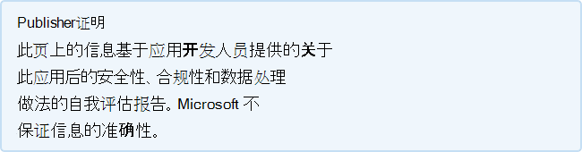

# Talview InterviewsTalview Interviews

开发人员上次更新时间：2021 年 2 月 12 日Last updated by the developer on: February 12, 2021

* <a href="https://teams.microsoft.com/l/app/a4f18f5c-2c9f-4a39-affe-68791a02f418" target="_blank">在应用商店Teams视图</a><a href="https://teams.microsoft.com/l/app/a4f18f5c-2c9f-4a39-affe-68791a02f418" target="_blank">View in Teams store</a>
* <a href="https://appsource.microsoft.com/product/office/WA200002437" target="_blank">在 AppSource 中查看</a><a href="https://appsource.microsoft.com/product/office/WA200002437" target="_blank">View in AppSource</a>

::: zone pivot="general"

### 一般信息General information

Talview Inc 提供给 Microsoft 的信息：Information provided by Talview Inc to Microsoft:

| **Information****Information** | **响应****Response** |
|:----------------|:-------------|
| 应用名称App name | Talview InterviewsTalview Interviews |
| IDID | WA200002437WA200002437 |
| 功能Capabilities | 选项卡Tab |
| Office 365支持的客户端Office 365 clients supported | Microsoft TeamsMicrosoft Teams |
| 合作伙伴公司名称Partner company name | Talview IncTalview Inc |
| 合作伙伴网站的 URLURL of partner website | [https://talview.com](https://talview.com) |
| "Teams应用程序信息"页的 URLURL of Teams application info page | [https://info.talview.com/talview-partners-microsoft-teams](https://info.talview.com/talview-partners-microsoft-teams) |
| 隐私策略的 URLURL of Privacy Policy | [https://talview.com/privacy](https://talview.com/privacy) |
| 使用条款 URLURL of Terms of Use | [https://talview.com/terms](https://talview.com/terms) |

 [!INCLUDE [Corrections or suggestions contact information](../includes/corrections-or-suggestions.md)]

::: zone-end

::: zone pivot="data"

### 应用如何处理数据How the app handles data

Talview Inc 提供了此信息，这些信息与此应用程序如何收集和存储组织数据以及组织将拥有对应用收集的数据的控制有关。This information has been provided by Talview Inc about how this app collects and stores organizational data and the control that your organization will have over the data the app collects.

#### 使用 Microsoft GraphData access using Microsoft Graph

列出[此Graph所需的](https://docs.microsoft.com/graph/permissions-reference)任何 Microsoft 权限。List any [Microsoft Graph permissions](https://docs.microsoft.com/graph/permissions-reference) this app requires.

>| **Permission****Permission**  | **委派/应用程序 (的权限类型)****Type of permission (Delegated/Application)** | **是否收集数据？收集它的理由？****Is data collected? Justification for collecting it?** | **是否存储数据？存储它的理由？****Is data stored? Justification for storing it?** | **Azure AD 应用 ID****Azure AD App ID** |
>|:----------------|:--------------------|:---------------------------------------------------|:--------------------------|:--------------------------|
>| User.ReadUser.Read | delegateddelegated | 登录并读取用户个人资料Sign in and read user profile | 用于通知和身份验证的电子邮件地址/用户名Email address/User Names for notifications and authentication | 8b976ed7-cc69-482a-a020-19bdce1041c48b976ed7-cc69-482a-a020-19bdce1041c4 |
>| emailemail | delegateddelegated | 查看用户的电子邮件地址以映射用户帐户View users' email address for mapping user accounts | 用于通知和身份验证的电子邮件地址/用户名Email address/User Names for notifications and authentication | 8b976ed7-cc69-482a-a020-19bdce1041c48b976ed7-cc69-482a-a020-19bdce1041c4 |
>| openidopenid | delegateddelegated | 登录用户，登录到平台Sign users in, To log in to the platform | 用于通知和身份验证的电子邮件地址/用户名Email address/User Names for notifications and authentication | 8b976ed7-cc69-482a-a020-19bdce1041c48b976ed7-cc69-482a-a020-19bdce1041c4 |
>| 个人资料profile | delegateddelegated | 查看用户的基本个人资料View users' basic profile | 用于通知和身份验证的电子邮件地址/用户名Email address/User Names for notifications and authentication | 8b976ed7-cc69-482a-a020-19bdce1041c48b976ed7-cc69-482a-a020-19bdce1041c4 |

#### 非Microsoft 服务使用Non-Microsoft services used

如果应用与非 Microsoft 服务传输或共享组织数据，请列出应用使用的非 Microsoft 服务、传输哪些数据，并包括应用需要传输此信息的原因的理由。If the app transfers or shares organizational data with non-Microsoft service, list the non-Microsoft service the app uses, what data is transferred, and include a justification for why the app needs to transfer this information.

>不Microsoft 服务非活动。Non-Microsoft services are not used.

#### 通过机器人访问数据Data access via bots

如果此应用程序包含机器人或消息扩展，则它可以访问最终用户可识别信息 (EUII) ：名单 (名字、姓氏、显示名称、电子邮件地址) （团队中任何团队成员的姓名、姓氏、电子邮件地址) 或添加到其中聊天）。If this app contains a bot or a messaging extension, it can access end-user identifiable information (EUII): the roster (first name, last name, display name, email address) of any team member in a team or chat it's added to. 此应用是否使用了此功能？Does this app make use of this capability?

>无法访问 EUII。No EUII is accessed.

#### 遥测数据Telemetry data

OII (组织) 或 EUII (最终用户可识别) 是否显示在此应用程序的遥测或日志中？Does any organizational identifiable information (OII) or end-user identifiable information (EUII) appear in this application's telemetry or logs? 如果是，请描述存储哪些数据以及保留和删除策略是什么？If yes, describe what data is stored and what are the retention and removal policies?

>应用程序遥测或日志中不显示 OII 或 EUII。No OII or EUII appear in the applications telemetry or logs.

#### 合作伙伴存储的数据的组织控制Organizational controls for data stored by partner

描述组织的管理员如何控制他们在合作伙伴系统中的信息？例如删除、保留、审核、存档、最终用户策略等。Describe how organization's administrators can control their information in partner systems? e.g. deletion, retention, auditing, archiving, end-user policy, etc.

>不适用NA

#### 组织信息的人工审阅Human review of organizational information

是否涉及人员查看或分析任何组织可识别信息 (OII) 收集或存储的数据？Are humans involved in reviewing or analyzing any organizational identifiable information (OII) data that is collected or stored by this app?

>是Yes

[!INCLUDE [Corrections or suggestions contact information](../includes/corrections-or-suggestions.md)]

::: zone-end

::: zone pivot="mcas"

下面将显示[Microsoft Cloud App Security](https://www.microsoft.com/enterprise-mobility-security/cloud-app-security)目录中的信息。Information from the [Microsoft Cloud App Security](https://www.microsoft.com/enterprise-mobility-security/cloud-app-security) catalog appears below.

<iframe height='1020' title='Microsoft Cloud App Security信息Microsoft Cloud App Security Information' src='https://appmcasinfoprod.azurewebsites.net/#/dashboard/36431' frameborder='no' style='width: 100%;'></iframe>

<a href="https://appmcasinfoprod.azurewebsites.net/#/dashboard/36431" target="_blank">在新建选项卡中查看</a>

<a href="https://appmcasinfoprod.azurewebsites.net/#/dashboard/36431" target="_blank">View in a new tab</a>

[!INCLUDE [Corrections or suggestions contact information](../includes/corrections-or-suggestions.md)]

::: zone-end

::: zone pivot="identity"

### 标识信息Identity information

此信息已由 Talview Inc 提供有关此应用如何处理身份验证、授权、应用程序注册最佳做法和其他标识条件的信息。This information has been provided by Talview Inc about how this app handles authentication, authorization, application registration best practices, and other Identity criteria.

| **Information****Information** | **响应****Response** |
|:----------------|:-------------|
| 你是否与 Microsoft 标识平台 (Azure AD) ？Do you integrate with Microsoft Identify Platform (Azure AD)?  | 是Yes |
| 您是否已查看并遵循了 Microsoft 标识平台 清单中列出的所有适用最佳做法？Have you reviewed and complied with all applicable best practices outlined in the Microsoft identity platform integration checklist?  | 是Yes |
| 你的应用是否使用 MSAL (Microsoft 身份验证库) 进行身份验证？Does your app use MSAL (Microsoft Authentication Library) for authentication? | 否No |
| 你的应用是否支持条件访问策略？Does your app support Conditional Access policies? | 否No |
| 应用是否请求方案最小特权权限？Does your app request least privilege permissions for your scenario? | 是Yes |
| 应用的静态注册权限是否准确反映应用将动态和增量请求的权限？Does your app's statically registered permissions accurately reflect the permissions your app will request dynamically and incrementally? | 是Yes |
| 你的应用是否支持多租户？Does your app support multi-tenancy? | 是Yes |
| 你的应用是否具有机密客户端？Does your app have a confidential client? | 是Yes |
| 你是否拥有为应用注册的所有重定向统 (URI) URI？Do you own all of the redirect Unified Resource Identifier (URI) registered for your app? | 是Yes |
| 你的应用是否公开任何 Web API？Does your app expose any web APIs? | 是Yes |
| 您的权限模型是否仅在客户端应用程序收到正确同意时允许呼叫成功？Does your permission model only allow calls to succeed if the client app receives the proper consent? | 是Yes |
| 你的应用是否使用预览 API？Does your app use preview APIs? | 否No |
| 你的应用是否使用已弃用 API？Does your app use deprecated APIs? | 否No |

[!INCLUDE [Corrections or suggestions contact information](../includes/corrections-or-suggestions.md)]

::: zone-end
